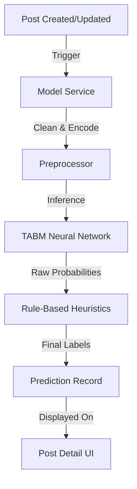

# Developer Manual: AI Model Module

The AI Model module (Prediction Engine) provides automated success probability and risk assessment for project campaigns using deep learning.

## 1. Program Structure

This module encapsulates the "Intelligence Layer" of the platform, utilizing a pre-trained PyTorch model.

### Backend Structure (`okard-backend/src/modules/model`)
- [service.py](file:///Users/wisapat/Documents/Code/Git/okard-backend/src/modules/model/service.py): Orchestrates pre-processing, model inference, and rule-based safety checks.
- [loader.py](file:///Users/wisapat/Documents/Code/Git/okard-backend/src/modules/model/loader.py): Handles the loading of the `.pth` model file and the TABM architecture.
- [mapping.py](file:///Users/wisapat/Documents/Code/Git/okard-backend/src/modules/model/mapping.py): Maps numerical model outputs to human-readable labels (e.g., "High Risk", "Likely Successful").
- [tabm_model.py](file:///Users/wisapat/Documents/Code/Git/okard-backend/src/modules/model/tabm_model.py): The structural definition of the Tabular Model used for inference.

### Data Assets
- `tabm_model.pth`: The trained model weights.
- `model_config.json`: Hyperparameters and configuration.
- `pkl_files/`: Scalers and encoders for data normalization.

---

## 2. Top-Down Functional Overview

The system uses a **Hybrid Inference** approach (ML + Heuristics).

---

## 3. Subprogram Descriptions

### Backend: Service Layer ([service.py](file:///Users/wisapat/Documents/Code/Git/okard-backend/src/modules/model/service.py))

| Subprogram | Responsibility | Input | Output |
| :--- | :--- | :--- | :--- |
| `predict` | Executes the full pipeline: Preprocessing -> Inference -> Post-processing -> Output Mapping. | `db`, `data`, `post_id`, `save` | `PredictionResults` |
| `preprocess` | (In loader.py) Transforms raw JSON post data into numerical tensors for the model. | `InputData` | `(num_tensor, cat_tensor)` |

---

## 4. Communication & Parameters

1.  **Prediction Tasks**: Triggered automatically in a `BackgroundTasks` queue after a post is created or its core text/budget is updated.
2.  **Output Categories**:
    - `success_cls`: Probability of hitting the funding goal.
    - `risk_level`: Assessment of project safety based on budget/duration/media ratio.
3.  **Heuristic Overrides**: The system includes "Hard Safety Rules" (e.g., a 45-day campaign with no video is automatically flagged as "High Risk" regardless of ML output).
4.  **Hardware Acceleration**: Inference is performed on `cpu` by default (defined in `loader.py`) to maintain low infrastructure costs, as the tabular model is highly efficient.
