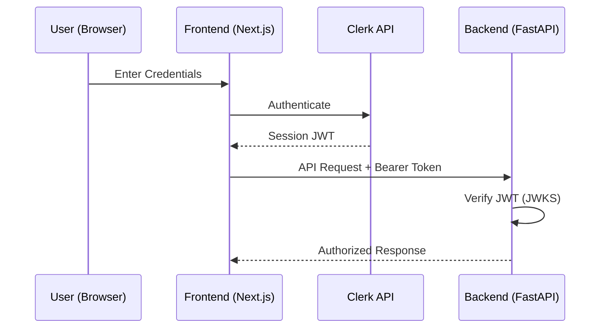

# Developer Manual: Auth Module

The Auth module handles user authentication and session management using **Clerk**. It provides secure access control for both the frontend and backend.

## 1. Program Structure

The Auth module is integrated into both the backend and frontend.

### Backend Structure (`okard-backend/src/modules/auth.py`)
- [auth.py](file:///Users/wisapat/Documents/Code/Git/okard-backend/src/modules/auth.py): Contains the logic for verifying Clerk-issued JWTs.

### Frontend Structure (`okard-frontend/src/modules/auth`)
- [components/SignInComponent.tsx](file:///Users/wisapat/Documents/Code/Git/okard-frontend/src/modules/auth/components/SignInComponent.tsx): UI for user login.
- [components/SignUpComponent.tsx](file:///Users/wisapat/Documents/Code/Git/okard-frontend/src/modules/auth/components/SignUpComponent.tsx): UI for user registration.
- **App Routes**: Found in `/src/app/sign-in`, `/src/app/sign-up`, and `/src/app/sso-callback`.

---

## 2. Top-Down Functional Overview

The system relies on Clerk as the Identity Provider.

---

## 3. Subprogram Descriptions

### Backend: Auth Logic ([auth.py](file:///Users/wisapat/Documents/Code/Git/okard-backend/src/modules/auth.py))

| Subprogram | Responsibility | Input | Output |
| :--- | :--- | :--- | :--- |
| `get_current_user` | Dependency that validates the Bearer token in the request header. | `token` (Bearer Token) | `payload` (Decoded JWT dict) or 401 Error |
| `get_optional_current_user` | Optional dependency that returns `None` instead of erroring if the token is missing/invalid. | `token` (Optional) | `payload` or `None` |

### Frontend: Auth Components ([components/](file:///Users/wisapat/Documents/Code/Git/okard-frontend/src/modules/auth/components))

| Subprogram | Responsibility | Input | Output |
| :--- | :--- | :--- | :--- |
| `SignInComponent` | Handles the login form and interaction with the `useSignIn` hook. | Form fields (username, password) | Session Activation & Redirect |
| `SignUpComponent` | Handles the registration form and interaction with the `useSignUp` hook. | Form fields (email, password, etc.) | Verification Step / Completion |

---

## 4. Communication & Parameters

1.  **Token Management**: The frontend obtains a JWT from Clerk and sends it in the `Authorization` header as `Bearer <token>`.
2.  **JWT Verification**: The backend fetches the public keys (JWKS) from Clerk's issuer URL and uses them to decode and verify the incoming tokens.
3.  **Payload**: The decoded `payload` contains the `sub` (Clerk User ID), which is used by other backend modules (like `User` and `Creator`) to identify the user.
