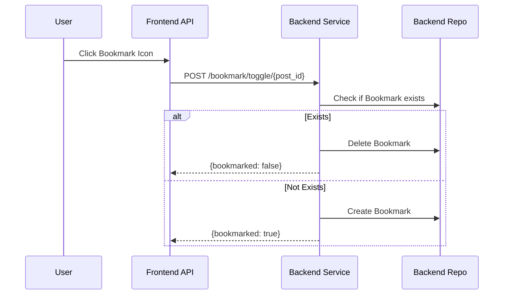

# Developer Manual: Bookmark Module

The Bookmark module allows users to save posts to their personal collection for quick access later.

## 1. Program Structure

The Bookmark module is a lightweight utility that links users and posts.

### Backend Structure (`okard-backend/src/modules/bookmark`)
- [controller.py](file:///Users/wisapat/Documents/Code/Git/okard-backend/src/modules/bookmark/controller.py): API for toggling bookmarks and fetching saved posts.
- [service.py](file:///Users/wisapat/Documents/Code/Git/okard-backend/src/modules/bookmark/service.py): Business logic for state toggling (create or delete).
- [repo.py](file:///Users/wisapat/Documents/Code/Git/okard-backend/src/modules/bookmark/repo.py): DB operations for the `bookmark` table.
- [model.py](file:///Users/wisapat/Documents/Code/Git/okard-backend/src/modules/bookmark/model.py): SQLAlchemy model defining the `user_id` and `post_id` pair.
- [schema.py](file:///Users/wisapat/Documents/Code/Git/okard-backend/src/modules/bookmark/schema.py): Simple response schemas.

### Frontend Structure
- [api/api.ts](file:///Users/wisapat/Documents/Code/Git/okard-frontend/src/modules/bookmark/api/api.ts): API clients for toggling and fetching bookmarks.

---

## 2. Top-Down Functional Overview

The Bookmark module operates as a simple join table with toggle logic.

---

## 3. Subprogram Descriptions

### Backend: Service Layer ([service.py](file:///Users/wisapat/Documents/Code/Git/okard-backend/src/modules/bookmark/service.py))

| Subprogram | Responsibility | Input | Output |
| :--- | :--- | :--- | :--- |
| `toggle_bookmark` | Orchestrates the create/delete logic based on existing state. | `db`, `user_id`, `post_id` | `{"bookmarked": bool}` |
| `get_bookmarks` | Retrieves a paginated list of posts bookmarked by a specific user. | `db`, `user_id`, `skip`, `limit` | `list[Bookmark]` |

---

## 4. Communication & Parameters

1.  **State Toggling**: The backend does NOT have separate "create" and "delete" endpoints for bookmarks; it uses a single `toggle` endpoint to simplify frontend implementation.
2.  **User Context**: The `user_id` is always derived from the authenticated Clerk session.
3.  **UI Feedback**: The frontend uses the Boolean response from `toggle_bookmark` to immediately update the visual state of the bookmark icon (filled vs. outline).
