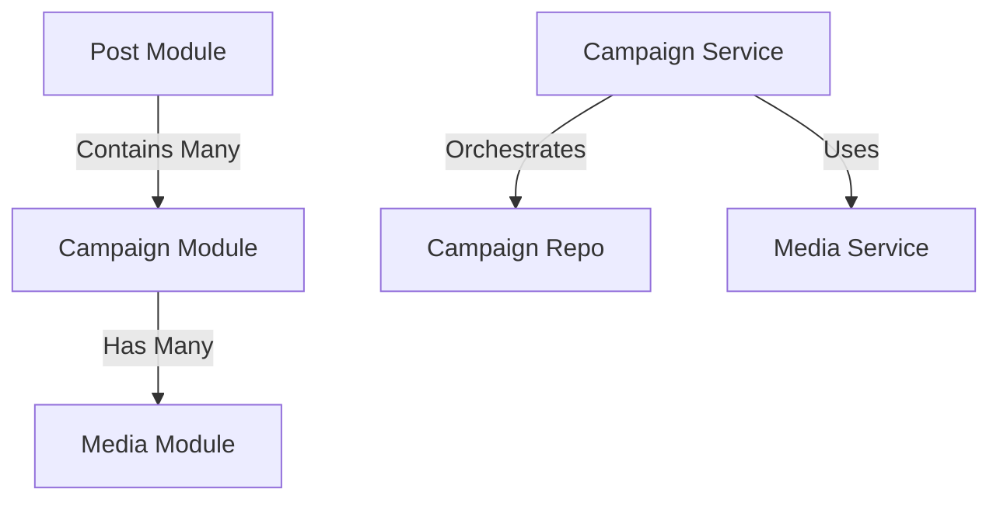

# Developer Manual: Campaign Module

The Campaign module manages secondary content within a Post, typically representing specific milestones, project phases, or "story" sections with their own media.

## 1. Program Structure

The Campaign module is a child of the Post module and is primarily managed through the `Post` controller.

### Backend Structure (`okard-backend/src/modules/campaign`)
- [service.py](file:///Users/wisapat/Documents/Code/Git/okard-backend/src/modules/campaign/service.py): Handles creation, updating, and deletion of campaigns and their associated media.
- [repo.py](file:///Users/wisapat/Documents/Code/Git/okard-backend/src/modules/campaign/repo.py): SQL operations for the `campaign` table.
- [model.py](file:///Users/wisapat/Documents/Code/Git/okard-backend/src/modules/campaign/model.py): SQLAlchemy model defining campaign attributes (title, description, display order).
- [schema.py](file:///Users/wisapat/Documents/Code/Git/okard-backend/src/modules/campaign/schema.py): Pydantic validation schemas.

---

## 2. Top-Down Functional Overview

Campaigns are treated as ordered sub-entities of a Post.

---

## 3. Subprogram Descriptions

### Backend: Service Layer ([service.py](file:///Users/wisapat/Documents/Code/Git/okard-backend/src/modules/campaign/service.py))

| Subprogram | Responsibility | Input | Output |
| :--- | :--- | :--- | :--- |
| `create_campaign_with_media` | Bulk creates campaigns and attaches uploaded media files. | `db`, `campaign_data` (List), `files` | `List[Campaign]` |
| `update_campaign_with_media` | Updates campaign text and replaces media if new files provided. | `db`, `campaign_id`, `data`, `files` | `Campaign` |
| `delete_campaign` | Removes campaign record and its physical media files. | `db`, `campaign_id` | `Campaign` (Deleted) |

---

## 4. Communication & Parameters

1.  **Parent Relationship**: Every campaign must have a `post_id` foreign key.
2.  **Order Management**: The `display_order` parameter determines the sequence in which milestones appear on the Post Detail page.
3.  **Media Lifecycle**: When a campaign is updated with a new image, the service layer explicitly deletes the old file via the `media_service` before saving the new one.
4.  **Transaction Context**: Campaign operations are usually called from the `PostService` during a multi-step post creation or edit.
