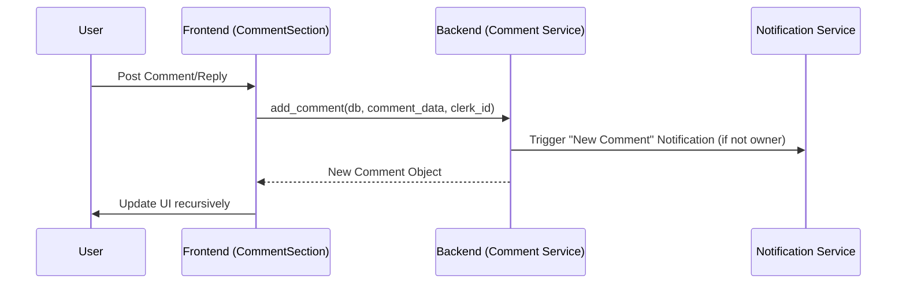

# Developer Manual: Comment Module

The Comment module facilitates community discussion on campaign posts, supporting threaded replies and a social "like" system.

## 1. Program Structure

The Comment module is a hierarchical system designed for scalability and user engagement.

### Backend Structure (`okard-backend/src/modules/comment`)
- [controller.py](file:///Users/wisapat/Documents/Code/Git/okard-backend/src/modules/comment/controller.py): API for posting, liking, and listing comments.
- [service.py](file:///Users/wisapat/Documents/Code/Git/okard-backend/src/modules/comment/service.py): Business logic including notification triggers for post owners.
- [repo.py](file:///Users/wisapat/Documents/Code/Git/okard-backend/src/modules/comment/repo.py): Complex SQL queries for threaded comments and like/unlike operations.
- [model.py](file:///Users/wisapat/Documents/Code/Git/okard-backend/src/modules/comment/model.py): SQLAlchemy model with `parent_id` for threading and `likes` relationship.
- [schema.py](file:///Users/wisapat/Documents/Code/Git/okard-backend/src/modules/comment/schema.py): Schemas for recursive comment trees.

### Frontend Structure (`okard-frontend/src/modules/post/components/comment`)
- [CommentSection.tsx](file:///Users/wisapat/Documents/Code/Git/okard-frontend/src/modules/post/components/comment/CommentSection.tsx): The main container for handling the comment list state.
- [CommentNode.tsx](file:///Users/wisapat/Documents/Code/Git/okard-frontend/src/modules/post/components/comment/CommentNode.tsx): Recursive component for rendering individual comments and their replies.
- [InlineComposer.tsx](file:///Users/wisapat/Documents/Code/Git/okard-frontend/src/modules/post/components/comment/InlineComposer.tsx): Text input for creating new comments or replies.

---

## 2. Top-Down Functional Overview

Comments are linked to Posts and can optionally link to a Parent Comment.

---

## 3. Subprogram Descriptions

### Backend: Service Layer ([service.py](file:///Users/wisapat/Documents/Code/Git/okard-backend/src/modules/comment/service.py))

| Subprogram | Responsibility | Input | Output |
| :--- | :--- | :--- | :--- |
| `add_comment` | Saves comment and sends a notification to the post creator. | `db`, `comment_data`, `clerk_id` | `Comment` |
| `like/unlike` | Manages the many-to-many relationship between users and comment likes. | `db`, `comment_id`, `clerk_id` | `{"ok": True}` |

### Frontend: Components ([comment/](file:///Users/wisapat/Documents/Code/Git/okard-frontend/src/modules/post/components/comment))

| Subprogram | Responsibility | Input | Output |
| :--- | :--- | :--- | :--- |
| `CommentSection` | Root manager for comments on a post. | `postId` | Rendered Thread |
| `CommentNode` | Renders a single entry and its child array (recursive). | `comment` object | Comment UI |

---

## 4. Communication & Parameters

1.  **Threading**: The `parent_id` in the `CommentCreate` schema is used to nest replies. If `null`, it is a top-level comment.
2.  **Notifications**: Notifications are only triggered if the commenter is NOT the post creator.
3.  **Recursive Fetching**: The `lists_comments` repository function uses a specialized join to fetch the hierarchy or sorts them such that the frontend can build the tree efficiently.
4.  **Optimistic UI**: Likes are often handled with optimistic state on the frontend for a snappier user experience.
