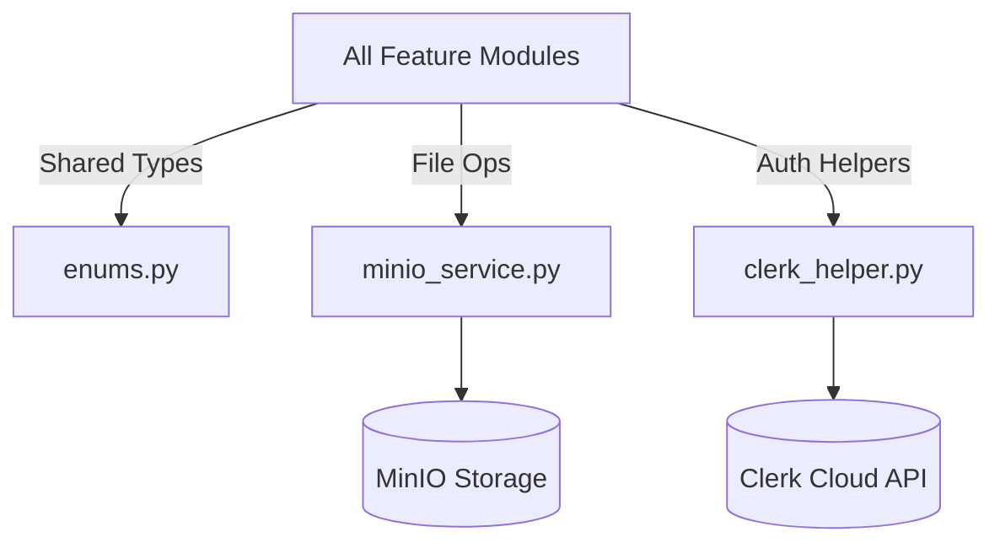

# Developer Manual: Common Infrastructure Module

The Common module provides cross-cutting utility services and the centralized "Type System" (Enums) used throughout the Okard platform.

## 1. Program Structure

The Common module is a stateless resource layer.

### Backend Structure (`okard-backend/src/modules/common`)
- [enums.py](file:///Users/wisapat/Documents/Code/Git/okard-backend/src/modules/common/enums.py): The single source of truth for all system states (PostState, UserRole, ReportStatus, etc.).
- [minio_service.py](file:///Users/wisapat/Documents/Code/Git/okard-backend/src/modules/common/minio_service.py): High-level wrapper for MinIO/S3 file operations.
- [clerk_helper.py](file:///Users/wisapat/Documents/Code/Git/okard-backend/src/modules/common/clerk_helper.py): Helper for interacting with the Clerk API.

---

## 2. Top-Down Functional Overview

The Common module acts as the "Standard Library" for all feature modules.

---

## 3. Subprogram Descriptions

### Backend: Shared Services ([common/](file:///Users/wisapat/Documents/Code/Git/okard-backend/src/modules/common/))

| Subprogram (File) | Responsibility | Core Components |
| :--- | :--- | :--- |
| `enums.py` | Defines the state transitions and roles for the entire application. | `PostState`, `UserRole`, `NotificationType`, `ReportStatus` |
| `minio_service.py` | Abstracted API for `upload_file`, `delete_file`, and `get_presigned_url`. | `MinioClient` integration |
| `clerk_helper.py` | Syncs user data and verifies sessions with the Clerk identity provider. | `ClerkSDK` wrapper |

---

## 4. Communication & Parameters

1.  **State Consistency**: By centralizing `PostState` (e.g., `draft`, `published`, `success`), we ensure that the database, backend logic, and frontend UI always share the same status definitions.
2.  **MinIO Configuration**: Storage settings (Bucket names, Access keys) are injected via environment variables and managed globally by the `MinioService` singleton.
3.  **Authentication Guard**: The `clerk_helper` provides the lower-level functionality used by the `auth` module's JWT verification middleware.
4.  **Reference Types**: The `ReferenceType` enum is particularly important for the polymorphic `MediaHandler` system, linking files to different business entities.
