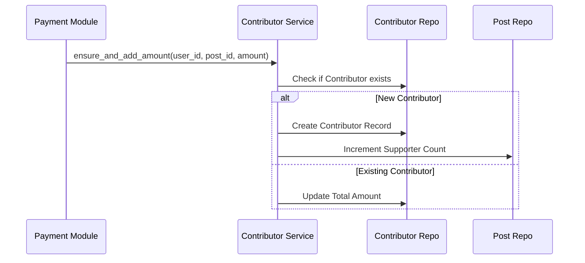

# Developer Manual: Contributor Module

The Contributor module tracks the relationship between supporters and the projects they fund, serving as a ledger for all contributions.

## 1. Program Structure

The Contributor module is primarily used by the Payment and Post modules to manage funding data.

### Backend Structure (`okard-backend/src/modules/contributor`)
- [controller.py](file:///Users/wisapat/Documents/Code/Git/okard-backend/src/modules/contributor/controller.py): API for fetching contributor lists for a specific post.
- [service.py](file:///Users/wisapat/Documents/Code/Git/okard-backend/src/modules/contributor/service.py): Logical operations for adding or updating contribution amounts.
- [repo.py](file:///Users/wisapat/Documents/Code/Git/okard-backend/src/modules/contributor/repo.py): DB operations for the `contributor` table.
- [model.py](file:///Users/wisapat/Documents/Code/Git/okard-backend/src/modules/contributor/model.py): SQLAlchemy model tracking `user_id`, `post_id`, and `total_amount` contributed.
- [schema.py](file:///Users/wisapat/Documents/Code/Git/okard-backend/src/modules/contributor/schema.py): Validation schemas for contributor data.

### Frontend Structure
- [types.ts](file:///Users/wisapat/Documents/Code/Git/okard-frontend/src/modules/contributor/types.ts): Data structures for displaying supporter lists.
- Integrated into [PostDetailTabs.tsx](file:///Users/wisapat/Documents/Code/Git/okard-frontend/src/modules/post/components/PostDetailTabs.tsx) to show a list of recent supporters.

---

## 2. Top-Down Functional Overview

Contributors represent the "Funding Ledger" for each campaign.

---

## 3. Subprogram Descriptions

### Backend: Service Layer ([service.py](file:///Users/wisapat/Documents/Code/Git/okard-backend/src/modules/contributor/service.py))

| Subprogram | Responsibility | Input | Output |
| :--- | :--- | :--- | :--- |
| `ensure_and_add_amount`| Upserts a contributor record and returns if it was a new supporter. | `user_id`, `post_id`, `amount` | `(Contributor, is_new)` |
| `list_contributors`| Lists all users who have supported a specific post. | `post_id` | `List[Contributor]` |

---

## 4. Communication & Parameters

1.  **Unique Relationship**: The database enforces a unique constraint on the `(user_id, post_id)` pair.
2.  **Cumulative Support**: If a user pays multiple times for the same post, the `total_amount` in the contributor record is incremented rather than creating new records.
3.  **Supporter Count**: The `is_new` boolean returned by the service is used by the caller (Payment module) to decide whether to increment the `supporter` counter on the `Post` model.
4.  **Privacy**: The frontend displays contributor names, but internal service logic ensures that sensitive transaction IDs are not leaked.
