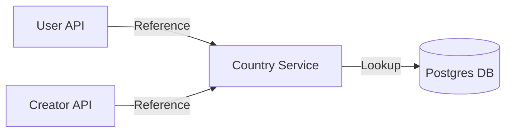

# Developer Manual: Country Module

The Country module provides a standardized list of countries for user profiles and campaign localization.

## 1. Program Structure

The Country module is a static lookup service used across the platform.

### Backend Structure (`okard-backend/src/modules/country`)
- [controller.py](file:///Users/wisapat/Documents/Code/Git/okard-backend/src/modules/country/controller.py): API for fetching the list of supported countries.
- [service.py](file:///Users/wisapat/Documents/Code/Git/okard-backend/src/modules/country/service.py): Business logic for country lookups.
- [repo.py](file:///Users/wisapat/Documents/Code/Git/okard-backend/src/modules/country/repo.py): DB operations for the `country` table.
- [model.py](file:///Users/wisapat/Documents/Code/Git/okard-backend/src/modules/country/model.py): SQLAlchemy model with `name`, `iso_code`, and `en_name`.
- [schema.py](file:///Users/wisapat/Documents/Code/Git/okard-backend/src/modules/country/schema.py): Validation and response schemas.

### Frontend Structure (`okard-frontend/src/modules/country`)
- [api/api.ts](file:///Users/wisapat/Documents/Code/Git/okard-frontend/src/modules/country/api/api.ts): API client to fetch the global country list.

---

## 2. Top-Down Functional Overview

The module serves as a read-only dictionary for the rest of the application.

---

## 3. Subprogram Descriptions

### Backend: Service Layer ([service.py](file:///Users/wisapat/Documents/Code/Git/okard-backend/src/modules/country/service.py))

| Subprogram | Responsibility | Input | Output |
| :--- | :--- | :--- | :--- |
| `get_country_list` | Retrieves all enabled countries from the database. | `db` | `List[Country]` |
| `get_country` | Fetches a single country record by ID. | `db`, `country_id` | `Country` or `None` |

---

## 4. Communication & Parameters

1.  **Normalization**: By using a centralized `country_id` (UUID) across the `User` and `Creator` tables, the system ensures consistent naming and ISO codes.
2.  **Multilingual Support**: The `model.py` includes both native names and `en_name` for internationalization support.
3.  **Low Latency**: Post-fetch results are often cached on the frontend to avoid redundant API calls during multi-step forms.
