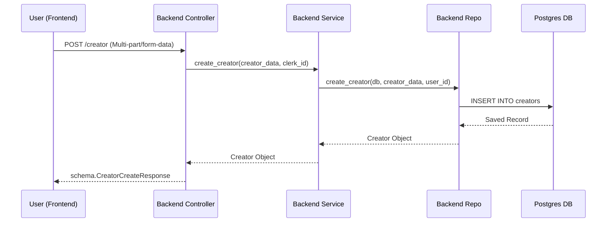

# Developer Manual: Creator Module

The Creator module manages the lifecycle of a creator's profile, including creation, verification, and profile updates. It bridges the gap between a standard user and a content creator.

## 1. Program Structure

The Creator module is split into backend (Python/FastAPI) and frontend (TypeScript/Next.js) components.

### Backend Structure (`okard-backend/src/modules/creator`)
- [controller.py](file:///Users/wisapat/Documents/Code/Git/okard-backend/src/modules/creator/controller.py): API route definitions and request handling.
- [service.py](file:///Users/wisapat/Documents/Code/Git/okard-backend/src/modules/creator/service.py): Business logic layer.
- [repo.py](file:///Users/wisapat/Documents/Code/Git/okard-backend/src/modules/creator/repo.py): Data access layer (SQLAlchemy).
- [model.py](file:///Users/wisapat/Documents/Code/Git/okard-backend/src/modules/creator/model.py): Database schema definition.
- [schema.py](file:///Users/wisapat/Documents/Code/Git/okard-backend/src/modules/creator/schema.py): Pydantic models for data validation and serialization.

### Frontend Structure (`okard-frontend/src/modules/creator`)
- [api/api.ts](file:///Users/wisapat/Documents/Code/Git/okard-frontend/src/modules/creator/api/api.ts): API client for interacting with the backend.
- [components/CreatorForm.tsx](file:///Users/wisapat/Documents/Code/Git/okard-frontend/src/modules/creator/components/CreatorForm.tsx): The primary UI component for creator registration and profile management.
- `types/`: TypeScript interfaces for the module.

---

## 2. Top-Down Functional Overview

The system follows a typical Controller -> Service -> Repository hierarchy.

---

## 3. Subprogram Descriptions

### Backend: Controller Layer ([controller.py](file:///Users/wisapat/Documents/Code/Git/okard-backend/src/modules/creator/controller.py))

| Subprogram | Responsibility | Input | Output |
| :--- | :--- | :--- | :--- |
| `create_creator` | Orchestrates creator profile creation, user role update, and document uploads. | `data` (JSON str), `image`, `id_card`, `house_registration`, `bank_statement` (Files) | `schema.CreatorCreateResponse` |
| `get_my_creator_profile` | Retrieves the creator profile for the logged-in user. | `clerk_id` (str) | `schema.CreatorOut` |
| `update_creator` | Updates existing creator profile fields. | `creator_id` (UUID), `creator_data` (Update Schema) | `schema.CreatorOut` |
| `verify_creator` | (Admin) Approves or rejects a creator's verification request. | `creator_id`, `status` (str), `admin_clerk_id` (str) | `schema.CreatorOut` |

### Backend: Service Layer ([service.py](file:///Users/wisapat/Documents/Code/Git/okard-backend/src/modules/creator/service.py))

| Subprogram | Responsibility | Input | Output |
| :--- | :--- | :--- | :--- |
| `create_creator` | Checks for existing profiles and maps `clerk_id` to `user_id`. | `db` (Session), `creator_data` (Schema), `clerk_id` (str) | `Creator` (Model object) |
| `verify_creator_request` | Updates status and handles admin permission logic. | `db`, `creator_id`, `status`, `admin_clerk_id` | `Creator` (Model object) |

### Backend: Repository Layer ([repo.py](file:///Users/wisapat/Documents/Code/Git/okard-backend/src/modules/creator/repo.py))

| Subprogram | Responsibility | Input | Output |
| :--- | :--- | :--- | :--- |
| `create_creator` | Performs the database INSERT operation. | `db`, `creator_data` (Schema), `user_id` (UUID) | `Creator` object |
| `get_creator_by_id` | Fetches a creator with joined User data. | `db`, `creator_id` | `Creator` or `None` |
| `update_verification_status`| Modifies status, verification timestamps, and reason. | `db`, `creator_id`, `status`, `verifier_id` | `Creator` object |

---

## 4. Communication & Parameters

Data flows from the frontend forms (`CreatorForm.tsx`) through the `api.ts` client as `FormData` (to support files). The backend controller parses this:

1.  **Parsing**: `controller.py` converts the `data` string parameter into Pydantic objects (`CreatorCreate` and `UserUpdate`).
2.  **Cross-Module Communication**:
    - The Creator module calls `userService.get_user_by_clerk_id` to link profiles.
    - It calls `mediaService.create_media_from_upload` for the profile image.
    - It calls `verificationDocService.create_verification_doc_from_upload` for ID/Bank statement images.
3.  **Database Linking**: The `user_id` (UUID) is the primary foreign key used to communicate between logic layers and link the `User` and `Creator` tables.
