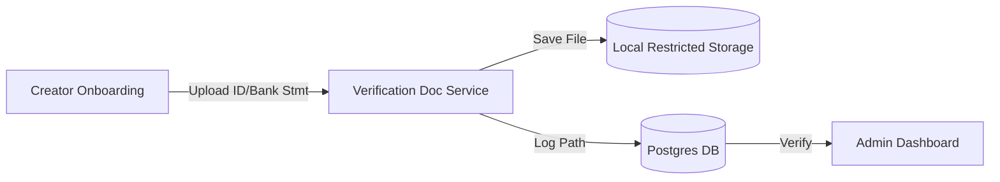

# Developer Manual: Creator Verification Document Module

The Creator Verification Document module handles the ingestion and storage of sensitive identity documents (ID cards, bank statements) required for creator KYC (Know Your Customer) verification.

## 1. Program Structure

This module is a high-security component that isolates sensitive files from the general media library.

### Backend Structure (`okard-backend/src/modules/creator_verification_doc`)
- [controller.py](file:///Users/wisapat/Documents/Code/Git/okard-backend/src/modules/creator_verification_doc/controller.py): API for uploading verification assets.
- [service.py](file:///Users/wisapat/Documents/Code/Git/okard-backend/src/modules/creator_verification_doc/service.py): Logic for local file storage and metadata association.
- [repo.py](file:///Users/wisapat/Documents/Code/Git/okard-backend/src/modules/creator_verification_doc/repo.py): DB operations for the `creator_verification_doc` table.
- [model.py](file:///Users/wisapat/Documents/Code/Git/okard-backend/src/modules/creator_verification_doc/model.py): SQLAlchemy model tracking file paths, mime types, and document types.
- [schema.py](file:///Users/wisapat/Documents/Code/Git/okard-backend/src/modules/creator_verification_doc/schema.py): Validation schemas.

---

## 2. Top-Down Functional Overview

The module provides a secure "Vault" for onboarding documents.

---

## 3. Subprogram Descriptions

### Backend: Service Layer ([service.py](file:///Users/wisapat/Documents/Code/Git/okard-backend/src/modules/creator_verification_doc/service.py))

| Subprogram | Responsibility | Input | Output |
| :--- | :--- | :--- | :--- |
| `create_verification_doc_from_upload` | Saves the sensitive file to a restricted local folder and persists the relative path. | `db`, `creator_id`, `doc_type`, `file` | `VerificationDoc` |
| `get_verification_docs`| Retrieves all documents associated with a creator for admin review. | `db`, `creator_id` | `List[VerificationDoc]` |

---

## 4. Communication & Parameters

1.  **Storage Isolation**: Unlike public media which uses MinIO, these documents are stored in a dedicated `uploads/verification_docs` folder on the local filesystem (as per current implementation) to restrict public access.
2.  **Document Types**: Uses the `VerificationDocType` enum (`id_card`, `house_registration`, `bank_statement`).
3.  **Pathing**: The database stores **relative** paths to the `BASE_DIR`, allowing for portability across environments.
4.  **Ownership**: Every document is strictly tied to a `creator_id` via a foreign key, ensuring data integrity.
