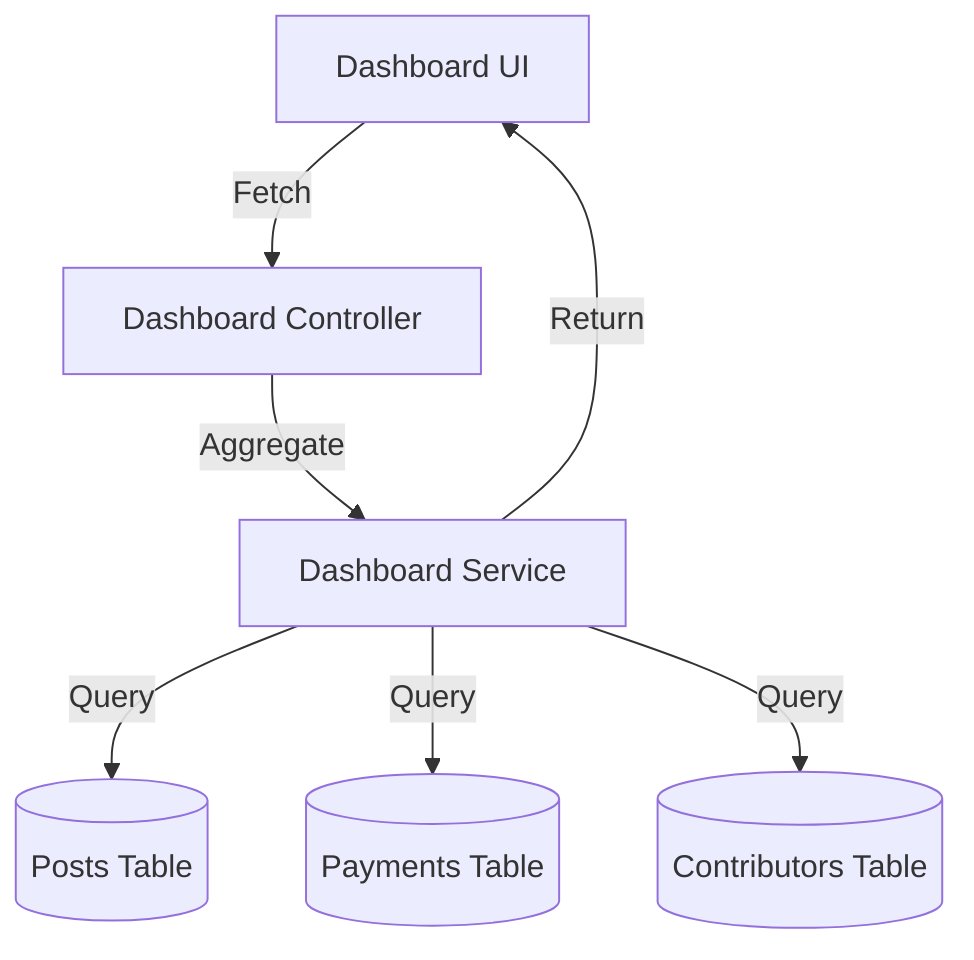

# Developer Manual: Dashboard Module

The Dashboard module acts as the analytical command center for creators, aggregating cross-module data into high-level visualizations and progress reports.

## 1. Program Structure

The Dashboard module is a composite service that queries Post, Payment, and Contributor data.

### Backend Structure (`okard-backend/src/modules/dashboard`)
- [controller.py](file:///Users/wisapat/Documents/Code/Git/okard-backend/src/modules/dashboard/controller.py): API endpoints for summary stats, progress lists, and country trends.
- [service.py](file:///Users/wisapat/Documents/Code/Git/okard-backend/src/modules/dashboard/service.py): Logic for calculating percentages, trends, and formatting chart data.
- [repo.py](file:///Users/wisapat/Documents/Code/Git/okard-backend/src/modules/dashboard/repo.py): Complex raw SQL and ORM queries for heavy data aggregation.
- [schema.py](file:///Users/wisapat/Documents/Code/Git/okard-backend/src/modules/dashboard/schema.py): Data structures for charts and multi-metric summaries.

### Frontend Structure (`okard-frontend/src/modules/dashboard`)
- [DashboardComponent.tsx](file:///Users/wisapat/Documents/Code/Git/okard-frontend/src/modules/dashboard/DashboardComponent.tsx): The main dashboard layout orchestrator.
- `components/`:
    - `DashboardBarChart.tsx`: Displays payment volume trends (last 7 days).
    - `DashboardPieChart.tsx`: Shows investor distribution by country.
    - `DashboardSummary.tsx`: Top-line metrics (Total Raised, Investors, Active Posts).
    - `DashboardPosts.tsx`: Tabular view of individual campaign progress.

---

## 2. Top-Down Functional Overview

The Dashboard is a "Read-Aggregate" module.

---

## 3. Subprogram Descriptions

### Backend: Service Layer ([service.py](file:///Users/wisapat/Documents/Code/Git/okard-backend/src/modules/dashboard/service.py))

| Subprogram | Responsibility | Input | Output |
| :--- | :--- | :--- | :--- |
| `get_user_dashboard` | Aggregates top-level KPI counts for the user. | `db`, `clerk_id` | `UserDashboardSummary` |
| `get_post_progress` | Calculates funding percentages and investor counts per project. | `db`, `clerk_id` | `List[PostProgress]` |
| `get_payment_stats` | Groups payment volume by date for chart rendering. | `db`, `clerk_id` | `List[PaymentStat]` |

---

## 4. Communication & Parameters

1.  **Clerk Integration**: Like all user-facing services, it derives the local `user_id` from the Clerk session ID.
2.  **Performance Optimization**: The `repo.py` uses optimized SQLAlchemy queries to perform group-by and count operations across potentially large datasets without fetching full objects.
3.  **Dynamic Rendering**: The frontend uses `DashboardBarChart` (powered by MUI X or similar) to map the date-based JSON results into a visual trendline.
4.  **Pagination**: The dashboard's project list supports `limit` and `offset` for efficient handling of power users with many campaigns.
