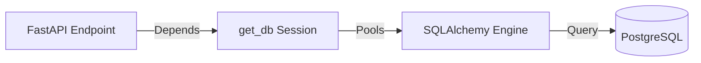

# Developer Manual: Database Infrastructure Module

The Database module manages the application's reliable connection to the PostgreSQL database, providing session management and the base for all ORM models.

## 1. Program Structure

The Database module is the core data-persistence driver.

### Backend Structure (`okard-backend/src/database`)
- [db.py](file:///Users/wisapat/Documents/Code/Git/okard-backend/src/database/db.py): Engine initialization, connection pooling setup, and the `get_db` FastAPI dependency.
- [models.py](file:///Users/wisapat/Documents/Code/Git/okard-backend/src/database/models.py): Centralized registry used by migrations to track all declarative models.

---

## 2. Top-Down Functional Overview

The Database module implements the **Repository Pattern** dependency injection.

---

## 3. Subprogram Descriptions

### Backend: Driver Layer ([db.py](file:///Users/wisapat/Documents/Code/Git/okard-backend/src/database/db.py))

| Subprogram | Responsibility | Key Parameters |
| :--- | :--- | :--- |
| `get_db` | A generator function that provides aScoped database sessions for প্রত্যেক request and ensures closure. | `yield db` |
| `create_engine` | Initializes the physical connection with optimized pooling. | `pool_size=20`, `max_overflow=10`, `pool_pre_ping=True` |

---

## 4. Communication & Parameters

1.  **Connection Pooling**: Uses SQLAlchemy's `QueuePool`. `pool_pre_ping=True` prevents "stale connection" errors during periods of inactivity.
2.  **Environment Loading**: Database credentials are loaded from `.env.local` using `pathlib` to ensure the path is resolved correctly regardless of where the app is started.
3.  **Declarative Base**: All feature-specific models (User, Post, etc.) inherit from the `Base` defined in `db.py`, allowing SQLAlchemy to generate the collective schema.
4.  **Session Lifecycle**: The `get_db` dependency ensures that every API request has a dedicated session that is automatically `closed()` in a `finally` block, preventing memory leaks and connection exhaustion.
