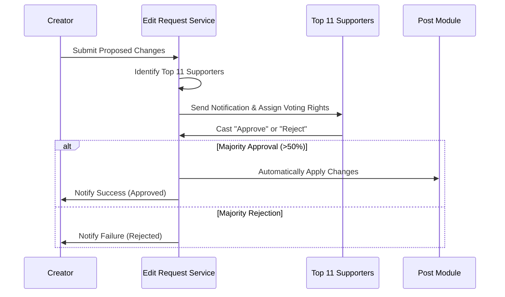

# Developer Manual: Edit Request Module

The Edit Request module implements a specialized governance process for modifying published posts, ensuring that major changes (like goals or rewards) are approved by top supporters.

## 1. Program Structure

This module features a complex state machine and a multi-user voting workflow.

### Backend Structure (`okard-backend/src/modules/edit_request`)
- [controller.py](file:///Users/wisapat/Documents/Code/Git/okard-backend/src/modules/edit_request/controller.py): API for creating requests, casting votes, and retrieving pending tasks.
- [service.py](file:///Users/wisapat/Documents/Code/Git/okard-backend/src/modules/edit_request/service.py): Core logic for change diffing, majority threshold calculation, and automatic application of approved changes.
- [repo.py](file:///Users/wisapat/Documents/Code/Git/okard-backend/src/modules/edit_request/repo.py): Handles relations between Requests, Approvers, and Votes.
- [model.py](file:///Users/wisapat/Documents/Code/Git/okard-backend/src/modules/edit_request/model.py): Defines the `EditRequest`, `EditRequestApprover`, and `EditRequestVote` tables.
- [schema.py](file:///Users/wisapat/Documents/Code/Git/okard-backend/src/modules/edit_request/schema.py): Schemas for the proposed changes payload and vote outcomes.

### Frontend Structure (`okard-frontend/src/modules/edit_request/components`)
- [EditRequestModal.tsx](file:///Users/wisapat/Documents/Code/Git/okard-frontend/src/modules/edit_request/components/EditRequestModal.tsx): Interface for creators to propose changes.
- [ReviewEditRequestModal.tsx](file:///Users/wisapat/Documents/Code/Git/okard-frontend/src/modules/edit_request/components/ReviewEditRequestModal.tsx): Interface for top contributors to review and vote.

---

## 2. Top-Down Functional Overview

The Edit Request process is a "Proposal-Vote-Execute" lifecycle.

---

## 3. Subprogram Descriptions

### Backend: Service Layer ([service.py](file:///Users/wisapat/Documents/Code/Git/okard-backend/src/modules/edit_request/service.py))

| Subprogram | Responsibility | Input | Output |
| :--- | :--- | :--- | :--- |
| `create_request` | Identifies top supporters, generates a "diff" text, and initializes the voting round. | `db`, `requester_id`, `data` | `EditRequest` |
| `cast_vote` | Records a vote and checks if the majority threshold has been reached. | `db`, `edit_request_id`, `user_id`, `data` | `Vote` |
| `_generate_display_changes`| Internal utility to create a human-readable list of what is changing. | `post`, `proposed_changes` | String (Markdown) |

---

## 4. Communication & Parameters

1.  **Top 11 Supporters**: The system automatically selects the 11 users with the highest total contribution to the specific post as the "Approvers".
2.  **Proposed Changes Payload**: A JSON blob containing the new values for `goal_amount`, `effective_end_date`, or nested `rewards_payload`.
3.  **Automatic Sync**: Upon approval, the `service.py` performs a complex sync of the Reward list (deleting removed rewards, updating modified ones, and adding new ones).
4.  **Threshold**: Uses a simple majority (> 50% of the total assigned approvers).
