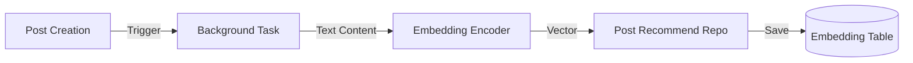

# Developer Manual: Embedding Module

The Embedding module (located in `src/modules/recommend`) is the system's vectorization engine, transforming text into numerical representations for search and recommendations.

## 1. Program Structure

This module is a purely computational utility that interfaces with machine learning models.

### Backend Structure (`okard-backend/src/modules/recommend`)
- [encoder.py](file:///Users/wisapat/Documents/Code/Git/okard-backend/src/modules/recommend/encoder.py): Public interface for encoding text lists into embeddings.
- [model.py](file:///Users/wisapat/Documents/Code/Git/okard-backend/src/modules/recommend/model.py): Singleton loader for the Transformer models.

---

## 2. Top-Down Functional Overview

The Embedding engine is a "Sync Utility" used by background tasks.

---

## 3. Subprogram Descriptions

### Backend: Encoder Layer ([encoder.py](file:///Users/wisapat/Documents/Code/Git/okard-backend/src/modules/recommend/encoder.py))

| Subprogram | Responsibility | Input | Output |
| :--- | :--- | :--- | :--- |
| `encode_texts` | Batches text strings and executes the model forward pass to generate vectors. | `List[str]` | `List[List[float]]` |
| `get_embedding_model`| (In model.py) Ensures the heavy ML model is only loaded into memory once. | N/A | `Model Instance` |

---

## 4. Communication & Parameters

1.  **Vector Dimensions**: The engine produces high-dimensional vectors (typically 384 or 768 depending on the specific model used).
2.  **Normalization**: Embeddings are returned as L2-normalized vectors, allowing downstream modules to use simple dot products for cosine similarity calculations.
3.  **Computational Cost**: Text encoding is a CPU/GPU intensive operation. It is **never** called directly from an API request and is always delegated to the `BackgroundTasks` system.
4.  **Language Support**: The model used is typically multi-lingual or localized to handle both English and the primary local language of the platform.
