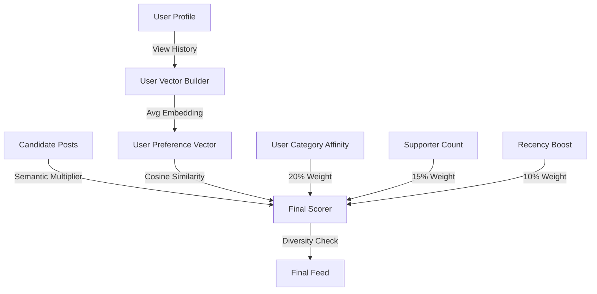

# Developer Manual: For You Module

The For You module provides a personalized recommendation feed for users, utilizing vector embeddings and behavioral analysis to surface relevant content.

## 1. Program Structure

The For You module is an advanced analytical service that combines several scoring factors into a final ranking.

### Backend Structure (`okard-backend/src/modules/for_you`)
- [service.py](file:///Users/wisapat/Documents/Code/Git/okard-backend/src/modules/for_you/service.py): The core recommendation engine, including user vector building and multi-factor scoring.
- [repo.py](file:///Users/wisapat/Documents/Code/Git/okard-backend/src/modules/for_you/repo.py): Fetches embeddings, view history, and category affinity metrics.
- [schema.py](file:///Users/wisapat/Documents/Code/Git/okard-backend/src/modules/for_you/schema.py): Data structures for scored campaign results.

### Frontend Structure
- [api/api.ts](file:///Users/wisapat/Documents/Code/Git/okard-frontend/src/modules/post/api/api.ts): The `getForYouCampaigns` function fetches the personalized list.
- Typically displayed in the "For You" tab of the Explore or Home page.

---

## 2. Top-Down Functional Overview

The module uses a hybrid approach: **Semantic Similarity + Category Affinity + Popularity + Freshness**.

---

## 3. Subprogram Descriptions

### Backend: Service Layer ([service.py](file:///Users/wisapat/Documents/Code/Git/okard-backend/src/modules/for_you/service.py))

| Subprogram | Responsibility | Input | Output |
| :--- | :--- | :--- | :--- |
| `for_you` | The main entry point that orchestrates fetching and scoring. | `db`, `user_id` | `List[ScoredCampaign]` |
| `_build_user_vector` | Creates a weighted average vector of the posts the user recently viewed. | `db`, `user_id` | `np.ndarray` |
| `diversity_penalty` | Reduces the score of posts that share a category with already-selected items. | `post`, `recent_posts`| `penalty` float |
| `inject_exploration` | Swaps a small percentage of top results with lower-ranked items to prevent echo chambers. | `scored` (List) | `List` |

---

## 4. Communication & Parameters

1.  **Scoring Weights**:
    - semantic similarity (vector dot product): 55%
    - user category affinity: 20%
    - popularity (supporter log): 15%
    - freshness (time decay): 10%
2.  **User Vector Decay**: The `_build_user_vector` function applies an exponential decay to older views, ensuring the vector reflects current interests.
3.  **Fallback**: If a user is new or has no view history, the system falls back to a global popularity-based feed.
4.  **Threshold**: A `MIN_SCORE` of 0.15 is applied to filter out low-quality matches.
