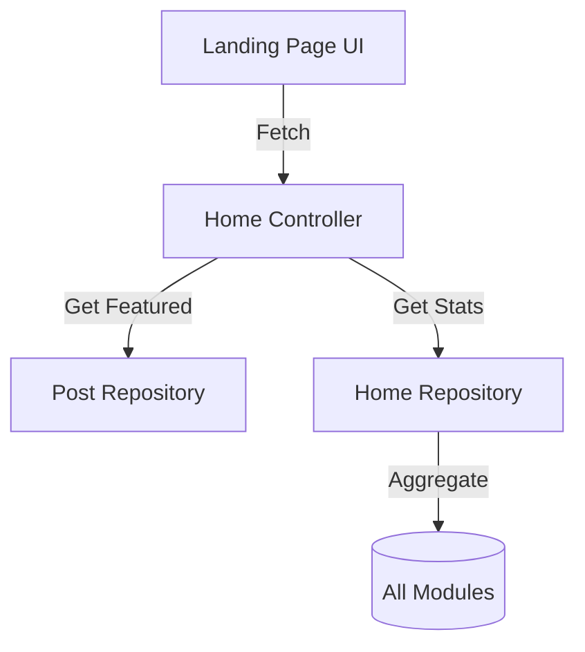

# Developer Manual: Home Module

The Home module is the platform's primary entry point, orchestrating the aggregation of featured content and category-wide activity metrics.

## 1. Program Structure

The Home module is a non-persistent aggregation layer that queries existing modules.

### Backend Structure (`okard-backend/src/modules/home`)
- [controller.py](file:///Users/wisapat/Documents/Code/Git/okard-backend/src/modules/home/controller.py): API for fetching the landing page's main datasets.
- [service.py](file:///Users/wisapat/Documents/Code/Git/okard-backend/src/modules/home/service.py): Business logic for selecting "Top Pledged" posts and calculating category stats.
- [repo.py](file:///Users/wisapat/Documents/Code/Git/okard-backend/src/modules/home/repo.py): Optimized SQL for cross-category aggregations.
- [schema.py](file:///Users/wisapat/Documents/Code/Git/okard-backend/src/modules/home/schema.py): Data structures for summary statistics.

### Frontend Structure
- Main landing page (`/` route) which consumes the Home API to render featured carousels and category filters.

---

## 2. Top-Down Functional Overview

The Home module serves as a "View Orchestrator".

---

## 3. Subprogram Descriptions

### Backend: Service Layer ([service.py](file:///Users/wisapat/Documents/Code/Git/okard-backend/src/modules/home/service.py))

| Subprogram | Responsibility | Input | Output |
| :--- | :--- | :--- | :--- |
| `get_top_pledged_campaigns` | Selects the most funded projects, optionally filtered by category. | `db`, `limit`, `category` | `List[Post]` |
| `get_category_stats_service`| Aggregates total projects, funded counts, and total amount raised per category. | `db` | `List[CategoryStat]` |

---

## 4. Communication & Parameters

1.  **Metric Calculation**: Category stats include `total_projects` (all states) vs `funded_projects` (those reaching their goal), providing a high-level overview of success rates.
2.  **Featured Content**: The "Top Pledged" logic prioritizes `current_amount` to showcase trending and high-impact campaigns.
3.  **Cross-Module Dependency**: While it doesn't have its own tables, the Home module depends heavily on the `Post` and `Payment` schemas.
4.  **UI Performance**: Results are often cached or served via a CDN on the frontend to ensure extremely fast initial page loads.
