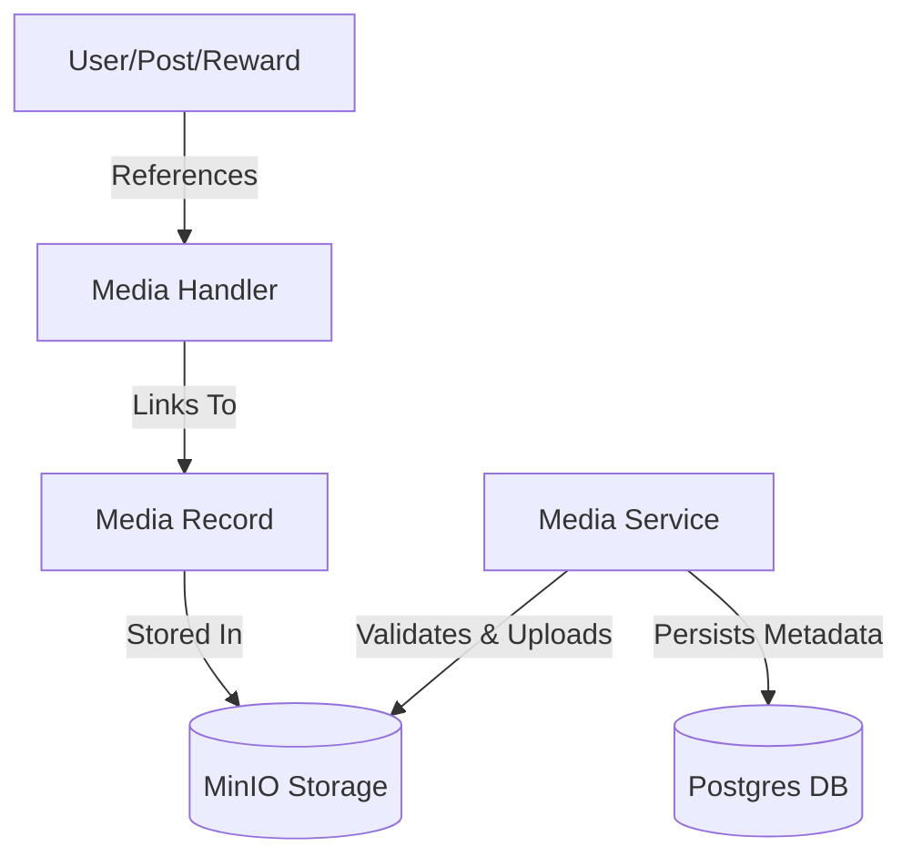

# Developer Manual: Media Module

The Media module provides a centralized file management service, handling uploads, storage in MinIO, and polymorphic associations with other system entities.

## 1. Program Structure

The Media module acts as the "Storage Layer" for all binary assets (images, videos, documents).

### Backend Structure (`okard-backend/src/modules/media`)
- [controller.py](file:///Users/wisapat/Documents/Code/Git/okard-backend/src/modules/media/controller.py): API for direct media uploads and deletions.
- [service.py](file:///Users/wisapat/Documents/Code/Git/okard-backend/src/modules/media/service.py): Core logic for file validation, MinIO integration, and metadata persistence.
- [repo.py](file:///Users/wisapat/Documents/Code/Git/okard-backend/src/modules/media/repo.py): SQL operations for `media` and `media_handler` tables.
- [model.py](file:///Users/wisapat/Documents/Code/Git/okard-backend/src/modules/media/model.py): Defines the `Media` attributes and the `MediaHandler` join table.
- [schema.py](file:///Users/wisapat/Documents/Code/Git/okard-backend/src/modules/media/schema.py): Validation schemas for media metadata.

### Shared Infrastructure
- [MinioService](file:///Users/wisapat/Documents/Code/Git/okard-backend/src/modules/common/minio_service.py): The underlying client for S3-compatible storage.

---

## 2. Top-Down Functional Overview

The module uses a **MediaHandler** pattern to support polymorphic relationships.

---

## 3. Subprogram Descriptions

### Backend: Service Layer ([service.py](file:///Users/wisapat/Documents/Code/Git/okard-backend/src/modules/media/service.py))

| Subprogram | Responsibility | Input | Output |
| :--- | :--- | :--- | :--- |
| `create_media_from_upload` | Handles single-file uploads with specific reference types (User/Post). | `db`, `file`, `post_id/clerk_id` | `Media` |
| `_save_files_and_create_media`| Bulk processing for campaigns/rewards, supporting `media_manifest` for ordering. | `db`, `parent_type`, `parent_id`, `files`, `manifest` | `List[Media]` |
| `delete_media` | Removes the database record and the physical file from MinIO. | `db`, `media_id` | `Media` (Deleted) |

---

## 4. Communication & Parameters

1.  **Validation Rules**:
    - **Images**: Max 5MB, formats: jpg, png, gif, webp.
    - **Videos**: Max 50MB, formats: mp4, mov, webm.
2.  **Display Order**: The `display_order` parameter allows the frontend to control the sequence of images in a gallery or campaign milestone.
3.  **MediaHandler**: This junction table stores a `reference_id` (UUID) and a `type` (Enum), allowing any module (Campaign, Reward, etc.) to "own" media without schema changes to the `Media` table itself.
4.  **Storage Paths**: Files are organized in MinIO following the pattern: `{parent_type}/{parent_id}/{unique_filename}`.
