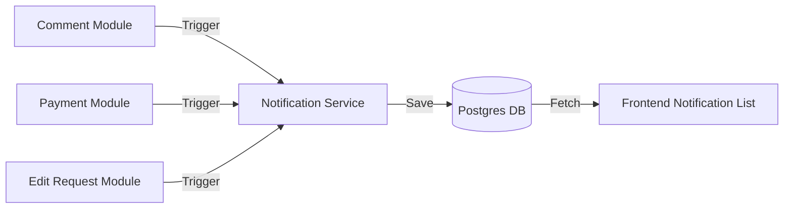

# Developer Manual: Notification Module

The Notification module provides a centralized alert system for informing users about social interactions, funding updates, and system changes.

## 1. Program Structure

The Notification module is a cross-cutting concern used by almost all other social and financial modules.

### Backend Structure (`okard-backend/src/modules/notification`)
- [controller.py](file:///Users/wisapat/Documents/Code/Git/okard-backend/src/modules/notification/controller.py): API for listing, marking as read, and deleting notifications.
- [service.py](file:///Users/wisapat/Documents/Code/Git/okard-backend/src/modules/notification/service.py): Logical operations for notification management.
- [repo.py](file:///Users/wisapat/Documents/Code/Git/okard-backend/src/modules/notification/repo.py): DB operations for the `notification` table.
- [model.py](file:///Users/wisapat/Documents/Code/Git/okard-backend/src/modules/notification/model.py): SQLAlchemy model defining `user_id` (recipient), `actor_id` (triggerer), and `type`.
- [schema.py](file:///Users/wisapat/Documents/Code/Git/okard-backend/src/modules/notification/schema.py): Validation schemas and notification types.

### Frontend Structure (`okard-frontend/src/modules/notification`)
- [NotificationComponent.tsx](file:///Users/wisapat/Documents/Code/Git/okard-frontend/src/modules/notification/NotificationComponent.tsx): Main UI for viewing the user's notification list.
- `components/`: List items and empty state views.

---

## 2. Top-Down Functional Overview

Notifications are generated by other modules and consumed by the Recipient.

---

## 3. Subprogram Descriptions

### Backend: Service Layer ([service.py](file:///Users/wisapat/Documents/Code/Git/okard-backend/src/modules/notification/service.py))

| Subprogram | Responsibility | Input | Output |
| :--- | :--- | :--- | :--- |
| `create_notification` | Persists a new notification and handles optional real-time hooks. | `db`, `notif_data` | `Notification` |
| `mark_all_as_read` | Updates all unread notifications for a specific user. | `db`, `user_id` | `count` of updated items |

---

## 4. Communication & Parameters

1.  **Notification Types**: Uses the `NotificationType` enum which includes `comment`, `payment`, `goal`, `edit_request`, and `system`.
2.  **Contextual Linking**: Each notification can optionally include a `post_id` or `comment_id`, allowing the frontend to navigate the user directly to the relevant content.
3.  **Actor vs. Recipient**: The `actor_id` identifies the user who performed the action (e.g., the commenter), while `user_id` identifies the recipient.
4.  **Automatic Cleanup**: Old notifications may be purged in accordance with data retention policies established in the repository layer.
