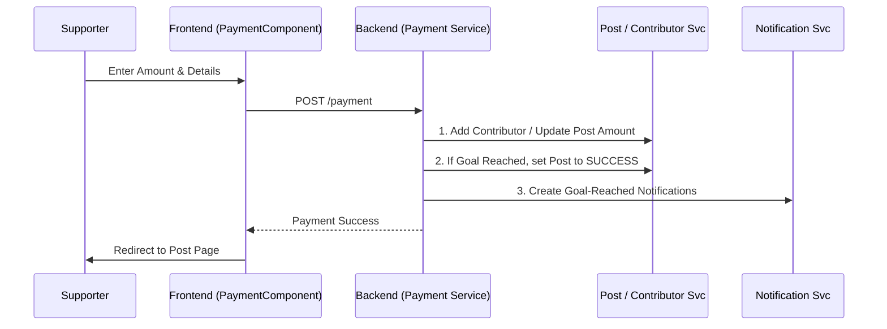

# Developer Manual: Payment Module

The Payment module handles the financial transactions within the platform, enabling users to support campaigns and tracking funding progress in real-time.

## 1. Program Structure

The Payment module is tightly integrated with the Post and Contributor modules to ensure data consistency during transactions.

### Backend Structure (`okard-backend/src/modules/payment`)
- [controller.py](file:///Users/wisapat/Documents/Code/Git/okard-backend/src/modules/payment/controller.py): API endpoints for processing payments and history retrieval.
- [service.py](file:///Users/wisapat/Documents/Code/Git/okard-backend/src/modules/payment/service.py): Crucial logic for handling transactions, updating post totals, and triggering success notifications.
- [repo.py](file:///Users/wisapat/Documents/Code/Git/okard-backend/src/modules/payment/repo.py): Basic persistence for payment records.
- [model.py](file:///Users/wisapat/Documents/Code/Git/okard-backend/src/modules/payment/model.py): Defines the `Payment` table with amount, method, and user/post references.
- [schema.py](file:///Users/wisapat/Documents/Code/Git/okard-backend/src/modules/payment/schema.py): Validation schemas for payment processing.

### Frontend Structure (`okard-frontend/src/modules/payment`)
- [api/api.ts](file:///Users/wisapat/Documents/Code/Git/okard-frontend/src/modules/payment/api/api.ts): Simple client for the `createPayment` endpoint.
- [PaymentComponent.tsx](file:///Users/wisapat/Documents/Code/Git/okard-frontend/src/modules/payment/PaymentComponent.tsx): The main checkout page orchestrator.
- `components/`:
    - `PaymentForm.tsx`: Form for user details and payment amount.
    - `PaymentMethod.tsx`: Payment provider selection (e.g., PromptPay).
    - `PaymentSummary.tsx`: Final cost breakdown and agreement logic.

---

## 2. Top-Down Functional Overview

The payment flow is a "Sync & Notify" pattern.

---

## 3. Subprogram Descriptions

### Backend: Service Layer ([service.py](file:///Users/wisapat/Documents/Code/Git/okard-backend/src/modules/payment/service.py))

| Subprogram | Responsibility | Input | Output |
| :--- | :--- | :--- | :--- |
| `create_payment` | Validates campaign status, records payment, and updates post-funding metrics. | `db`, `clerk_id`, `data` (Schema) | `Payment` object |
| `calculate_backup_amounts`| (Called via reward_service) Updates tiered funding calculations. | `db`, `post_id` | N/A |

### Frontend: UI Orchestrator ([PaymentComponent.tsx](file:///Users/wisapat/Documents/Code/Git/okard-frontend/src/modules/payment/PaymentComponent.tsx))

| Subprogram | Responsibility | Input | Output |
| :--- | :--- | :--- | :--- |
| `handleSubmit` | Validates form agreement and sends payload to backend. | Component State (Amount, Tip, etc.) | Navigation to Post Show |
| `useEffect (Load Post)` | Fetches target campaign data to show progress & header. | `postId` | Component State Update |

---

## 4. Communication & Parameters

1.  **Transaction Integrity**: The `create_payment` service in the backend wraps several operations (Payment record, Contributor update, Post amount update) which should ideally be within a database transaction block to ensure consistency.
2.  **External IDs**: Uses `clerk_id` from the frontend to resolve the local `user_id`.
3.  **State Transitions**: When a payment pushes `current_amount` above `goal_amount`, the service automatically flips the post's `state` from `published` to `success`.
4.  **Automatic Notifications**: Two types of notifications are fired on goal completion: one for the creator and separate broadcasts for all existing contributors via the `contributor_service`.
