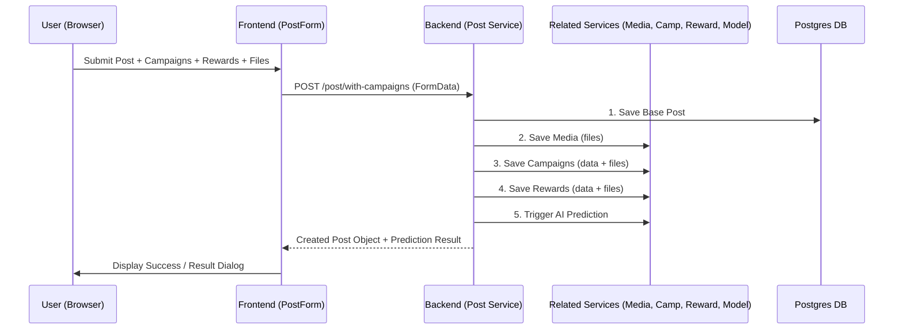

# Developer Manual: Post Module

The Post module is the core of the Okard platform, allowing creators to publish project campaigns, manage rewards, and interact with the community. It includes integrated AI predictions and complex media management.

## 1. Program Structure

The Post module involves multiple layers and integration with several other modules (Media, Campaign, Reward, Model).

### Backend Structure (`okard-backend/src/modules/post`)
- [controller.py](file:///Users/wisapat/Documents/Code/Git/okard-backend/src/modules/post/controller.py): API for post discovery, detailed view, and multipart creation/updates.
- [service.py](file:///Users/wisapat/Documents/Code/Git/okard-backend/src/modules/post/service.py): Orchestrates the complex creation of posts, campaigns, and rewards, plus AI prediction triggers.
- [repo.py](file:///Users/wisapat/Documents/Code/Git/okard-backend/src/modules/post/repo.py): Handles advanced PostgreSQL queries including full-text search and sorting filters.
- [model.py](file:///Users/wisapat/Documents/Code/Git/okard-backend/src/modules/post/model.py): Defines the `Post` model with its many relationships (Media, Campaigns, Rewards, etc.).
- [background.py](file:///Users/wisapat/Documents/Code/Git/okard-backend/src/modules/post/background.py): Handles asynchronous tasks like generating vector embeddings for search.

### Frontend Structure (`okard-frontend/src/modules/post`)
- [api/api.ts](file:///Users/wisapat/Documents/Code/Git/okard-frontend/src/modules/post/api/api.ts): Methods for multipart/form-data requests (`fetchPosts`, `createPost`, etc.).
- [PostComponent.tsx](file:///Users/wisapat/Documents/Code/Git/okard-frontend/src/modules/post/PostComponent.tsx): The "Explore" page controller managing search, filter, and sort state.
- `components/`:
    - `PostForm.tsx`: Large multi-step/section form for content creation.
    - `SideFilters.tsx`: Filter sidebar for category and status selection.
    - `PostList.tsx`: Grid display for post summaries.

---

## 2. Top-Down Functional Overview

The Post creation process is a "Heavy Orchestration" flow.

---

## 3. Subprogram Descriptions

### Backend: Controller Layer ([controller.py](file:///Users/wisapat/Documents/Code/Git/okard-backend/src/modules/post/controller.py))

| Subprogram | Responsibility | Input | Output |
| :--- | :--- | :--- | :--- |
| `list_posts` | Handles discovery with multiple query params. | `category`, `q`, `sort`, `state` | `list[PostOut]` |
| `create` | Deep-creates a post and all its children from FormData. | `post_data`, `media`, `campaigns`, `rewards` | `PostOut` |
| `get_post_community` | Retrieves supporter statistics and city-based distribution. | `post_id` | `PostCommunityOut` |

### Backend: Service Layer ([service.py](file:///Users/wisapat/Documents/Code/Git/okard-backend/src/modules/post/service.py))

| Subprogram | Responsibility | Input | Output |
| :--- | :--- | :--- | :--- |
| `create_post` | Primary orchestrator for cross-module object creation. | `db`, `clerk_id`, `post_data`, `files...` | `Post` object |
| `update_post` | Handles complex diffing/patching of campaigns and rewards. | `db`, `post_id`, `post_data`, `payloads...` | `Post` object |
| `update_prediction` | Prepares post features and calls AI Prediction service. | `db`, `post_id` | N/A (Updates DB) |

### Frontend: Components ([components/](file:///Users/wisapat/Documents/Code/Git/okard-frontend/src/modules/post/components))

| Subprogram | Responsibility | Input | Output |
| :--- | :--- | :--- | :--- |
| `PostComponent` | Global exploration state manager (URL sync). | `searchParams` | Explore UI |
| `PostForm` | Form state management for complex nested objects. | `initialData` (Optional) | `FormData` Submission |

---

## 4. Communication & Parameters

1.  **Orchestrated FormData**: Creation/Updates use a single `FormData` object containing:
    - `data`: JSON string of the post header/description.
    - `campaigns`/`rewards`: JSON strings of the nested object lists.
    - `media`/`campaign_media`/`reward_media`: List of files matching the JSON indices 1:1.
2.  **State Management**: Posts transition through states: `draft` -> `published` -> `success` / `failed` / `archived`.
3.  **Cross-Module Dependency**: The Post module directly calls `CampaignService`, `RewardService`, `MediaService`, and `ModelService` within its transaction block in `service.py`.
4.  **AI Integration**: Upon creation/edit, the post's text and metadata are sent to the prediction model to estimate success risk and goal feasibility.
