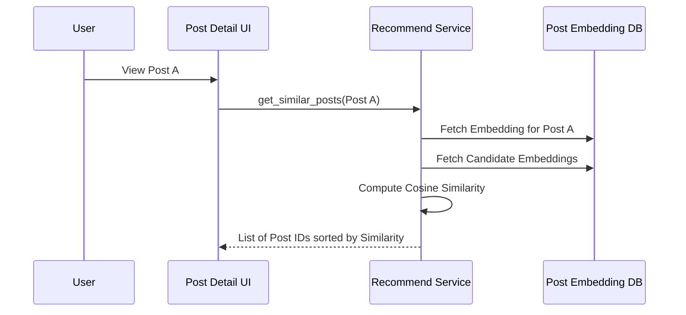

# Developer Manual: Post Recommendation Module

The Post Recommendation module provides "Similar Posts" suggestions based on content-based filtering and vector similarity.

## 1. Program Structure

This module focuses on item-to-item similarity, helping users discover content related to what they are currently viewing.

### Backend Structure (`okard-backend/src/modules/post_recommend`)
- [service.py](file:///Users/wisapat/Documents/Code/Git/okard-backend/src/modules/post_recommend/service.py): Calculates similarity between a source post and candidate posts.
- [repo.py](file:///Users/wisapat/Documents/Code/Git/okard-backend/src/modules/post_recommend/repo.py): Fetches embeddings from the `post_embedding` table.
- [schema.py](file:///Users/wisapat/Documents/Code/Git/okard-backend/src/modules/post_recommend/schema.py): Simple response schemas for post IDs and scores.

### Frontend Structure
- [api/api.ts](file:///Users/wisapat/Documents/Code/Git/okard-frontend/src/modules/post/api/api.ts): `fetchRecommendedPosts` retrieves related items for the Post Detail page.

---

## 2. Top-Down Functional Overview

The system uses high-dimensional vector embeddings generated for each post's title and description.

---

## 3. Subprogram Descriptions

### Backend: Service Layer ([service.py](file:///Users/wisapat/Documents/Code/Git/okard-backend/src/modules/post_recommend/service.py))

| Subprogram | Responsibility | Input | Output |
| :--- | :--- | :--- | :--- |
| `recommend_by_post` | Main logic for calculating top-k similar posts. | `db`, `post_id`, `top_k` | `List[dict]` |
| `fallback_same_category`| (Repo Level) Provides random items if embeddings are missing. | `db`, `post`, `limit` | `List[Post]` |

---

## 4. Communication & Parameters

1.  **Vector Dot Product**: Because embeddings are normalized, the system uses a simple dot product (`vec @ source_vec`) to determine similarity scores efficiently.
2.  **Fallback Logic**: If a post is new and its embedding hasn't been generated yet (background task pending), the module defaults to surface items from the same category.
3.  **Top-K**: The default value is 5, but the API allows the caller to specify a custom limit.
4.  **Data Source**: Reads from a specialized `post_embedding` table to avoid overloading the primary `post` table with large binary data.
