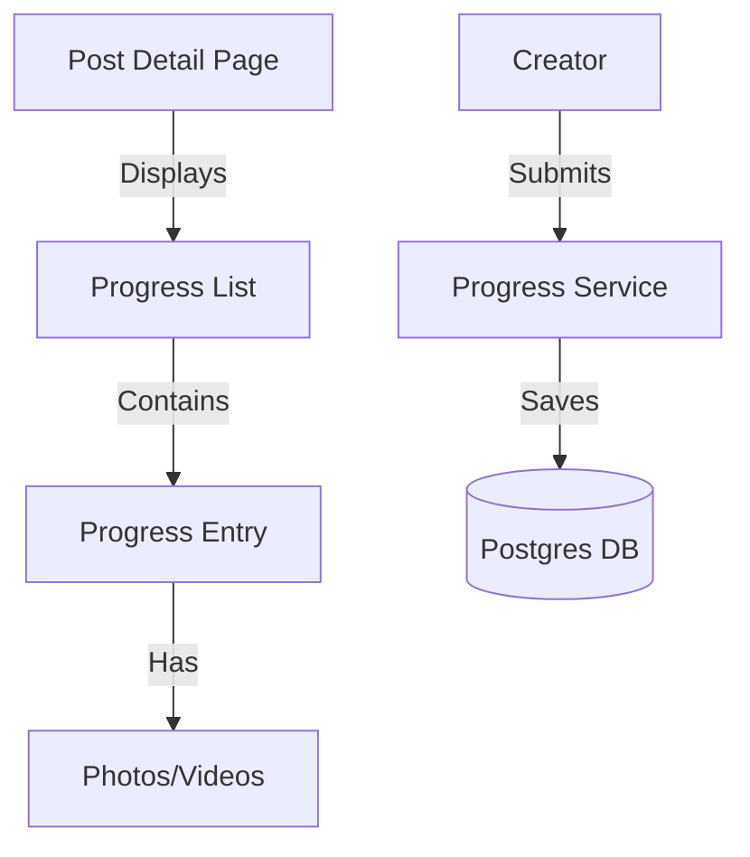

# Developer Manual: Progress Module

The Progress module allows creators to post regular updates to their supporters, documenting project development and transparency.

## 1. Program Structure

The Progress module operates as a dedicated "Activity Feed" for each project.

### Backend Structure (`okard-backend/src/modules/progress`)
- [controller.py](file:///Users/wisapat/Documents/Code/Git/okard-backend/src/modules/progress/controller.py): API for posting and retrieving project updates.
- [service.py](file:///Users/wisapat/Documents/Code/Git/okard-backend/src/modules/progress/service.py): Manages text content and associated gallery images.
- [repo.py](file:///Users/wisapat/Documents/Code/Git/okard-backend/src/modules/progress/repo.py): DB operations for the `progress` table.
- [model.py](file:///Users/wisapat/Documents/Code/Git/okard-backend/src/modules/progress/model.py): SQLAlchemy model for updates linked to a `post_id`.
- [schema.py](file:///Users/wisapat/Documents/Code/Git/okard-backend/src/modules/progress/schema.py): Validation schemas.

### Frontend Structure (`okard-frontend/src/modules/progress`)
- [types.ts](file:///Users/wisapat/Documents/Code/Git/okard-frontend/src/modules/progress/types.ts): TypeScript interfaces for progress entries.
- [components/ProgressComposer.tsx](file:///Users/wisapat/Documents/Code/Git/okard-frontend/src/modules/progress/components/ProgressComposer.tsx): Form for creators to write updates.
- Integrated into the "Updates" tab of the Post Detail page.

---

## 2. Top-Down Functional Overview

Progress updates provide a linear timeline of project evolution.

---

## 3. Subprogram Descriptions

### Backend: Service Layer ([service.py](file:///Users/wisapat/Documents/Code/Git/okard-backend/src/modules/progress/service.py))

| Subprogram | Responsibility | Input | Output |
| :--- | :--- | :--- | :--- |
| `create_progress_with_images` | Saves the update text and processes attached media files. | `db`, `progress_data`, `files` | `Progress` |
| `delete_progress` | Removes the update and cleans up its physical media from storage. | `db`, `progress_id` | `Progress` (Deleted) |

---

## 4. Communication & Parameters

1.  **Media Multiplicity**: An update can have multiple images attached, handled via the same `media_service` pattern used in the Post module.
2.  **Visibility**: Progress updates are public but are primarily targeted at existing supporters to maintain trust.
3.  **Reverse Chronology**: The API typically returns updates sorted by `created_at` in descending order.
