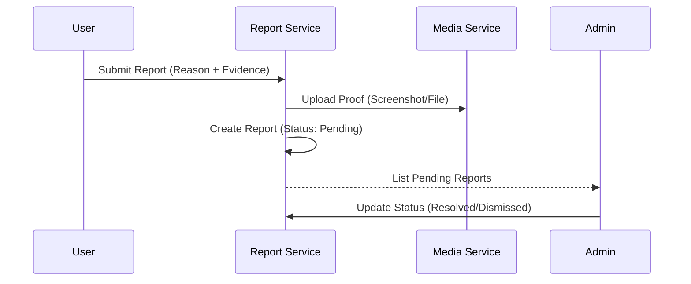

# Developer Manual: Report Module

The Report module facilitates community-driven moderation by allowing users to flag inappropriate content or potential fraud.

## 1. Program Structure

The Report module is a case-tracking system with a workflow for administrative review.

### Backend Structure (`okard-backend/src/modules/report`)
- [controller.py](file:///Users/wisapat/Documents/Code/Git/okard-backend/src/modules/report/controller.py): API for submitting reports and administrative listing.
- [service.py](file:///Users/wisapat/Documents/Code/Git/okard-backend/src/modules/report/service.py): Logic for saving reports and attaching evidence media.
- [repo.py](file:///Users/wisapat/Documents/Code/Git/okard-backend/src/modules/report/repo.py): DB operations for the `report` table.
- [model.py](file:///Users/wisapat/Documents/Code/Git/okard-backend/src/modules/report/model.py): SQLAlchemy model defining `reporter_id`, `reported_item_id`, `reason`, and `status`.
- [schema.py](file:///Users/wisapat/Documents/Code/Git/okard-backend/src/modules/report/schema.py): Validation schemas.

---

## 2. Top-Down Functional Overview

The report workflow moves from user submission to administrative resolution.

---

## 3. Subprogram Descriptions

### Backend: Service Layer ([service.py](file:///Users/wisapat/Documents/Code/Git/okard-backend/src/modules/report/service.py))

| Subprogram | Responsibility | Input | Output |
| :--- | :--- | :--- | :--- |
| `create_report` | Saves the report text and processes one or more evidence files. | `db`, `reporter_id`, `data`, `files` | `Report` |
| `update_report_status`| Allows administrators to change report state. | `db`, `report_id`, `status` | `Report` |

---

## 4. Communication & Parameters

1.  **Polymorphic Reporting**: While currently used for Posts, the schema allows `reported_item_id` to refer to various entities via the `target_type` parameter if extended.
2.  **Evidence Management**: Reports utilize the `media_service` logic to store files in a dedicated `report/` folder in MinIO.
3.  **Status Flow**: Reports start as `pending` and can transition to `investigating`, `resolved`, or `spam`.
4.  **Anonymity Policy**: While the `reporter_id` is stored for internal record-keeping, it is typically masked in the administrative dashboard to protect the whistleblower.
