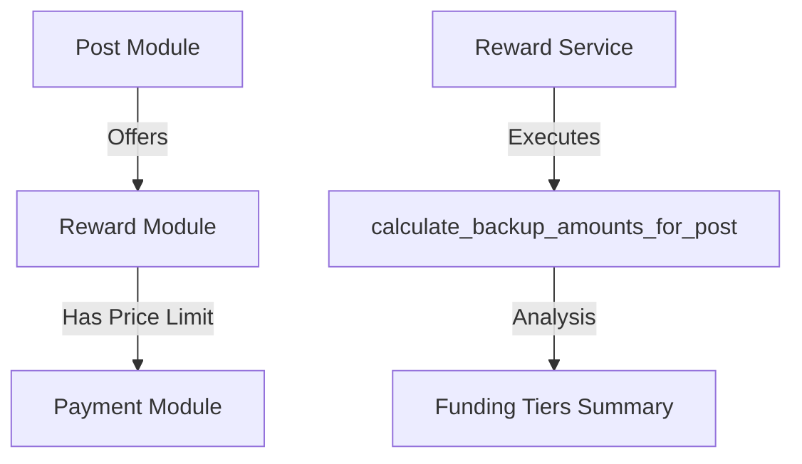

# Developer Manual: Reward Module

The Reward module governs the incentive system for supporters, allowing creators to offer perks (physical or digital) at different funding tiers.

## 1. Program Structure

Like Campaigns, Reward entities are child nodes of a Post and are tightly integrated into the content creation flow.

### Backend Structure (`okard-backend/src/modules/reward`)
- [service.py](file:///Users/wisapat/Documents/Code/Git/okard-backend/src/modules/reward/service.py): Manages reward business logic and triggers funding tier calculations.
- [repo.py](file:///Users/wisapat/Documents/Code/Git/okard-backend/src/modules/reward/repo.py): Handles persistent storage and complex tier-based aggregations.
- [model.py](file:///Users/wisapat/Documents/Code/Git/okard-backend/src/modules/reward/model.py): SQLAlchemy model defining reward attributes (price, quantity, estimated delivery).
- [schema.py](file:///Users/wisapat/Documents/Code/Git/okard-backend/src/modules/reward/schema.py): Pydantic validation schemas.

---

## 2. Top-Down Functional Overview

Rewards create a structured incentive layer for supporters.

---

## 3. Subprogram Descriptions

### Backend: Service Layer ([service.py](file:///Users/wisapat/Documents/Code/Git/okard-backend/src/modules/reward/service.py))

| Subprogram | Responsibility | Input | Output |
| :--- | :--- | :--- | :--- |
| `create_reward_with_media` | Creates reward record and associates images. | `db`, `reward_data` (List), `files` | `List[Reward]` |
| `update_reward_with_media` | Updates reward details and optionally replaces its image. | `db`, `reward_id`, `data`, `files` | `Reward` |
| `calculate_backup_amounts` | Re-calculates reward tier distribution based on new payments. | `db`, `post_id` | N/A (Updates Repo) |

---

## 4. Communication & Parameters

1.  **Funding Tiers**: The `price` parameter in the Reward schema dictates the minimum amount a supporter must pay to claim that reward.
2.  **Tier Analysis**: The `calculate_backup_amounts_for_post` function is triggered automatically after any payment or reward update to refresh the "Supporter Breakdown" statistics.
3.  **Media Handling**: Each reward typically features a representative image, which is managed via the `MediaService`.
4.  **Integration**: The `Reward` model maintains a `post_id` foreign key.
