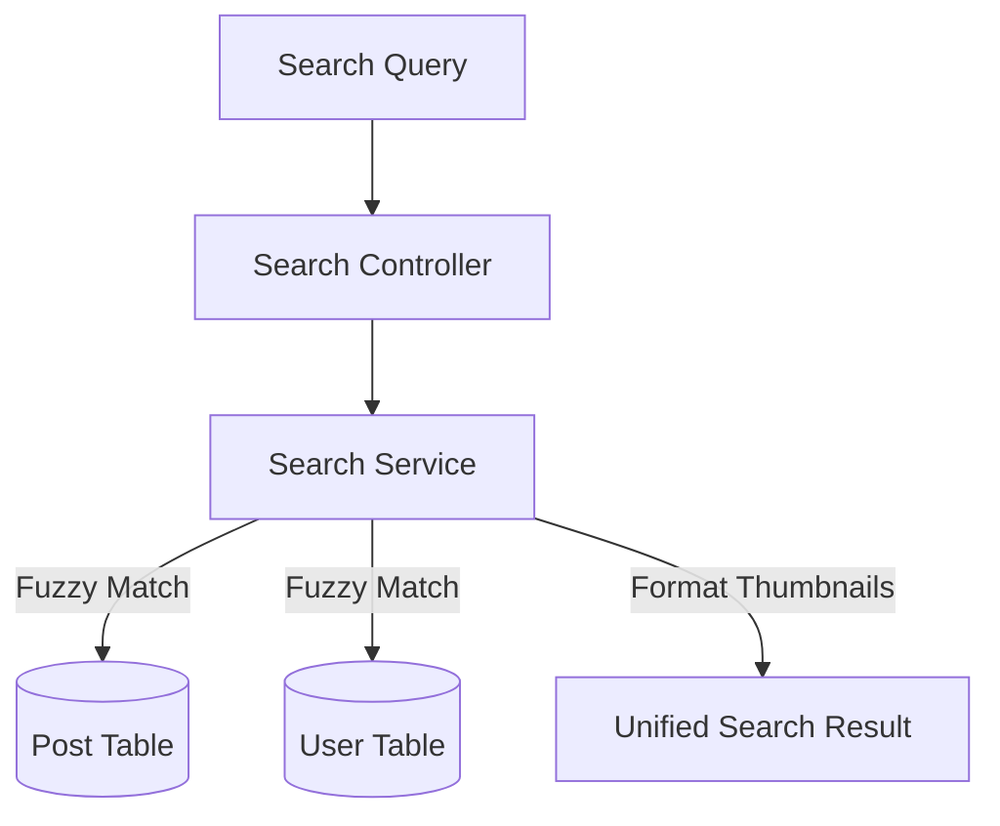

# Developer Manual: Search Module

The Search module provides keyword-based discovery for campaigns and creators across the platform.

## 1. Program Structure

The Search module is a read-only service that aggregates data from multiple entity tables.

### Backend Structure (`okard-backend/src/modules/search`)
- [controller.py](file:///Users/wisapat/Documents/Code/Git/okard-backend/src/modules/search/controller.py): API for performing global searches.
- [service.py](file:///Users/wisapat/Documents/Code/Git/okard-backend/src/modules/search/service.py): Orchestrates fetching from repo and formatting results (e.g., building thumbnail URLs).
- [repo.py](file:///Users/wisapat/Documents/Code/Git/okard-backend/src/modules/search/repo.py): Contains native SQL or ORM queries for name and description fuzzy matching.
- [schemas.py](file:///Users/wisapat/Documents/Code/Git/okard-backend/src/modules/search/schemas.py): Defines the unified `SearchResult` and `SearchResponse` structures.

### Frontend Structure
- Integrated into the global search bar and the search results page.

---

## 2. Top-Down Functional Overview

The Search module acts as a "Broadcaster" to various entity repositories.

---

## 3. Subprogram Descriptions

### Backend: Service Layer ([service.py](file:///Users/wisapat/Documents/Code/Git/okard-backend/src/modules/search/service.py))

| Subprogram | Responsibility | Input | Output |
| :--- | :--- | :--- | :--- |
| `search` | Main entry point that combines user and post results into a single list. | `db`, `query`, `request` | `SearchResponse` |
| `build_image_url` | Formats a relative storage path into a fully qualified URL for the frontend. | `request`, `path` | `str` (URL) |

---

## 4. Communication & Parameters

1.  **Fuzzy Searching**: The repository typically uses case-insensitive `LIKE` or `ILIKE` operations on the `post_header` and `post_description` fields.
2.  **Polymorphic Results**: Results are returned with a `type` field ("user" or "post"), allowing the frontend to render appropriate icons and link to correct routes.
3.  **Thumbnail Selection**: When a post has multiple images, the service layer prefers images over other media types for the search result thumbnail.
4.  **Performance**: For high-volume environments, this module is a candidate for full-text search indexing (e.g., GiST/GIN in Postgres) or external indexing (Elasticsearch).
