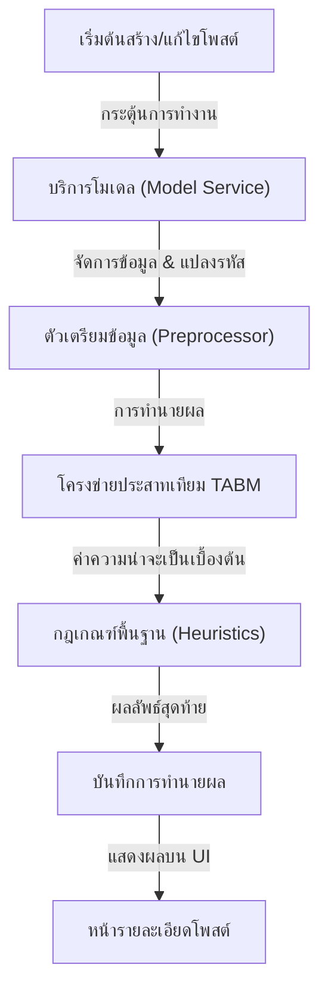

# คู่มือสำหรับนักพัฒนา: โมดูล AI Model (AI Model Module)

โมดูล AI Model (ระบบทำนายผล) ทำหน้าที่ประเมินโอกาสความสำเร็จและความเสี่ยงของแคมเปญต่างๆ โดยอัตโนมัติ โดยใช้เทคนิคการเรียนรู้เชิงลึก (Deep Learning)

## 1. โครงสร้างโปรแกรม (Program Structure)

โมดูลนี้รวบรวม "ชั้นการประมวลผลอัจฉริยะ" (Intelligence Layer) ของแพลตฟอร์ม โดยใช้โมเดล PyTorch ที่ผ่านการฝึกฝนมาแล้ว

### โครงสร้างฝั่ง Backend (`okard-backend/src/modules/model`)
- [service.py](file:///Users/wisapat/Documents/Code/Git/okard-backend/src/modules/model/service.py): จัดการลำดับการทำงานตั้งแต่การเตรียมข้อมูล (Pre-processing), การทำนายผล (Model Inference), และการตรวจสอบความปลอดภัยตามกฎที่กำหนด (Rule-based safety checks)
- [loader.py](file:///Users/wisapat/Documents/Code/Git/okard-backend/src/modules/model/loader.py): จัดการการโหลดไฟล์โมเดล `.pth` และโครงสร้างโมเดลแบบ TABM
- [mapping.py](file:///Users/wisapat/Documents/Code/Git/okard-backend/src/modules/model/mapping.py): แปลงค่าผลลัพธ์ที่เป็นตัวเลขจากโมเดลให้เป็นข้อความที่มนุษย์เข้าใจได้ (เช่น "ความเสี่ยงสูง", "มีแนวโน้มสำเร็จ")
- [tabm_model.py](file:///Users/wisapat/Documents/Code/Git/okard-backend/src/modules/model/tabm_model.py): คำนิยามโครงสร้างของ Tabular Model ที่ใช้ในการทำนายผล

### สินทรัพย์ข้อมูล (Data Assets)
- `tabm_model.pth`: ไฟล์ค่าน้ำหนักของโมเดลที่ผ่านการฝึกฝนแล้ว (Trained model weights)
- `model_config.json`: ไฟล์ค่าที่ตั้งไว้ (Hyperparameters) และการตั้งค่าต่างๆ
- `pkl_files/`: ไฟล์ Scalers และ Encoders สำหรับการปรับค่าข้อมูลให้เป็นมาตรฐาน (Data normalization)

---

## 2. ภาพรวมการทำงาน (Top-Down Functional Overview)

ระบบใช้แนวทางการทำนายผลแบบ **Hybrid Inference** (ใช้ทั้ง Machine Learning และกฎเกณฑ์พื้นฐาน)

---

## 3. คำอธิบายโปรแกรมย่อย (Subprogram Descriptions)

### Backend: ชั้นบริการ (Service Layer - [service.py](file:///Users/wisapat/Documents/Code/Git/okard-backend/src/modules/model/service.py))

| โปรแกรมย่อย | หน้าที่ความรับผิดชอบ | ข้อมูลเข้า (Input) | ข้อมูลออก (Output) |
| :--- | :--- | :--- | :--- |
| `predict` | รันกระบวนการทั้งหมด: ตั้งแต่เตรียมข้อมูล -> ทำนายผล -> หลังประมวลผล -> แปลงผลลัพธ์ | `db`, `data`, `post_id`, `save` | `PredictionResults` |
| `preprocess` | (อยู่ใน loader.py) แปลงข้อมูลโพสต์แบบ JSON ให้เป็นรูปแบบตัวเลข (Numerical tensors) เพื่อส่งให้โมเดลประมวลผล | `InputData` | `(num_tensor, cat_tensor)` |

---

## 4. การสื่อสารและพารามิเตอร์ (Communication & Parameters)

1.  **งานทำนายผล (Prediction Tasks)**: จะถูกเรียกทำงานอัตโนมัติผ่านคิว `BackgroundTasks` หลังจากที่มีการสร้างโพสต์ หรือมีการแก้ไขเนื้อหาหลัก/งบประมาณ
2.  **หมวดหมู่ผลลัพธ์**:
    - `success_cls`: ความน่าจะเป็นในการบรรลุเป้าหมายการระดมทุน
    - `risk_level`: การประเมินความปลอดภัยของโครงการโดยดูจาก งบประมาณ/ระยะเวลา/สัดส่วนสื่อ (รูปภาพ/วิดีโอ)
3.  **การควบคุมด้วยกฎเกณฑ์ (Heuristic Overrides)**: ระบบมี "กฎความปลอดภัยที่เข้มงวด" (เช่น แคมเปญที่มีระยะเวลา 45 วันแต่ไม่มีวิดีโอประกอบ จะถูกทำเครื่องหมายเป็น "ความเสี่ยงสูง" โดยอัตโนมัติ ไม่ว่าผลลัพธ์จาก ML จะเป็นอย่างไร)
4.  **การเร่งความเร็วด้วยฮาร์ดแวร์**: การทำนายผลทำบน `cpu` เป็นค่าเริ่มต้น (กำหนดไว้ใน `loader.py`) เพื่อรักษาต้นทุนโครงสร้างพื้นฐานให้ต่ำ เนื่องจากโมเดลแบบ Tabular มีประสิทธิภาพในการประมวลผลสูงอยู่แล้ว
