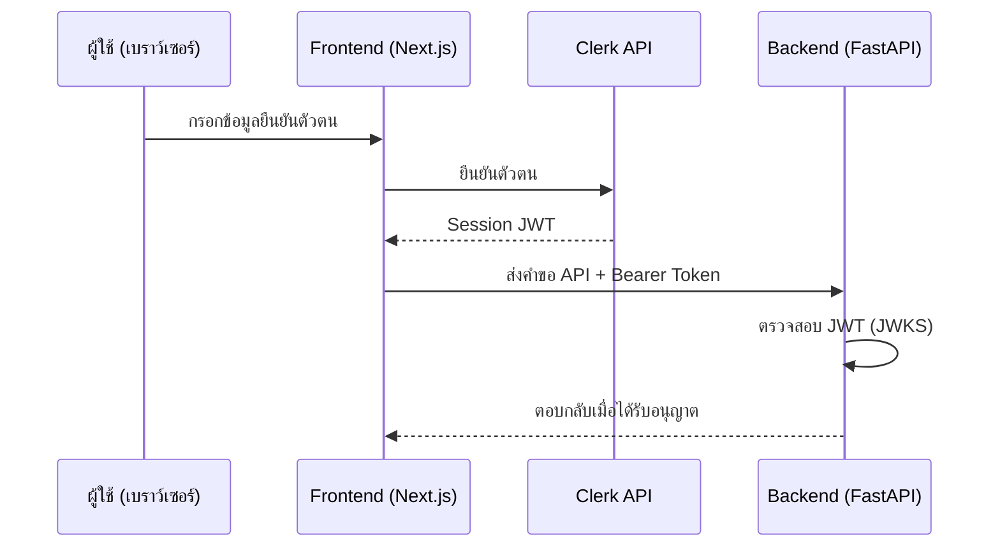

# คู่มือสำหรับนักพัฒนา: โมดูลการยืนยันตัวตน (Auth Module)

โมดูล Auth ทำหน้าที่จัดการการยืนยันตัวตนผู้ใช้และการจัดการเซสชัน (Session Management) โดยใช้ **Clerk** นอกจากนี้ยังมีการควบคุมการเข้าถึงที่ปลอดภัยสำหรับทั้งฝั่ง Frontend และ Backend

## 1. โครงสร้างโปรแกรม (Program Structure)

โมดูล Auth ถูกรวมเข้ากับทั้งส่วนหลังบ้าน (Backend) และส่วนหน้าบ้าน (Frontend)

### โครงสร้างฝั่ง Backend (`okard-backend/src/modules/auth.py`)
- [auth.py](file:///Users/wisapat/Documents/Code/Git/okard-backend/src/modules/auth.py): ประกอบด้วยตรรกะสำหรับการตรวจสอบความถูกต้องของ JWT ที่ออกโดย Clerk

### โครงสร้างฝั่ง Frontend (`okard-frontend/src/modules/auth`)
- [components/SignInComponent.tsx](file:///Users/wisapat/Documents/Code/Git/okard-frontend/src/modules/auth/components/SignInComponent.tsx): ส่วนติดต่อผู้ใช้สำหรับการเข้าสู่ระบบ
- [components/SignUpComponent.tsx](file:///Users/wisapat/Documents/Code/Git/okard-frontend/src/modules/auth/components/SignUpComponent.tsx): ส่วนติดต่อผู้ใช้สำหรับการลงทะเบียน
- **เส้นทางแอป (App Routes)**: อยู่ใน `/src/app/sign-in`, `/src/app/sign-up`, และ `/src/app/sso-callback`

---

## 2. ภาพรวมการทำงาน (Top-Down Functional Overview)

ระบบใช้ Clerk เป็นผู้ให้บริการระบุตัวตน (Identity Provider)

---

## 3. คำอธิบายโปรแกรมย่อย (Subprogram Descriptions)

### Backend: ตรรกะการยืนยันตัวตน (Auth Logic - [auth.py](file:///Users/wisapat/Documents/Code/Git/okard-backend/src/modules/auth.py))

| โปรแกรมย่อย | หน้าที่ความรับผิดชอบ | ข้อมูลเข้า (Input) | ข้อมูลออก (Output) |
| :--- | :--- | :--- | :--- |
| `get_current_user` | ตัวช่วยจัดการ (Dependency) ที่ตรวจสอบความถูกต้องของ Bearer token ในส่วนหัวของคำขอ | `token` (Bearer Token) | `payload` (ข้อมูล JWT ที่ถอดรหัสแล้ว) หรือข้อผิดพลาด 401 |
| `get_optional_current_user` | ตัวช่วยจัดการที่เป็นทางเลือก ซึ่งจะส่งกลับ `None` แทนที่จะส่งข้อผิดพลาดหากไม่พบ token หรือ token ไม่ถูกต้อง | `token` (เลือกใส่ได้) | `payload` หรือ `None` |

### Frontend: ส่วนประกอบการยืนยันตัวตน (Auth Components - [components/](file:///Users/wisapat/Documents/Code/Git/okard-frontend/src/modules/auth/components))

| โปรแกรมย่อย | หน้าที่ความรับผิดชอบ | ข้อมูลเข้า (Input) | ข้อมูลออก (Output) |
| :--- | :--- | :--- | :--- |
| `SignInComponent` | จัดการแบบฟอร์มการเข้าสู่ระบบและการทำงานร่วมกับ hook `useSignIn` | ฟิลด์ข้อมูล (username, password) | การเปิดใช้งานเซสชันและการเปลี่ยนหน้า |
| `SignUpComponent` | จัดการแบบฟอร์มการลงทะเบียนและการทำงานร่วมกับ hook `useSignUp` | ฟิลด์ข้อมูล (email, password ฯลฯ) | ขั้นตอนการตรวจสอบ / เสร็จสิ้นการลงทะเบียน |

---

## 4. การสื่อสารและพารามิเตอร์ (Communication & Parameters)

1.  **การจัดการ Token**: Frontend จะได้รับ JWT จาก Clerk และส่งไปในส่วนหัว `Authorization` ในรูปแบบ `Bearer <token>`
2.  **การตรวจสอบ JWT**: Backend จะดึงชุดกุญแจสาธารณะ (JWKS) จาก URL ของ Clerk และใช้กุญแจเหล่านั้นในการถอดรหัสและตรวจสอบความถูกต้องของ token ที่ส่งเข้ามา
3.  **ข้อมูล Payload**: `payload` ที่ถอดรหัสแล้วจะมี `sub` (รหัสผู้ใช้ของ Clerk) ซึ่งจะถูกใช้โดยโมดูล Backend อื่นๆ (เช่น `User` และ `Creator`) เพื่อระบุตัวตนของผู้ใช้
