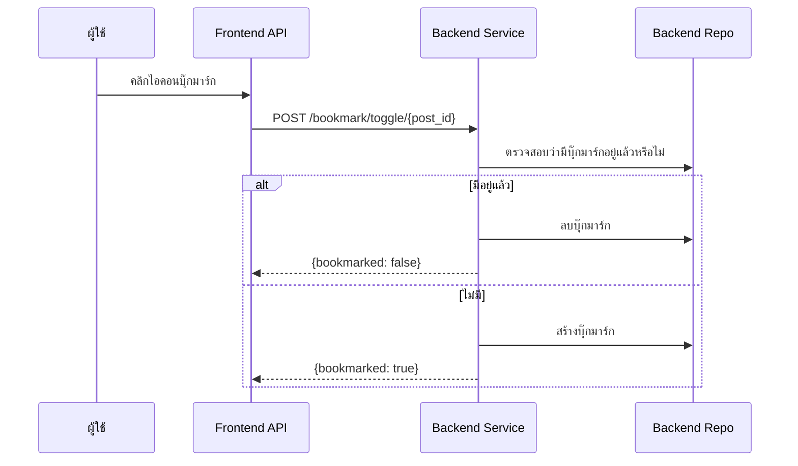

# คู่มือสำหรับนักพัฒนา: โมดูลบุ๊กมาร์ก (Bookmark Module)

โมดูลบุ๊กมาร์กช่วยให้ผู้ใช้สามารถบันทึกโพสต์ไว้ในคอลเลกชันส่วนตัวเพื่อความสะดวกในการเข้าถึงในภายหลัง

## 1. โครงสร้างโปรแกรม (Program Structure)

โมดูลบุ๊กมาร์กเป็นยูทิลิตี้ขนาดเล็กที่เชื่อมโยงผู้ใช้และโพสต์เข้าด้วยกัน

### โครงสร้างฝั่ง Backend (`okard-backend/src/modules/bookmark`)
- [controller.py](file:///Users/wisapat/Documents/Code/Git/okard-backend/src/modules/bookmark/controller.py): API สำหรับการสลับสถานะบุ๊กมาร์กและการดึงข้อมูลโพสต์ที่บันทึกไว้
- [service.py](file:///Users/wisapat/Documents/Code/Git/okard-backend/src/modules/bookmark/service.py): ตรรกะทางธุรกิจสำหรับการสลับสถานะ (สร้างหรือลบ)
- [repo.py](file:///Users/wisapat/Documents/Code/Git/okard-backend/src/modules/bookmark/repo.py): การดำเนินการฐานข้อมูลสำหรับตาราง `bookmark`
- [model.py](file:///Users/wisapat/Documents/Code/Git/okard-backend/src/modules/bookmark/model.py): โมเดล SQLAlchemy ที่กำหนดคู่ของ `user_id` และ `post_id`
- [schema.py](file:///Users/wisapat/Documents/Code/Git/okard-backend/src/modules/bookmark/schema.py): โครงสร้างข้อมูล (Schemas) สำหรับการตอบกลับพื้นฐาน

### โครงสร้างฝั่ง Frontend
- [api/api.ts](file:///Users/wisapat/Documents/Code/Git/okard-frontend/src/modules/bookmark/api/api.ts): ตัวเชื่อมต่อ API สำหรับการสลับสถานะและการดึงข้อมูลบุ๊กมาร์ก

---

## 2. ภาพรวมการทำงาน (Top-Down Functional Overview)

โมดูลบุ๊กมาร์กทำงานเสมือนตารางเชื่อมโยง (Join table) แบบง่ายพร้อมตรรกะการสลับสถานะ

---

## 3. คำอธิบายโปรแกรมย่อย (Subprogram Descriptions)

### Backend: ชั้นบริการ (Service Layer - [service.py](file:///Users/wisapat/Documents/Code/Git/okard-backend/src/modules/bookmark/service.py))

| โปรแกรมย่อย | หน้าที่ความรับผิดชอบ | ข้อมูลเข้า (Input) | ข้อมูลออก (Output) |
| :--- | :--- | :--- | :--- |
| `toggle_bookmark` | จัดลำดับตรรกะการสร้าง/ลบตามสถานะที่มีอยู่ | `db`, `user_id`, `post_id` | `{"bookmarked": bool}` |
| `get_bookmarks` | ดึงรายการโพสต์ที่ผู้ใช้ระบุบุ๊กมาร์กไว้แบบแบ่งหน้า | `db`, `user_id`, `skip`, `limit` | `list[Bookmark]` |

---

## 4. การสื่อสารและพารามิเตอร์ (Communication & Parameters)

1.  **การสลับสถานะ**: Backend จะไม่มีจุดเชื่อมต่อ (Endpoint) สำหรับ "สร้าง" และ "ลบ" แยกกันสำหรับบุ๊กมาร์ก แต่จะใช้จุดเชื่อมต่อ `toggle` เพียงจุดเดียวเพื่อลดความซับซ้อนในการจัดการฝั่ง Frontend
2.  **บริบทผู้ใช้ (User Context)**: `user_id` จะถูกนำมาจากเซสชันของ Clerk ที่ได้รับการยืนยันตัวตนแล้วเสมอ
3.  **การตอบสนองบน UI**: Frontend ใช้ผลลัพธ์แบบ Boolean จาก `toggle_bookmark` เพื่ออัปเดตสถานะภาพของไอคอนบุ๊กมาร์กทันที (แบบทึบเทียบกับแบบเส้นขอบ)
