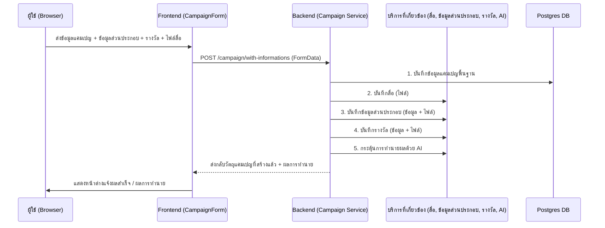

# คู่มือสำหรับนักพัฒนา: โมดูลแคมเปญ (Campaign Module)

โมดูลแคมเปญเป็นหัวใจสำคัญของแพลตฟอร์ม Okard ช่วยให้ผู้สร้างสามารถเผยแพร่แคมเปญโครงการ, จัดการข้อมูลส่วนประกอบ (Informations), จัดการของรางวัล (Rewards) และโต้ตอบกับชุมชน ตัวโมดูลยังประกอบด้วยการทำนายผลด้วย AI และการจัดการสื่อที่ซับซ้อน

## 1. โครงสร้างโปรแกรม (Program Structure)

โมดูลแคมเปญประกอบด้วยหลายชั้นและทำงานร่วมกับโมดูลอื่นๆ มากมาย (สื่อ, ข้อมูลส่วนประกอบ, รางวัล, โมเดล AI)

### โครงสร้างฝั่ง Backend (`okard-backend/src/modules/campaign`)
- [controller.py](file:///Users/wisapat/Documents/Code/Git/okard-backend/src/modules/campaign/controller.py): API สำหรับการค้นหาแคมเปญ, มุมมองรายละเอียด และการสร้าง/อัปเดตแบบหลายส่วน (Multipart)
- [service.py](file:///Users/wisapat/Documents/Code/Git/okard-backend/src/modules/campaign/service.py): จัดลำดับการสร้างสิ่งที่ซับซ้อน เช่น แคมเปญ, ข้อมูลส่วนประกอบ และรางวัล รวมถึงการกระตุ้นการทำนายผลด้วย AI
- [repo.py](file:///Users/wisapat/Documents/Code/Git/okard-backend/src/modules/campaign/repo.py): จัดการการสืบค้น PostgreSQL ขั้นสูงรวมถึงการค้นหาข้อความแบบเต็ม (Full-text search) และตัวกรองการจัดเรียง
- [model.py](file:///Users/wisapat/Documents/Code/Git/okard-backend/src/modules/campaign/model.py): กำหนดโมเดล `Campaign` พร้อมความสัมพันธ์ที่หลากหลาย (สื่อ, ข้อมูลส่วนประกอบ, รางวัล และอื่นๆ)
- [background.py](file:///Users/wisapat/Documents/Code/Git/okard-backend/src/modules/campaign/background.py): จัดการงานแบบอะซิงโครนัส เช่น การสร้างเวกเตอร์สำหรับการค้นหา

### โครงสร้างฝั่ง Frontend (`okard-frontend/src/modules/campaign`)
- [api/api.ts](file:///Users/wisapat/Documents/Code/Git/okard-frontend/src/modules/campaign/api/api.ts): วิธีการใช้คำขอแบบ multipart/form-data (`fetchCampaigns`, `createCampaign` และอื่นๆ)
- [CampaignComponent.tsx](file:///Users/wisapat/Documents/Code/Git/okard-frontend/src/modules/campaign/CampaignComponent.tsx): ตัวควบคุมหน้า "สำรวจ" (Explore) ที่จัดการสถานะการค้นหา, ตัวกรอง และการจัดเรียง
- `components/`:
    - `CampaignForm.tsx`: แบบฟอร์มขนาดใหญ่ที่มีหลายขั้นตอน/ส่วนประกอบสำหรับการสร้างเนื้อหา
    - `SideFilters.tsx`: แถบด้านข้างสำหรับกรองหมวดหมู่และเลือกสถานะ
    - `CampaignList.tsx`: การแสดงผลแบบตาราง (Grid) สำหรับข้อมูลสรุปของแคมเปญ

---

## 2. ภาพรวมการทำงาน (Top-Down Functional Overview)

กระบวนการสร้างแคมเปญเป็นกระบวนการที่มีการจัดลำดับการทำงานที่ค่อนข้าง "เข้มข้น" (Heavy Orchestration)

---

## 3. คำอธิบายโปรแกรมย่อย (Subprogram Descriptions)

### Backend: ชั้นคอนโทรลเลอร์ (Controller Layer - [controller.py](file:///Users/wisapat/Documents/Code/Git/okard-backend/src/modules/campaign/controller.py))

| โปรแกรมย่อย | หน้าที่ความรับผิดชอบ | ข้อมูลเข้า (Input) | ข้อมูลออก (Output) |
| :--- | :--- | :--- | :--- |
| `list_campaigns` | จัดการการค้นหาโครงการด้วยพารามิเตอร์ที่หลากหลาย | `category`, `q`, `sort`, `state` | `list[CampaignOut]` |
| `create` | สร้างแคมเปญและข้อมูลส่วนประกอบย่อยทั้งหมดอย่างละเอียดจาก FormData | `campaign_data`, `media`, `informations`, `rewards` | `CampaignOut` |
| `get_campaign_community` | ดึงสถิติผู้สนับสนุนและการกระจายตัวตามรายเมือง | `campaign_id` | `CampaignCommunityOut` |

### Backend: ชั้นบริการ (Service Layer - [service.py](file:///Users/wisapat/Documents/Code/Git/okard-backend/src/modules/campaign/service.py))

| โปรแกรมย่อย | หน้าที่ความรับผิดชอบ | ข้อมูลเข้า (Input) | ข้อมูลออก (Output) |
| :--- | :--- | :--- | :--- |
| `create_campaign` | ตัวจัดลำดับหลักสำหรับการสร้างวัตถุข้ามโมดูล | `db`, `clerk_id`, `campaign_data`, `files...` | วัตถุ `Campaign` |
| `update_campaign` | จัดการการเปรียบเทียบข้อมูลและการแก้ไข (Patching) ข้อมูลส่วนประกอบและรางวัลที่ซับซ้อน | `db`, `campaign_id`, `campaign_data`, `payloads...` | วัตถุ `Campaign` |
| `update_prediction` | เตรียมคุณลักษณะของแคมเปญและเรียกใช้บริการทำนายผลด้วย AI | `db`, `campaign_id` | ไม่มี (อัปเดตลงฐานข้อมูล) |

### Frontend: ส่วนประกอบต่างๆ (Components - [components/](file:///Users/wisapat/Documents/Code/Git/okard-frontend/src/modules/campaign/components))

| โปรแกรมย่อย | หน้าที่ความรับผิดชอบ | ข้อมูลเข้า (Input) | ข้อมูลออก (Output) |
| :--- | :--- | :--- | :--- |
| `CampaignComponent` | ตัวจัดการสถานะการสำรวจทั่วโลก (ซิงค์ข้อมูลกับ URL) | `searchParams` | UI สำหรับการสำรวจ |
| `CampaignForm` | การจัดการสถานะแบบฟอร์มสำหรับชุดข้อมูลที่ซ้อนกันและซับซ้อน | `initialData` (ทางเลือก) | การส่งข้อมูลแบบ `FormData` |

---

## 4. การสื่อสารและพารามิเตอร์ (Communication & Parameters)

1.  **FormData ที่ถูกจัดลำดับ**: การสร้าง/อัปเดตใช้พารามิเตอร์ `FormData` เพียงอันเดียวซึ่งประกอบด้วย:
    - `campaign_data`: ข้อความ JSON ของหัวข้อ/คำอธิบายแคมเปญ
    - `informations`/`rewards`: ข้อความ JSON ของรายการวัตถุที่ซ้อนอยู่ข้างใน
    - `media`/`information_media`/`reward_media`: รายการไฟล์ที่ตรงกับดัชนี JSON แบบ 1:1
2.  **การจัดการสถานะ**: แคมเปญจะเปลี่ยนสถานะตามลำดับ: `draft` -> `published` -> `success` / `failed` / `archived`
3.  **การพึ่งพาข้ามโมดูล**: โมดูลแคมเปญเรียกใช้ `InformationService`, `RewardService`, `MediaService` และ `ModelService` โดยตรงภายในบล็อกการทำธุรกรรม (Transaction block) ในไฟล์ `service.py`
4.  **การทำงานร่วมกับ AI**: เมื่อมีการสร้างหรือแก้ไข ข้อความและข้อมูล Meta ของแคมเปญจะถูกส่งไปยังโมเดลการทำนายเพื่อประเมินความเสี่ยงและโอกาสในการบรรลุเป้าหมาย
