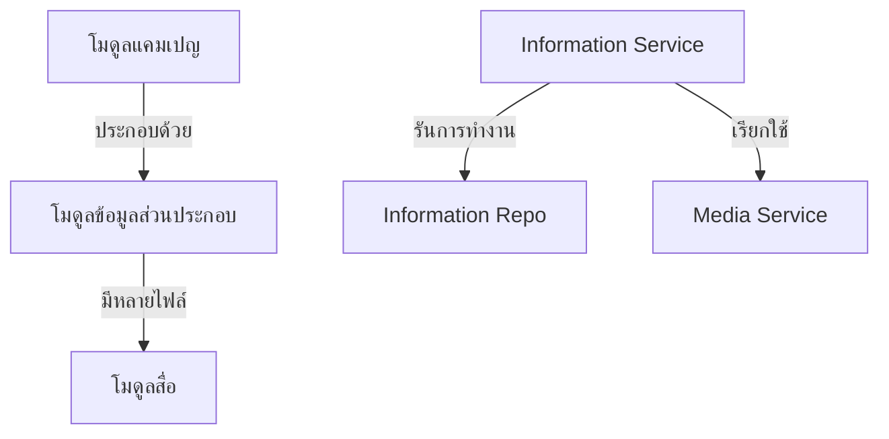

# คู่มือสำหรับนักพัฒนา: โมดูลข้อมูลส่วนประกอบ (Information Module)

โมดูลข้อมูลส่วนประกอบทำหน้าที่จัดการเนื้อหารองภายในแคมเปญ (Campaign) โดยทั่วไปจะใช้แทนลำดับเหตุการณ์สำคัญ (Milestones), ระยะของโครงการ หรือส่วนของ "เรื่องราว" (Story) ที่มีสื่อประกอบของตัวเอง

## 1. โครงสร้างโปรแกรม (Program Structure)

โมดูลข้อมูลส่วนประกอบเป็นลูกของโมดูลแคมเปญ (Campaign Module) และส่วนใหญ่จะถูกจัดการผ่านคอนโทรลเลอร์ของ `Campaign`

### โครงสร้างฝั่ง Backend (`okard-backend/src/modules/information`)
- [service.py](file:///Users/wisapat/Documents/Code/Git/okard-backend/src/modules/information/service.py): จัดการการสร้าง, การอัปเดต และการลบข้อมูลส่วนประกอบรวมถึงสื่อที่เกี่ยวข้อง
- [repo.py](file:///Users/wisapat/Documents/Code/Git/okard-backend/src/modules/information/repo.py): การดำเนินการ SQL สำหรับตาราง `information`
- [model.py](file:///Users/wisapat/Documents/Code/Git/okard-backend/src/modules/information/model.py): โมเดล SQLAlchemy ที่กำหนดแอตทริบิวต์ของข้อมูลส่วนประกอบ (หัวข้อ, คำอธิบาย, ลำดับการแสดงผล)
- [schema.py](file:///Users/wisapat/Documents/Code/Git/okard-backend/src/modules/information/schema.py): โครงสร้างข้อมูลสำหรับการตรวจสอบความถูกต้องโดย Pydantic

---

## 2. ภาพรวมการทำงาน (Top-Down Functional Overview)

ข้อมูลส่วนประกอบถูกปฏิบัติเป็นหน่วยย่อยที่มีลำดับการทำงานภายใต้แคมเปญ

---

## 3. คำอธิบายโปรแกรมย่อย (Subprogram Descriptions)

### Backend: ชั้นบริการ (Service Layer - [service.py](file:///Users/wisapat/Documents/Code/Git/okard-backend/src/modules/information/service.py))

| โปรแกรมย่อย | หน้าที่ความรับผิดชอบ | ข้อมูลเข้า (Input) | ข้อมูลออก (Output) |
| :--- | :--- | :--- | :--- |
| `create_information_with_media` | สร้างข้อมูลส่วนประกอบจำนวนมากพร้อมแนบไฟล์สื่อที่อัปโหลด | `db`, `information_data` (รายการ), `files` | `List[Information]` |
| `update_information_with_media` | อัปเดตข้อความในข้อมูลส่วนประกอบและเปลี่ยนไฟล์สื่อหากมีการส่งไฟล์ใหม่มาให้ | `db`, `information_id`, `data`, `files` | `Information` |
| `delete_information` | ลบบันทึกข้อมูลส่วนประกอบและไฟล์สื่อจริงออก | `db`, `information_id` | `Information` (ที่ถูกลบ) |

---

## 4. การสื่อสารและพารามิเตอร์ (Communication & Parameters)

1.  **ความสัมพันธ์กับตัวหลัก (Parent Relationship)**: ทุกข้อมูลส่วนประกอบต้องมี Foreign Key `campaign_id` เสมอ
2.  **การจัดการลำดับ**: พารามิเตอร์ `display_order` จะเป็นตัวกำหนดลำดับที่เหตุการณ์สำคัญจะปรากฏในหน้ารายละเอียดแคมเปญ
3.  **วงจรชีวิตของสื่อ (Media Lifecycle)**: เมื่อมีการอัปเดตข้อมูลส่วนประกอบด้วยรูปภาพใหม่ ชั้นบริการจะลบไฟล์เก่าอย่างชัดเจนผ่าน `media_service` ก่อนจะบันทึกไฟล์ใหม่
4.  **บริบทการทำธุรกรรม (Transaction Context)**: การดำเนินการของข้อมูลส่วนประกอบมักจะถูกเรียกจาก `CampaignService` ระหว่างขั้นตอนการสร้างหรือแก้ไขแคมเปญที่มีหลายขั้นตอน
