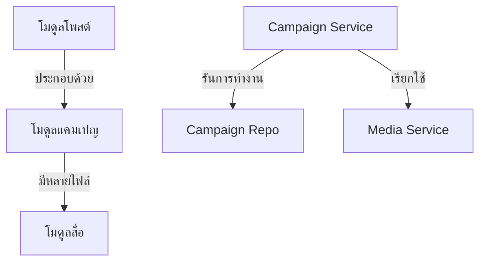

# คู่มือสำหรับนักพัฒนา: โมดูลแคมเปญ (Campaign Module)

โมดูลแคมเปญทำหน้าที่จัดการเนื้อหารองภายในโพสต์ (Post) โดยทั่วไปจะใช้แทนลำดับเหตุการณ์สำคัญ (Milestones), ระยะของโครงการ หรือส่วนของ "เรื่องราว" (Story) ที่มีสื่อประกอบของตัวเอง

## 1. โครงสร้างโปรแกรม (Program Structure)

โมดูลแคมเปญเป็นลูกของโมดูลโพสต์ (Post Module) และส่วนใหญ่จะถูกจัดการผ่านคอนโทรลเลอร์ของ `Post`

### โครงสร้างฝั่ง Backend (`okard-backend/src/modules/campaign`)
- [service.py](file:///Users/wisapat/Documents/Code/Git/okard-backend/src/modules/campaign/service.py): จัดการการสร้าง, การอัปเดต และการลบแคมเปญรวมถึงสื่อที่เกี่ยวข้อง
- [repo.py](file:///Users/wisapat/Documents/Code/Git/okard-backend/src/modules/campaign/repo.py): การดำเนินการ SQL สำหรับตาราง `campaign`
- [model.py](file:///Users/wisapat/Documents/Code/Git/okard-backend/src/modules/campaign/model.py): โมเดล SQLAlchemy ที่กำหนดแอตทริบิวต์ของแคมเปญ (หัวข้อ, คำอธิบาย, ลำดับการแสดงผล)
- [schema.py](file:///Users/wisapat/Documents/Code/Git/okard-backend/src/modules/campaign/schema.py): โครงสร้างข้อมูลสำหรับการตรวจสอบความถูกต้องโดย Pydantic

---

## 2. ภาพรวมการทำงาน (Top-Down Functional Overview)

แคมเปญถูกปฏิบัติเป็นหน่วยย่อยที่มีลำดับการทำงานภายใต้โพสต์

---

## 3. คำอธิบายโปรแกรมย่อย (Subprogram Descriptions)

### Backend: ชั้นบริการ (Service Layer - [service.py](file:///Users/wisapat/Documents/Code/Git/okard-backend/src/modules/campaign/service.py))

| โปรแกรมย่อย | หน้าที่ความรับผิดชอบ | ข้อมูลเข้า (Input) | ข้อมูลออก (Output) |
| :--- | :--- | :--- | :--- |
| `create_campaign_with_media` | สร้างแคมเปญจำนวนมากพร้อมแนบไฟล์สื่อที่อัปโหลด | `db`, `campaign_data` (รายการ), `files` | `List[Campaign]` |
| `update_campaign_with_media` | อัปเดตข้อความในแคมเปญและเปลี่ยนไฟล์สื่อหากมีการส่งไฟล์ใหม่มาให้ | `db`, `campaign_id`, `data`, `files` | `Campaign` |
| `delete_campaign` | ลบบันทึกแคมเปญและไฟล์สื่อจริงออก | `db`, `campaign_id` | `Campaign` (ที่ถูกลบ) |

---

## 4. การสื่อสารและพารามิเตอร์ (Communication & Parameters)

1.  **ความสัมพันธ์กับตัวหลัก (Parent Relationship)**: ทุกแคมเปญต้องมี Foreign Key `post_id` เสมอ
2.  **การจัดการลำดับ**: พารามิเตอร์ `display_order` จะเป็นตัวกำหนดลำดับที่เหตุการณ์สำคัญจะปรากฏในหน้ารายละเอียดโพสต์
3.  **วงจรชีวิตของสื่อ (Media Lifecycle)**: เมื่อมีการอัปเดตแคมเปญด้วยรูปภาพใหม่ ชั้นบริการจะลบไฟล์เก่าอย่างชัดเจนผ่าน `media_service` ก่อนจะบันทึกไฟล์ใหม่
4.  **บริบทการทำธุรกรรม (Transaction Context)**: การดำเนินการของแคมเปญมักจะถูกเรียกจาก `PostService` ระหว่างขั้นตอนการสร้างหรือแก้ไขโพสต์ที่มีหลายขั้นตอน
