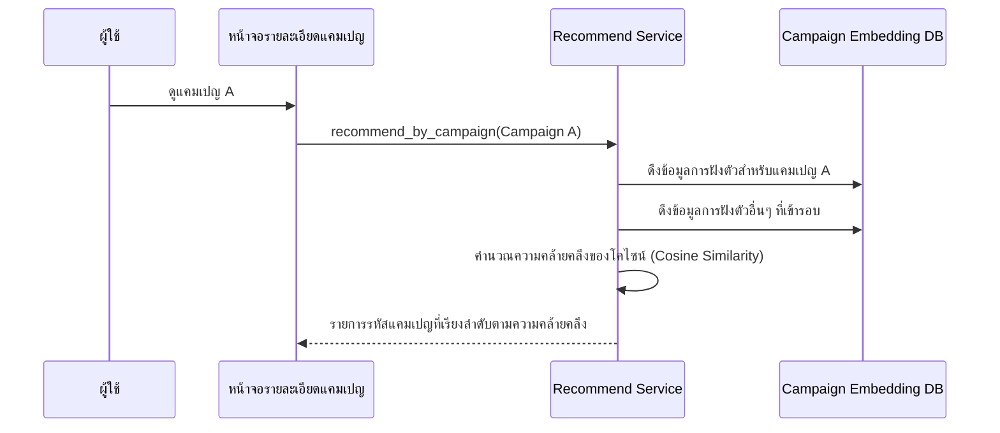

# คู่มือสำหรับนักพัฒนา: โมดูลแนะนำแคมเปญ (Campaign Recommendation Module)

โมดูลแนะนำแคมเปญทำหน้าที่จัดการส่วน "แคมเปญที่คล้ายกัน" (Similar Campaigns) โดยใช้การกรองตามเนื้อหา (Content-based filtering) และความคล้ายคลึงของเวกเตอร์

## 1. โครงสร้างโปรแกรม (Program Structure)

โมดูลนี้เน้นไปที่ความคล้ายคลึงกันระหว่างสองสิ่ง (Item-to-item similarity) เพื่อช่วยให้ผู้ใช้ค้นหาเนื้อหาที่เกี่ยวข้องกับสิ่งที่พวกเขากำลังรับชมอยู่ได้ง่ายขึ้น

### โครงสร้างฝั่ง Backend (`okard-backend/src/modules/campaign_recommend`)
- [service.py](file:///Users/wisapat/Documents/Code/Git/okard-backend/src/modules/campaign_recommend/service.py): คำนวณความคล้ายคลึงกันระหว่างแคมเปญต้นทางและแคมเปญอื่นๆ ที่เข้ารอบ
- [repo.py](file:///Users/wisapat/Documents/Code/Git/okard-backend/src/modules/campaign_recommend/repo.py): ดึงข้อมูลการฝังตัว (Embeddings) จากตาราง `campaign_embedding`
- [schema.py](file:///Users/wisapat/Documents/Code/Git/okard-backend/src/modules/campaign_recommend/schema.py): โครงสร้างข้อมูลสำหรับการตอบกลับอย่างง่ายซึ่งประกอบด้วยรหัสแคมเปญและคะแนนความคล้ายคลึง

### โครงสร้างฝั่ง Frontend
- [api/api.ts](file:///Users/wisapat/Documents/Code/Git/okard-frontend/src/modules/campaign/api/api.ts): ฟังก์ชัน `fetchRecommendedCampaigns` จะดึงรายการที่เกี่ยวข้องมาแสดงในหน้ารายละเอียดแคมเปญ

---

## 2. ภาพรวมการทำงาน (Top-Down Functional Overview)

ระบบจะใช้เวกเตอร์การฝังตัวที่มีมิติสูง ซึ่งสร้างขึ้นจากชื่อและคำอธิบายของแต่ละแคมเปญ

---

## 3. คำอธิบายโปรแกรมย่อย (Subprogram Descriptions)

### Backend: ชั้นบริการ (Service Layer - [service.py](file:///Users/wisapat/Documents/Code/Git/okard-backend/src/modules/campaign_recommend/service.py))

| โปรแกรมย่อย | หน้าที่ความรับผิดชอบ | ข้อมูลเข้า (Input) | ข้อมูลออก (Output) |
| :--- | :--- | :--- | :--- |
| `recommend_by_campaign` | ตรรกะหลักสำหรับการคำนวณหาแคมเปญที่คล้ายกันจำนวน k อันดับแรก | `db`, `campaign_id`, `top_k`, `clerk_id` | `List[dict]` |
| `fallback_same_category`| (ระดับ Repo) จัดเตรียมรายการโครงการในหมวดหมู่เดียวกันในกรณีที่ไม่พบข้อมูลการฝังตัว | `db`, `campaign`, `limit` | `List[Campaign]` |

---

## 4. การสื่อสารและพารามิเตอร์ (Communication & Parameters)

1.  **คูณเวกเตอร์แบบ Dot Product**: เนื่องจากข้อมูลการฝังตัวได้รับการปรับมาตรฐานแล้ว ระบบจึงใช้การคูณแบบ Dot product อย่างง่าย (`vec @ source_vec`) เพื่อกำหนดคะแนนความคล้ายคลึงได้อย่างมีประสิทธิภาพ
2.  **ตรรกะแผนสำรอง (Fallback)**: หากแคมเปญเป็นโครงการใหม่ที่ยังไม่ได้สร้างข้อมูลการฝังตัว (เนื่องจากงานเบื้องหลังยังรอดำเนินการอยู่) โมดูลจะแสดงโครงการอื่นๆ จากหมวดหมู่เดียวกันแทนตามค่าเริ่มต้น
3.  **ค่า Top-K**: ค่าเริ่มต้นถูกตั้งไว้ที่ 5 แต่ API ช่วยให้ผู้เรียกสามารถระบุจำนวนจำกัดเองได้
4.  **แหล่งที่มาของข้อมูล**: ระบบจะอ่านข้อมูลจากตารางพิเศษ `campaign_embedding` เพื่อหลีกเลี่ยงการทำให้ตาราง `campaign` หลักทำงานหนักเกินไปจากข้อมูลไบนารีขนาดใหญ่
