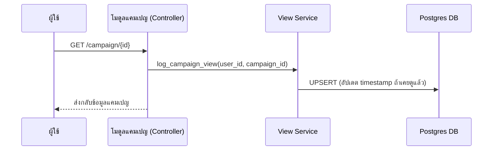

# คู่มือสำหรับนักพัฒนา: โมดูลบันทึกการเข้าชมแคมเปญ (Campaign View Module)

โมดูลบันทึกการเข้าชมแคมเปญทำหน้าที่รับผิดชอบในการติดตามการมีปฏิสัมพันธ์ของผู้ใช้กับแคมเปญต่างๆ ข้อมูลนี้เป็นพื้นฐานสำคัญสำหรับโมดูล "สำหรับคุณ" (For You) เพื่อใช้แนะนำเนื้อหาตามความสนใจส่วนบุคคล

## 1. โครงสร้างโปรแกรม (Program Structure)

โมดูลนี้ทำงานเบื้องหลังเมื่อผู้ใช้ที่ลงชื่อเข้าใช้แล้วเปิดดูหน้ารายละเอียดแคมเปญ

### โครงสร้างฝั่ง Backend (`okard-backend/src/modules/campaign_view`)
- [service.py](file:///Users/wisapat/Documents/Code/Git/okard-backend/src/modules/campaign_view/service.py): จัดเตรียมฟังก์ชันสำหรับบันทึกหรืออัปเดตกิจกรรมการเข้าชม
- [repo.py](file:///Users/wisapat/Documents/Code/Git/okard-backend/src/modules/campaign_view/repo.py): จัดการการดำเนินการ `UPSERT` ในฐานข้อมูลสำหรับตาราง `user_campaign_view`
- [model.py](file:///Users/wisapat/Documents/Code/Git/okard-backend/src/modules/campaign_view/model.py): กำหนดโครงสร้างตาราง `user_campaign_view` (ความสัมพันธ์ระหว่าง User และ Campaign)

---

## 2. ภาพรวมการทำงาน (Top-Down Functional Overview)

เมื่อมีการเรียกดูรายละเอียดแคมเปญ ระบบจะบันทึกเวลาที่เข้าชมล่าสุด

---

## 3. คำอธิบายโปรแกรมย่อย (Subprogram Descriptions)

### Backend: ชั้นบริการ (Service Layer - [service.py](file:///Users/wisapat/Documents/Code/Git/okard-backend/src/modules/campaign_view/service.py))

| โปรแกรมย่อย | หน้าที่ความรับผิดชอบ | ข้อมูลเข้า (Input) | ข้อมูลออก (Output) |
| :--- | :--- | :--- | :--- |
| `log_campaign_view` | บันทึกการเข้าชมแคมเปญโดยผู้ใช้ และยืนยันการเปลี่ยนแปลง (Commit) ลงฐานข้อมูล | `db`, `user_id`, `campaign_id` | ไม่มี |

---

## 4. การสื่อสารและพารามิเตอร์ (Communication & Parameters)

1.  **กลไกการทำงานเบื้องหลัง**: การบันทึกการเข้าชมถูกเรียกใช้โดยตรงจาก `CampaignController` เมื่อมีการดึงข้อมูลรายละเอียดแคมเปญสำเร็จ
2.  **การจัดการข้อมูลซ้ำ (Idempotency)**: ระบบใช้กลไก `UPSERT` เพื่อให้แน่ใจว่าแต่ละคู่ (User, Campaign) จะมีเพียงหนึ่งแถวเท่านั้นในฐานข้อมูล โดยจะอัปเดตเพียงเวลา `viewed_at` ล่าสุด
3.  **การระบุตัวตน**: การบันทึกจะเกิดขึ้นเฉพาะเมื่อผู้ใช้มีการยืนยันตัวตนแล้วเท่านั้น (มี `user_id`) หากเป็นการเข้าชมโดยบุคคลทั่วไป (Guest) ระบบจะไม่บันทึกข้อมูลนี้
