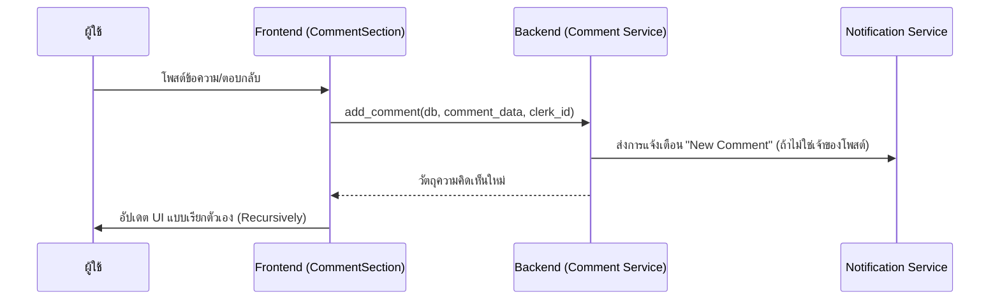

# คู่มือสำหรับนักพัฒนา: โมดูลความคิดเห็น (Comment Module)

โมดูลความคิดเห็นช่วยอำนวยความสะดวกในการสนทนาของชุมชนในโพสต์แคมเปญ รองรับการตอบกลับแบบเป็นลำดับชั้น (Threaded replies) และระบบการกด "ถูกใจ" (Like) ทางสังคม

## 1. โครงสร้างโปรแกรม (Program Structure)

โมดูลความคิดเห็นเป็นระบบที่มีลำดับชั้น ออกแบบมาเพื่อความสามารถในการขยายตัว (Scalability) และการมีส่วนร่วมของผู้ใช้

### โครงสร้างฝั่ง Backend (`okard-backend/src/modules/comment`)
- [controller.py](file:///Users/wisapat/Documents/Code/Git/okard-backend/src/modules/comment/controller.py): API สำหรับการโพสต์, กดถูกใจ และเรียกดูรายการความคิดเห็น
- [service.py](file:///Users/wisapat/Documents/Code/Git/okard-backend/src/modules/comment/service.py): ตรรกะทางธุรกิจ รวมถึงการส่งการแจ้งเตือนไปยังเจ้าของโพสต์
- [repo.py](file:///Users/wisapat/Documents/Code/Git/okard-backend/src/modules/comment/repo.py): การค้นหา SQL ที่ซับซ้อนสำหรับความคิดเห็นแบบลำดับชั้นและการดำเนินการถูกใจ/เลิกถูกใจ
- [model.py](file:///Users/wisapat/Documents/Code/Git/okard-backend/src/modules/comment/model.py): โมเดล SQLAlchemy ที่มี `parent_id` สำหรับการทำลำดับชั้นและความสัมพันธ์แบบ `likes`
- [schema.py](file:///Users/wisapat/Documents/Code/Git/okard-backend/src/modules/comment/schema.py): โครงสร้างข้อมูลสำหรับแผนผังความคิดเห็นแบบเรียกตัวเอง (Recursive)

### โครงสร้างฝั่ง Frontend (`okard-frontend/src/modules/post/components/comment`)
- [CommentSection.tsx](file:///Users/wisapat/Documents/Code/Git/okard-frontend/src/modules/post/components/comment/CommentSection.tsx): คอนเทนเนอร์หลักสำหรับจัดการสถานะรายการสินค้าความคิดเห็น
- [CommentNode.tsx](file:///Users/wisapat/Documents/Code/Git/okard-frontend/src/modules/post/components/comment/CommentNode.tsx): ส่วนประกอบแบบเรียกตัวเองสำหรับการแสดงผลความคิดเห็นแต่ละรายการและรายการตอบกลับ
- [InlineComposer.tsx](file:///Users/wisapat/Documents/Code/Git/okard-frontend/src/modules/post/components/comment/InlineComposer.tsx): ช่องทางรับข้อมูลข้อความสำหรับการสร้างความคิดเห็นหรือการตอบกลับใหม่

---

## 2. ภาพรวมการทำงาน (Top-Down Functional Overview)

ความคิดเห็นถูกเชื่อมโยงกับโพสต์ และสามารถเลือกเชื่อมโยงกับความคิดเห็นหลัก (Parent Comment) ได้

---

## 3. คำอธิบายโปรแกรมย่อย (Subprogram Descriptions)

### Backend: ชั้นบริการ (Service Layer - [service.py](file:///Users/wisapat/Documents/Code/Git/okard-backend/src/modules/comment/service.py))

| โปรแกรมย่อย | หน้าที่ความรับผิดชอบ | ข้อมูลเข้า (Input) | ข้อมูลออก (Output) |
| :--- | :--- | :--- | :--- |
| `add_comment` | บันทึกความคิดเห็นและส่งการแจ้งเตือนไปยังผู้สร้างโพสต์ | `db`, `comment_data`, `clerk_id` | `Comment` |
| `like/unlike` | จัดการความสัมพันธ์แบบ many-to-many ระหว่างผู้ใช้และการถูกใจความคิดเห็น | `db`, `comment_id`, `clerk_id` | `{"ok": True}` |

### Frontend: ส่วนประกอบต่างๆ (Components - [comment/](file:///Users/wisapat/Documents/Code/Git/okard-frontend/src/modules/post/components/comment))

| โปรแกรมย่อย | หน้าที่ความรับผิดชอบ | ข้อมูลเข้า (Input) | ข้อมูลออก (Output) |
| :--- | :--- | :--- | :--- |
| `CommentSection` | ตัวจัดการหลักสำหรับความคิดเห็นในโพสต์ | `postId` | รายการการสนทนาที่แสดงผลแล้ว |
| `CommentNode` | แสดงผลรายการความคิดเห็นเดี่ยวและรายการย่อย (แบบเรียกตัวเอง) | `comment` object | UI ของความคิดเห็น |

---

## 4. การสื่อสารและพารามิเตอร์ (Communication & Parameters)

1.  **แบบลำดับชั้น (Threading)**: `parent_id` ในโครงสร้าง `CommentCreate` จะถูกใช้เพื่อซ้อนการตอบกลับ หากค่าเป็น `null` แสดงว่าเป็นความคิดเห็นระดับบนสุด
2.  **การแจ้งเตือน (Notifications)**: การแจ้งเตือนจะถูกส่งเฉพาะในกรณีที่ผู้แสดงความคิดเห็นไม่ใช่ผู้สร้างโพสต์เท่านั้น
3.  **การดึงข้อมูลแบบเรียกตัวเอง (Recursive Fetching)**: ฟังก์ชัน `lists_comments` ใน repository จะใช้การจอย (Join) แบบพิเศษเพื่อดึงข้อมูลลำดับชั้น หรือจัดเรียงเพื่อให้ Frontend สามารถสร้างแผนผังได้อย่างมีประสิทธิภาพ
4.  **UI แบบมองโลกในแง่ดี (Optimistic UI)**: การกดถูกใจมักจะถูกจัดการด้วยสถานะแบบ optimistic ในฝั่ง Frontend เพื่อให้ผู้ใช้งานรู้สึกถึงความรวดเร็วในการตอบสนอง
