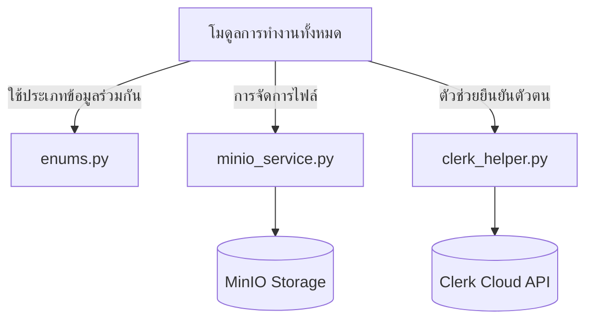

# คู่มือสำหรับนักพัฒนา: โมดูลโครงสร้างพื้นฐานส่วนกลาง (Common Infrastructure Module)

โมดูล Common ทำหน้าที่ให้บริการยูทิลิตี้แบบข้ามสายงาน (Cross-cutting utility services) และทำหน้าที่เป็น "ระบบประเภทข้อมูล" (Type System/Enums) ส่วนกลางที่ใช้ทั่วทั้งแพลตฟอร์ม Okard

## 1. โครงสร้างโปรแกรม (Program Structure)

โมดูล Common เป็นชั้นทรัพยากรแบบไร้สถานะ (Stateless resource layer)

### โครงสร้างฝั่ง Backend (`okard-backend/src/modules/common`)
- [enums.py](file:///Users/wisapat/Documents/Code/Git/okard-backend/src/modules/common/enums.py): แหล่งข้อมูลอ้างอิงหลักสำหรับสถานะระบบทั้งหมด (เช่น PostState, UserRole, ReportStatus เป็นต้น)
- [minio_service.py](file:///Users/wisapat/Documents/Code/Git/okard-backend/src/modules/common/minio_service.py): ตัวหุ้มการทำงานระดับสูง (Wrapper) สำหรับการจัดการไฟล์แบบ MinIO/S3
- [clerk_helper.py](file:///Users/wisapat/Documents/Code/Git/okard-backend/src/modules/common/clerk_helper.py): ตัวช่วยสำหรับการโต้ตอบกับ Clerk API

---

## 2. ภาพรวมการทำงาน (Top-Down Functional Overview)

โมดูล Common ทำหน้าที่เสมือน "ห้องสมุดมาตรฐาน" (Standard Library) สำหรับโมดูลการทำงานอื่นๆ ทั้งหมด

---

## 3. คำอธิบายโปรแกรมย่อย (Subprogram Descriptions)

### Backend: บริการส่วนกลาง (Shared Services - [common/](file:///Users/wisapat/Documents/Code/Git/okard-backend/src/modules/common/))

| โปรแกรมย่อย (ไฟล์) | หน้าที่ความรับผิดชอบ | องค์ประกอบหลัก |
| :--- | :--- | :--- |
| `enums.py` | กำหนดการเปลี่ยนสถานะและบทบาทสำหรับทั้งแอปพลิเคชัน | `PostState`, `UserRole`, `NotificationType`, `ReportStatus` |
| `minio_service.py` | API ที่ถูกทำเป็นนามธรรมสำหรับการ `upload_file`, `delete_file` และ `get_presigned_url` | การรวมเข้ากับ `MinioClient` |
| `clerk_helper.py` | เชื่อมซิงค์ข้อมูลผู้ใช้และตรวจสอบเซสชันกับผู้ให้บริการข้อมูลตัวตน Clerk | ตัวหุ้ม `ClerkSDK` |

---

## 4. การสื่อสารและพารามิเตอร์ (Communication & Parameters)

1.  **ความสอดคล้องของสถานะ (State Consistency)**: การรวมศูนย์ `PostState` (เช่น `draft`, `published`, `success`) ช่วยให้แน่ใจว่าฐานข้อมูล, ตรรกะส่วนหลังบ้าน และส่วนหน้าบ้านจะใช้คำนิยามสถานะเดียวกันเสมอ
2.  **การตั้งค่า MinIO**: การตั้งค่าพื้นที่จัดเก็บข้อมูล (ชื่อ Bucket, Access keys) จะถูกส่งผ่านตัวแปรสภาพแวดล้อม (Environment variables) และจัดการในระดับสากลโดย singleton ของ `MinioService`
3.  **เกราะป้องกันการยืนยันตัวตน (Authentication Guard)**: `clerk_helper` จะมอบคุณสมบัติการทำงานระดับล่างที่ใช้โดยมิดเดิลแวร์ตรวจสอบ JWT ของโมดูล `auth`
4.  **ประเภทการอ้างอิง (Reference Types)**: Enum `ReferenceType` มีความสำคัญอย่างยิ่งต่อระบบ `MediaHandler` แบบ polymorphic ซึ่งเชื่อมโยงไฟล์กับหน่วยธุรกิจที่แตกต่างกัน
