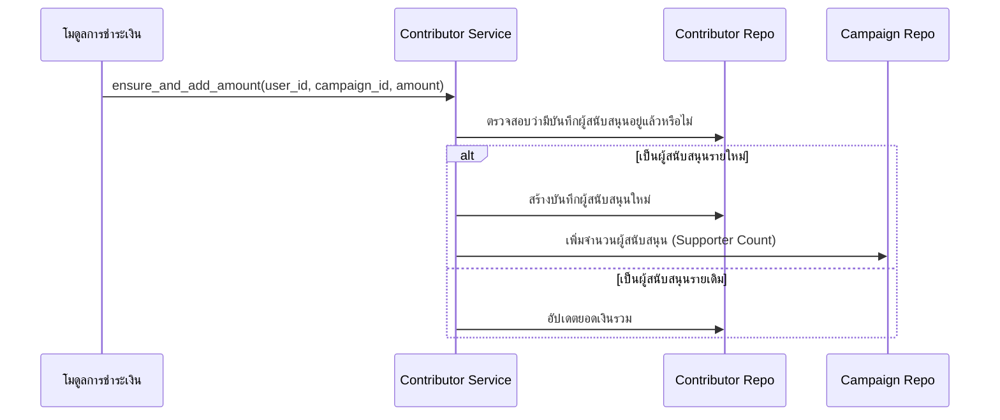

# คู่มือสำหรับนักพัฒนา: โมดูลผู้สนับสนุน (Contributor Module)

โมดูลผู้สนับสนุนทำหน้าที่ติดตามความสัมพันธ์ระหว่างผู้สนับสนุนและแคมเปญที่พวกเขาให้ทุน โดยทำหน้าที่เป็นสมุดบัญชีสำหรับเงินสนับสนุนทั้งหมด

## 1. โครงสร้างโปรแกรม (Program Structure)

โมดูลผู้สนับสนุนถูกใช้งานเป็นหลักโดยโมดูลการชำระเงิน (Payment) และโมดูลแคมเปญ (Campaign) เพื่อจัดการข้อมูลการให้ทุน

### โครงสร้างฝั่ง Backend (`okard-backend/src/modules/contributor`)
- [controller.py](file:///Users/wisapat/Documents/Code/Git/okard-backend/src/modules/contributor/controller.py): API สำหรับการดึงรายการผู้สนับสนุนสำหรับแคมเปญที่เฉพาะเจาะจง
- [service.py](file:///Users/wisapat/Documents/Code/Git/okard-backend/src/modules/contributor/service.py): การดำเนินการทางตรรกะสำหรับการเพิ่มหรืออัปเดตยอดเงินสนับสนุน
- [repo.py](file:///Users/wisapat/Documents/Code/Git/okard-backend/src/modules/contributor/repo.py): การดำเนินการฐานข้อมูลสำหรับตาราง `contributor`
- [model.py](file:///Users/wisapat/Documents/Code/Git/okard-backend/src/modules/contributor/model.py): โมเดล SQLAlchemy ที่ติดตาม `user_id`, `campaign_id` และยอดรวมเงินสนับสนุน (`total_amount`)
- [schema.py](file:///Users/wisapat/Documents/Code/Git/okard-backend/src/modules/contributor/schema.py): โครงสร้างข้อมูลสำหรับการตรวจสอบความถูกต้องของข้อมูลผู้สนับสนุน

### โครงสร้างฝั่ง Frontend
- [types.ts](file:///Users/wisapat/Documents/Code/Git/okard-frontend/src/modules/contributor/types.ts): โครงสร้างข้อมูลสำหรับการแสดงรายการผู้สนับสนุน
- รวมอยู่ใน [CampaignDetailTabs.tsx](file:///Users/wisapat/Documents/Code/Git/okard-frontend/src/modules/campaign/components/CampaignDetailTabs.tsx) เพื่อแสดงรายการผู้สนับสนุนล่าสุด

---

## 2. ภาพรวมการทำงาน (Top-Down Functional Overview)

ผู้สนับสนุนเปรียบเสมือน "สมุดบัญชีการให้ทุน" (Funding Ledger) สำหรับแต่ละแคมเปญ

---

## 3. คำอธิบายโปรแกรมย่อย (Subprogram Descriptions)

### Backend: ชั้นบริการ (Service Layer - [service.py](file:///Users/wisapat/Documents/Code/Git/okard-backend/src/modules/contributor/service.py))

| โปรแกรมย่อย | หน้าที่ความรับผิดชอบ | ข้อมูลเข้า (Input) | ข้อมูลออก (Output) |
| :--- | :--- | :--- | :--- |
| `ensure_and_add_amount`| อัปเดตหรือสร้างบันทึกผู้สนับสนุน และแจ้งว่าเป็นผู้สนับสนุนรายใหม่หรือไม่ | `user_id`, `campaign_id`, `amount` | `(Contributor, is_new)` |
| `list_contributors`| รายงานรายชื่อผู้ใช้ทั้งหมดที่สนับสนุนแคมเปญที่ระบุ | `campaign_id` | `List[Contributor]` |

---

## 4. การสื่อสารและพารามิเตอร์ (Communication & Parameters)

1.  **ความสัมพันธ์แบบหนึ่งเดียว (Unique Relationship)**: ฐานข้อมูลบังคับใช้ข้อจำกัดแบบไม่ซ้ำกัน (Unique constraint) กับคู่ของ `(user_id, campaign_id)`
2.  **ยอดสนับสนุนสะสม**: หากผู้ใช้ชำระเงินหลายครั้งสำหรับแคมเปญเดียวกัน ยอดเงินรวม (`total_amount`) ในบันทึกผู้สนับสนุนจะถูกเพิ่มขึ้นแทนที่จะสร้างบันทึกใหม่
3.  **จำนวนผู้สนับสนุน**: ค่า Boolean `is_new` ที่ส่งกลับจากบริการจะถูกผู้เรียก (โมดูลการชำระเงิน) ใช้เพื่อตัดสินใจว่าจะเพิ่มตัวนับ `supporter` ในโมเดล `Campaign` หรือไม่
4.  **ความเป็นส่วนตัว**: Frontend จะแสดงชื่อผู้สนับสนุน แต่ตรรกะของบริการภายในจะรับประกันว่ารหัสธุรกรรม (Transaction IDs) ที่ละเอียดอ่อนจะไม่รั่วไหลออกมา
