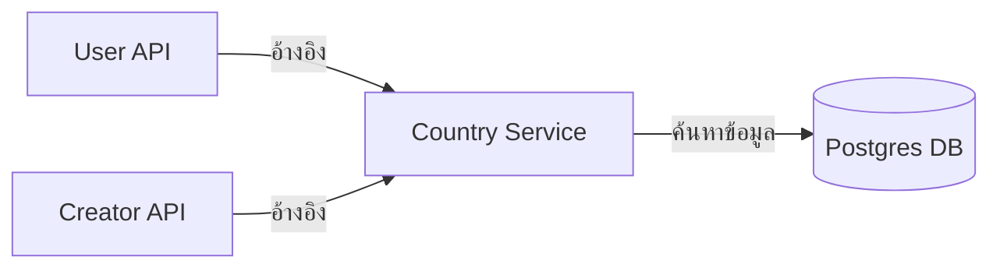

# คู่มือสำหรับนักพัฒนา: โมดูลประเทศ (Country Module)

โมดูลประเทศจัดเตรียมรายการมาตรฐานของประเทศสำหรับการระบุข้อมูลในโปรไฟล์ผู้ใช้และการกำหนดตำแหน่งที่ตั้งของแคมเปญ (Campaign localization)

## 1. โครงสร้างโปรแกรม (Program Structure)

โมดูลประเทศเป็นบริการค้นหาข้อมูลแบบคงที่ (Static lookup service) ที่ใช้งานทั่วทั้งแพลตฟอร์ม

### โครงสร้างฝั่ง Backend (`okard-backend/src/modules/country`)
- [controller.py](file:///Users/wisapat/Documents/Code/Git/okard-backend/src/modules/country/controller.py): API สำหรับการดึงรายการประเทศที่รองรับ
- [service.py](file:///Users/wisapat/Documents/Code/Git/okard-backend/src/modules/country/service.py): ตรรกะทางธุรกิจสำหรับการค้นหาข้อมูลประเทศ
- [repo.py](file:///Users/wisapat/Documents/Code/Git/okard-backend/src/modules/country/repo.py): การดำเนินการฐานข้อมูลสำหรับตาราง `country`
- [model.py](file:///Users/wisapat/Documents/Code/Git/okard-backend/src/modules/country/model.py): โมเดล SQLAlchemy ที่ประกอบด้วย `name`, `iso_code` และ `en_name`
- [schema.py](file:///Users/wisapat/Documents/Code/Git/okard-backend/src/modules/country/schema.py): โครงสร้างข้อมูลสำหรับการตรวจสอบความถูกต้องและการตอบกลับ

### โครงสร้างฝั่ง Frontend (`okard-frontend/src/modules/country`)
- [api/api.ts](file:///Users/wisapat/Documents/Code/Git/okard-frontend/src/modules/country/api/api.ts): ตัวเชื่อมต่อ API เพื่อดึงรายการประเทศทั้งหมด

---

## 2. ภาพรวมการทำงาน (Top-Down Functional Overview)

โมดูลนี้ทำหน้าที่เป็นเสมือนพจนานุกรมแบบอ่านอย่างเดียวสำหรับส่วนอื่นๆ ของแอปพลิเคชัน

---

## 3. คำอธิบายโปรแกรมย่อย (Subprogram Descriptions)

### Backend: ชั้นบริการ (Service Layer - [service.py](file:///Users/wisapat/Documents/Code/Git/okard-backend/src/modules/country/service.py))

| โปรแกรมย่อย | หน้าที่ความรับผิดชอบ | ข้อมูลเข้า (Input) | ข้อมูลออก (Output) |
| :--- | :--- | :--- | :--- |
| `get_country_list` | ดึงข้อมูลประเทศทั้งหมดที่เปิดใช้งานจากฐานข้อมูล | `db` | `List[Country]` |
| `get_country` | ดึงข้อมูลบันทึกประเทศรายการเดียวตามรหัส ID | `db`, `country_id` | `Country` หรือ `None` |

---

## 4. การสื่อสารและพารามิเตอร์ (Communication & Parameters)

1.  **การปรับข้อมูลให้เป็นมาตรฐาน (Normalization)**: การใช้ `country_id` (UUID) ที่เป็นศูนย์กลางทั่วทั้งตาราง `User` และ `Creator` ช่วยให้ระบบมั่นใจถึงความสอดคล้องของการเรียกชื่อและรหัส ISO
2.  **การรองรับหลายภาษา**: `model.py` มีทั้งชื่อภาษาท้องถิ่นและ `en_name` เพื่อรองรับความเป็นสากล (Internationalization)
3.  **ความหน่วงต่ำ (Low Latency)**: ผลลัพธ์จากการดึงข้อมูลมักจะถูกแคชไว้ที่ฝั่ง Frontend เพื่อหลีกเลี่ยงการเรียกใช้ API ซ้ำซ้อนระหว่างกระบวนการกรอกแบบฟอร์มที่มีหลายขั้นตอน
