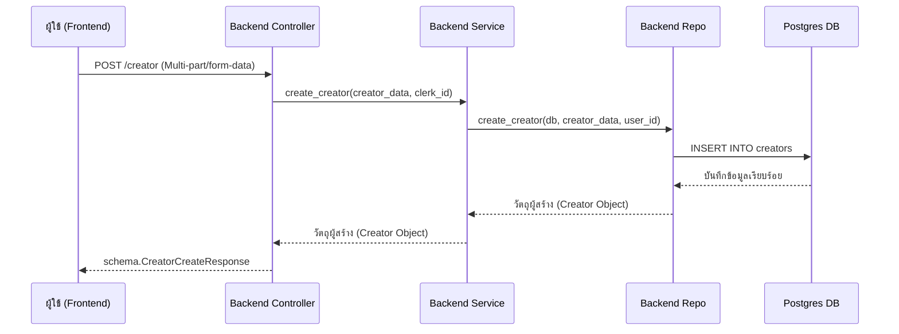

# คู่มือสำหรับนักพัฒนา: โมดูลผู้สร้าง (Creator Module)

โมดูลผู้สร้างทำหน้าที่จัดการวงจรชีวิตของโปรไฟล์ผู้สร้าง (Creator) รวมถึงการสร้าง, การประมูลการตรวจสอบ และการอัปเดตโปรไฟล์ โดยทำหน้าที่เป็นสะพานเชื่อมระหว่างผู้ใช้ทั่วไปและผู้สร้างเนื้อหา

## 1. โครงสร้างโปรแกรม (Program Structure)

โมดูลผู้สร้างแบ่งออกเป็นองค์ประกอบส่วนหลังบ้าน (Python/FastAPI) และส่วนหน้าบ้าน (TypeScript/Next.js)

### โครงสร้างฝั่ง Backend (`okard-backend/src/modules/creator`)
- [controller.py](file:///Users/wisapat/Documents/Code/Git/okard-backend/src/modules/creator/controller.py): การกำหนดเส้นทาง API (Routes) และการจัดการคำขอ
- [service.py](file:///Users/wisapat/Documents/Code/Git/okard-backend/src/modules/creator/service.py): ชั้นตรรกะทางธุรกิจ
- [repo.py](file:///Users/wisapat/Documents/Code/Git/okard-backend/src/modules/creator/repo.py): ชั้นการเข้าถึงข้อมูล (SQLAlchemy)
- [model.py](file:///Users/wisapat/Documents/Code/Git/okard-backend/src/modules/creator/model.py): การกำหนดโครงสร้างฐานข้อมูล (Database Schema)
- [schema.py](file:///Users/wisapat/Documents/Code/Git/okard-backend/src/modules/creator/schema.py): โมเดล Pydantic สำหรับการตรวจสอบความถูกต้องของข้อมูลและการทำ Serialization

### โครงสร้างฝั่ง Frontend (`okard-frontend/src/modules/creator`)
- [api/api.ts](file:///Users/wisapat/Documents/Code/Git/okard-frontend/src/modules/creator/api/api.ts): ตัวเชื่อมต่อ API สำหรับโต้ตอบกับส่วนหลังบ้าน
- [components/CreatorForm.tsx](file:///Users/wisapat/Documents/Code/Git/okard-frontend/src/modules/creator/components/CreatorForm.tsx): ส่วนประกอบ UI หลักสำหรับการลงทะเบียนผู้สร้างและการจัดการโปรไฟล์
- `types/`: พื้นที่เก็บอินเตอร์เฟซ TypeScript (Interfaces) ของโมดูล

---

## 2. ภาพรวมการทำงาน (Top-Down Functional Overview)

ระบบทำงานตามลำดับชั้นของ Controller -> Service -> Repository

---

## 3. คำอธิบายโปรแกรมย่อย (Subprogram Descriptions)

### Backend: ชั้นคอนโทรลเลอร์ (Controller Layer - [controller.py](file:///Users/wisapat/Documents/Code/Git/okard-backend/src/modules/creator/controller.py))

| โปรแกรมย่อย | หน้าที่ความรับผิดชอบ | ข้อมูลเข้า (Input) | ข้อมูลออก (Output) |
| :--- | :--- | :--- | :--- |
| `create_creator` | จัดลำดับการสร้างโปรไฟล์ผู้สร้าง, อัปเดตบทบาทผู้ใช้ และการอัปโหลดเอกสาร | `data` (JSON str), `image`, `id_card`, `house_registration`, `bank_statement` (ไฟล์) | `schema.CreatorCreateResponse` |
| `get_my_creator_profile` | ดึงข้อมูลโปรไฟล์ผู้สร้างของผู้คนที่เข้าสู่ระบบอยู่ | `clerk_id` (str) | `schema.CreatorOut` |
| `update_creator` | อัปเดตฟิลด์ข้อมูลโปรไฟล์ผู้สร้างที่มีอยู่ | `creator_id` (UUID), `creator_data` (สปริงอัปเดต) | `schema.CreatorOut` |
| `verify_creator` | (ผู้ดูแลระบบ) อนุมัติหรือปฏิเสธคำขอตรวจสอบของผู้สร้าง | `creator_id`, `status` (str), `admin_clerk_id` (str) | `schema.CreatorOut` |

### Backend: ชั้นบริการ (Service Layer - [service.py](file:///Users/wisapat/Documents/Code/Git/okard-backend/src/modules/creator/service.py))

| โปรแกรมย่อย | หน้าที่ความรับผิดชอบ | ข้อมูลเข้า (Input) | ข้อมูลออก (Output) |
| :--- | :--- | :--- | :--- |
| `create_creator` | ตรวจสอบโปรไฟล์ที่มีอยู่และจับคู่ `clerk_id` กับ `user_id` | `db` (Session), `creator_data` (Schema), `clerk_id` (str) | `Creator` (Model object) |
| `verify_creator_request` | อัปเดตสถานะและจัดการตรรกะการอนุญาตของผู้ดูแลระบบ | `db`, `creator_id`, `status`, `admin_clerk_id` | `Creator` (Model object) |

### Backend: ชั้นที่เก็บข้อมูล (Repository Layer - [repo.py](file:///Users/wisapat/Documents/Code/Git/okard-backend/src/modules/creator/repo.py))

| โปรแกรมย่อย | หน้าที่ความรับผิดชอบ | ข้อมูลเข้า (Input) | ข้อมูลออก (Output) |
| :--- | :--- | :--- | :--- |
| `create_creator` | ดำเนินการ INSERT ข้อมูลลงในฐานข้อมูล | `db`, `creator_data` (Schema), `user_id` (UUID) | วัตถุ `Creator` |
| `get_creator_by_id` | ดึงข้อมูลผู้สร้างพร้อมข้อมูลผู้ใช้ที่เชื่อมโยงกัน | `db`, `creator_id` | `Creator` หรือ `None` |
| `update_verification_status`| แก้ไขสถานะ, เวลาที่ตรวจสอบ และเหตุผล | `db`, `creator_id`, `status`, `verifier_id` | วัตถุ `Creator` |

---

## 4. การสื่อสารและพารามิเตอร์ (Communication & Parameters)

ข้อมูลไหลจากแบบฟอร์มฝั่ง Frontend (`CreatorForm.tsx`) ผ่านตัวเชื่อมต่อ `api.ts` ในรูปแบบ `FormData` (เพื่อรองรับไฟล์) โดยที่ Backend Controller จะประมวลผลดังนี้:

1.  **การแยกส่วนประกอบ (Parsing)**: `controller.py` แปลงพารามิเตอร์สตริง `data` ให้เป็นวัตถุ Pydantic (`CreatorCreate` และ `UserUpdate`)
2.  **การสื่อสารข้ามโมดูล**:
    - โมดูลผู้สร้างจะเรียกใช้ `userService.get_user_by_clerk_id` เพื่อเชื่อมโยงโปรไฟล์
    - เรียกใช้ `mediaService.create_media_from_upload` สำหรับรูปภาพโปรไฟล์
    - เรียกใช้ `verificationDocService.create_verification_doc_from_upload` สำหรับรูปภาพบัตรประชาชนหรือใบแจ้งยอดธนาคาร
3.  **การเชื่อมโยงฐานข้อมูล**: `user_id` (UUID) เป็น Foreign Key หลักที่ใช้สื่อสารระหว่างชั้นการทำงานต่างๆ และใช้เชื่อมโยงตาราง `User` และ `Creator` เข้าด้วยกัน
