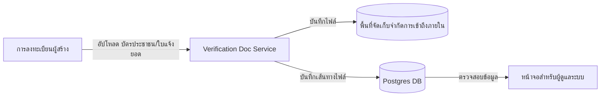

# คู่มือสำหรับนักพัฒนา: โมดูลเอกสารตรวจสอบผู้สร้าง (Creator Verification Document Module)

โมดูลเอกสารตรวจสอบผู้สร้างจัดการการนำเข้าและจัดเก็บเอกสารระบุตัวตนที่สำคัญ (เช่น บัตรประชาชน, ใบแจ้งยอดธนาคาร) ซึ่งจำเป็นสำหรับการตรวจสอบ KYC (Know Your Customer) ของผู้สร้าง

## 1. โครงสร้างโปรแกรม (Program Structure)

โมดูลนี้เป็นองค์ประกอบที่มีความปลอดภัยสูง ซึ่งทำหน้าที่แยกไฟล์ที่สำคัญออกจากคลังสื่อทั่วไป

### โครงสร้างฝั่ง Backend (`okard-backend/src/modules/creator_verification_doc`)
- [controller.py](file:///Users/wisapat/Documents/Code/Git/okard-backend/src/modules/creator_verification_doc/controller.py): API สำหรับการอัปโหลดไฟล์ที่ใช้ในการตรวจสอบ
- [service.py](file:///Users/wisapat/Documents/Code/Git/okard-backend/src/modules/creator_verification_doc/service.py): ตรรกะสำหรับการจัดเก็บไฟล์ในระบบภายในและการเชื่อมโยงข้อมูล Meta
- [repo.py](file:///Users/wisapat/Documents/Code/Git/okard-backend/src/modules/creator_verification_doc/repo.py): การดำเนินการฐานข้อมูลสำหรับตาราง `creator_verification_doc`
- [model.py](file:///Users/wisapat/Documents/Code/Git/okard-backend/src/modules/creator_verification_doc/model.py): โมเดล SQLAlchemy ที่ติดตามเส้นทางไฟล์ (File paths), ประเภทไฟล์ (Mime types) และประเภทเอกสาร
- [schema.py](file:///Users/wisapat/Documents/Code/Git/okard-backend/src/modules/creator_verification_doc/schema.py): โครงสร้างข้อมูลสำหรับการตรวจสอบความถูกต้อง

---

## 2. ภาพรวมการทำงาน (Top-Down Functional Overview)

โมดูลนี้ทำหน้าที่เป็น "ห้องนิรภัย" (Vault) ที่ปลอดภัยสำหรับเอกสารประกอบการลงทะเบียน

---

## 3. คำอธิบายโปรแกรมย่อย (Subprogram Descriptions)

### Backend: ชั้นบริการ (Service Layer - [service.py](file:///Users/wisapat/Documents/Code/Git/okard-backend/src/modules/creator_verification_doc/service.py))

| โปรแกรมย่อย | หน้าที่ความรับผิดชอบ | ข้อมูลเข้า (Input) | ข้อมูลออก (Output) |
| :--- | :--- | :--- | :--- |
| `create_verification_doc_from_upload` | บันทึกไฟล์ข้อมูลสำคัญลงในโฟลเดอร์ท้องถิ่นที่จำกัดการเข้าถึง และเก็บเส้นทางไฟล์ที่เกี่ยวข้อง | `db`, `creator_id`, `doc_type`, `file` | `VerificationDoc` |
| `get_verification_docs`| ดึงข้อมูลเอกสารทั้งหมดที่เกี่ยวข้องกับผู้สร้างเพื่อให้ผู้ดูแลระบบตรวจสอบ | `db`, `creator_id` | `List[VerificationDoc]` |

---

## 4. การสื่อสารและพารามิเตอร์ (Communication & Parameters)

1.  **การคัดแยกพื้นที่จัดเก็บ (Storage Isolation)**: แตกต่างจากสื่อสาธารณะที่ใช้ MinIO เอกสารเหล่านี้จะถูกจัดเก็บไว้ในโฟลเดอร์เฉพาะ `uploads/verification_docs` ในระบบไฟล์ท้องถิ่น (ตามการทำงานในปัจจุบัน) เพื่อจำกัดการเข้าถึงจากสาธารณะ
2.  **ประเภทเอกสาร**: ใช้ Enum `VerificationDocType` (ประกอบด้วย `id_card`, `house_registration`, `bank_statement`)
3.  **การระบุเส้นทาง (Pathing)**: ฐานข้อมูลจะเก็บเส้นทางไฟล์แบบ **สัมพัทธ์ (Relative)** ต่อ `BASE_DIR` ซึ่งช่วยให้มีความคล่องตัวในการย้ายข้อมูลข้ามสภาพแวดล้อม (Environments) ต่างๆ
4.  **ความเป็นเจ้าของ**: ทุกเอกสารจะถูกผูกสัมพันธ์กับ `creator_id` อย่างเคร่งครัดผ่าน Foreign Key เพื่อรับประกันความถูกต้องครบถ้วนของข้อมูล
