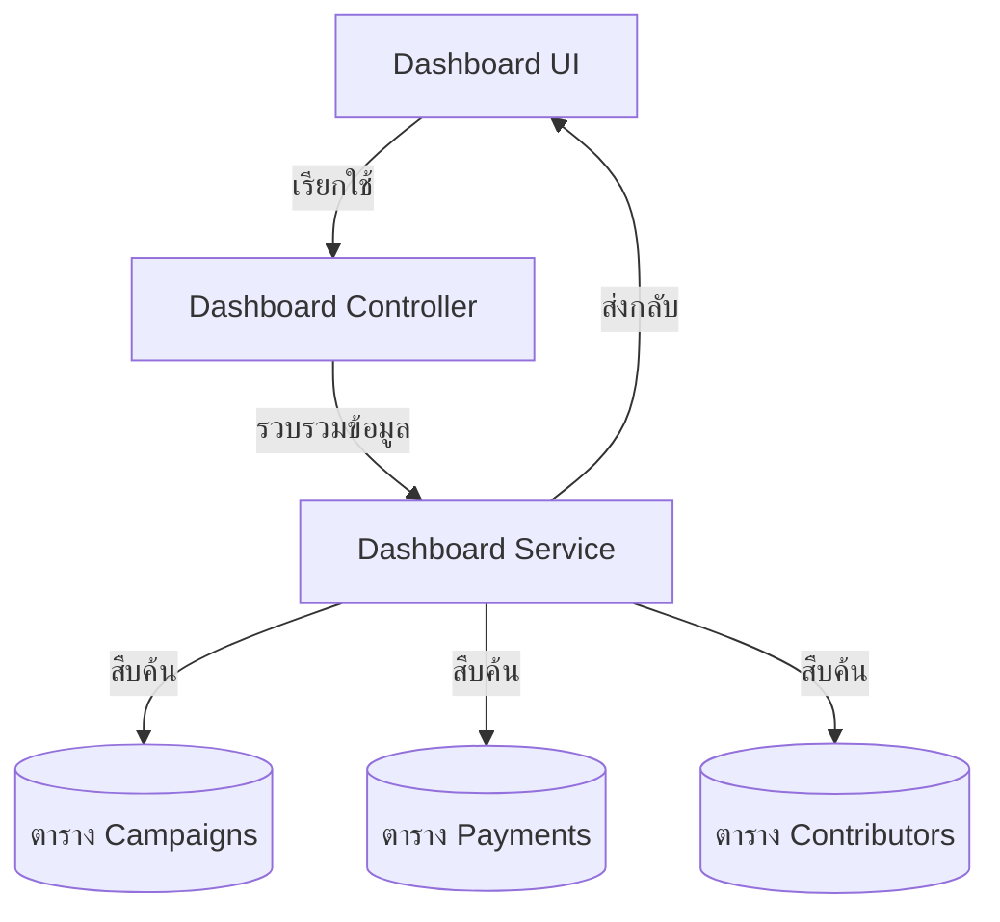

# คู่มือสำหรับนักพัฒนา: โมดูลแดชบอร์ด (Dashboard Module)

โมดูลแดชบอร์ดทำหน้าที่เป็นศูนย์ควบคุมการวิเคราะห์ข้อมูลสำหรับผู้สร้าง โดยทำการรวบรวมข้อมูลข้ามโมดูลมาแสดงผลเป็นภาพระดับสูงและรายงานความคืบหน้า

## 1. โครงสร้างโปรแกรม (Program Structure)

โมดูลแดชบอร์ดเป็นบริการแบบผสมผสานที่จะทำการเรียกดูข้อมูลจากโมดูล Campaign, Payment และ Contributor

### โครงสร้างฝั่ง Backend (`okard-backend/src/modules/dashboard`)
- [controller.py](file:///Users/wisapat/Documents/Code/Git/okard-backend/src/modules/dashboard/controller.py): จุดเชื่อมต่อ API สำหรับสรุปสถิติ, รายการความคืบหน้า และแนวโน้มตามประเทศ
- [service.py](file:///Users/wisapat/Documents/Code/Git/okard-backend/src/modules/dashboard/service.py): ตรรกะสำหรับการคำนวณเปอร์เซ็นต์, แนวโน้ม และการจัดรูปแบบข้อมูลสำหรับแผนภูมิ
- [repo.py](file:///Users/wisapat/Documents/Code/Git/okard-backend/src/modules/dashboard/repo.py): การใช้ SQL แบบดิบและคำสั่ง ORM ที่ซับซ้อนสำหรับการประมวลผลข้อมูลจำนวนมาก
- [schema.py](file:///Users/wisapat/Documents/Code/Git/okard-backend/src/modules/dashboard/schema.py): โครงสร้างข้อมูลสำหรับแผนภูมิและข้อมูลสรุปหลายตัววัด

### โครงสร้างฝั่ง Frontend (`okard-frontend/src/modules/dashboard`)
- [DashboardComponent.tsx](file:///Users/wisapat/Documents/Code/Git/okard-frontend/src/modules/dashboard/DashboardComponent.tsx): ตัวจัดลำดับเค้าโครงหลักของแดชบอร์ด
- `components/`:
    - `DashboardBarChart.tsx`: แสดงแนวโน้มปริมาณการชำระเงิน (7 วันล่าสุด)
    - `DashboardPieChart.tsx`: แสดงสัดส่วนนักลงทุนตามรายประเทศ
    - `DashboardSummary.tsx`: ตัววัดหลักระดับบนสุด (ยอดรวมที่ระดมได้, จำนวนนักลงทุน, แคมเปญที่ยังเปิดรับทุนอยู่)
    - `DashboardCampaigns.tsx`: มุมมองแบบตารางของความคืบหน้าแคมเปญในแต่ละรายการ

---

## 2. ภาพรวมการทำงาน (Top-Down Functional Overview)

แดชบอร์ดเป็นโมดูลประเภท "อ่านและรวบรวมข้อมูล" (Read-Aggregate)

---

## 3. คำอธิบายโปรแกรมย่อย (Subprogram Descriptions)

### Backend: ชั้นบริการ (Service Layer - [service.py](file:///Users/wisapat/Documents/Code/Git/okard-backend/src/modules/dashboard/service.py))

| โปรแกรมย่อย | หน้าที่ความรับผิดชอบ | ข้อมูลเข้า (Input) | ข้อมูลออก (Output) |
| :--- | :--- | :--- | :--- |
| `get_user_dashboard` | รวบรวมจำนวน KPI ระดับบนสุดสำหรับผู้ใช้ | `db`, `clerk_id` | `UserDashboardSummary` |
| `get_campaign_progress` | คำนวณเปอร์เซ็นต์การระดมทุนและจำนวนนักลงทุนต่อโครงการ | `db`, `clerk_id` | `List[CampaignProgress]` |
| `get_payment_stats` | จัดกลุ่มปริมาณการชำระเงินตามวันที่เพื่อใช้แสดงผลแผนภูมิ | `db`, `clerk_id` | `List[PaymentStat]` |

---

## 4. การสื่อสารและพารามิเตอร์ (Communication & Parameters)

1.  **การรวมระบบเข้ากับ Clerk**: เช่นเดียวกับบริการอื่นๆ ที่เกี่ยวข้องกับผู้ใช้ ระบบจะดึงข้อมูล `user_id` ในพื้นที่จากรหัสเซสชันของ Clerk
2.  **การเพิ่มประสิทธิภาพการทำงาน**: ไฟล์ `repo.py` ใช้การสืบค้นข้อมูล SQLAlchemy ที่ได้รับการเพิ่มประสิทธิภาพเพื่อดำเนินการจัดกลุ่ม (Group-by) และนับจำนวน (Count) ผ่านชุดข้อมูลที่อาจมีขนาดใหญ่โดยไม่ต้องดึงข้อมูลวัตถุทั้งหมดมาประมวลผล
3.  **การแสดงผลแบบไดนามิก**: ฝั่ง Frontend ใช้ `DashboardBarChart` (ขับเคลื่อนโดย MUI X หรือไลบรารีที่ใกล้เคียง) เพื่อแปลงผลลัพธ์ JSON ตามวันที่ให้เป็นเส้นแนวโน้มที่เห็นภาพได้
4.  **การแบ่งหน้า (Pagination)**: รายการแคมเปญในแดชบอร์ดรองรับ `limit` และ `offset` เพื่อให้จัดการกับผู้ใช้ที่มีแคมเปญจำนวนมากได้อย่างมีประสิทธิภาพ
