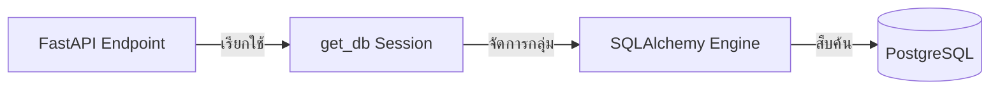

# คู่มือสำหรับนักพัฒนา: โมดูลโครงสร้างพื้นฐานฐานข้อมูล (Database Infrastructure Module)

โมดูลฐานข้อมูลจัดการการเชื่อมต่อที่เชื่อถือได้ของแอปพลิเคชันกับฐานข้อมูล PostgreSQL โดยทำหน้าที่จัดการเซสชัน (Session management) และเป็นฐานสำหรับโมดูล ORM ทั้งหมด

## 1. โครงสร้างโปรแกรม (Program Structure)

โมดูลฐานข้อมูลเป็นตัวขับเคลื่อนหลักในการจัดเก็บข้อมูลของระบบ

### โครงสร้างฝั่ง Backend (`okard-backend/src/database`)
- [db.py](file:///Users/wisapat/Documents/Code/Git/okard-backend/src/database/db.py): การเริ่มการทำงานของ Engine, การตั้งค่าการรวมกลุ่มการเชื่อมต่อ (Connection pooling) และตัวจัดการ `get_db` สำหรับ FastAPI
- [models.py](file:///Users/wisapat/Documents/Code/Git/okard-backend/src/database/models.py): แหล่งทะเบียนส่วนกลางที่ใช้โดยกระบวนการ Migrations เพื่อติดตามโมเดลทั้งหมดที่ประกาศไว้

---

## 2. ภาพรวมการทำงาน (Top-Down Functional Overview)

โมดูลฐานข้อมูลใช้รูปแบบการฉีดส่วนประกอบ (Dependency Injection) ตาม **Repository Pattern**

---

## 3. คำอธิบายโปรแกรมย่อย (Subprogram Descriptions)

### Backend: ชั้นไดรเวอร์ (Driver Layer - [db.py](file:///Users/wisapat/Documents/Code/Git/okard-backend/src/database/db.py))

| โปรแกรมย่อย | หน้าที่ความรับผิดชอบ | พารามิเตอร์หลัก |
| :--- | :--- | :--- |
| `get_db` | ฟังก์ชัน Generator ที่ทำหน้าที่จัดสรรเซสชันฐานข้อมูลสำหรับแต่ละคำขอ (Request) และรับประกันการปิดเซสชันหลังจบงาน | `yield db` |
| `create_engine` | เริ่มการเชื่อมต่อทางกายภาพด้วยการจัดการกลุ่มการเชื่อมต่อ (Pooling) ที่ได้รับการเพิ่มประสิทธิภาพ | `pool_size=20`, `max_overflow=10`, `pool_pre_ping=True` |

---

## 4. การสื่อสารและพารามิเตอร์ (Communication & Parameters)

1.  **การรวมกลุ่มการเชื่อมต่อ (Connection Pooling)**: ใช้ `QueuePool` ของ SQLAlchemy โดยตั้งค่า `pool_pre_ping=True` เพื่อป้องกันข้อผิดพลาด "การเชื่อมต่อค้าง" (Stale connection) เมื่อไม่มีกิจกรรมเป็นเวลานาน
2.  **การโหลดสภาพแวดล้อม**: ข้อมูลรับรองฐานข้อมูลถูกโหลดจาก `.env.local` โดยใช้ `pathlib` เพื่อให้แน่ใจว่าการระบุเส้นทางไฟล์ถูกต้องไม่ว่าจะเริ่มรันแอปพลิเคชันจากที่ใด
3.  **โมเดลฐาน (Declarative Base)**: โมเดลเฉพาะของแต่ละฟีเจอร์ (User, Post และอื่นๆ) ทั้งหมดจะสืบทอดมาจาก `Base` ที่กำหนดไว้ใน `db.py` ซึ่งช่วยให้ SQLAlchemy สามารถสร้างโครงสร้างฐานข้อมูลแบบรวมหมู่ได้
4.  **วงจรชีวิตของเซสชัน**: ตัวจัดการ `get_db` ช่วยให้แน่ใจว่าทุกคำขอ API จะมีเซสชันเฉพาะตัวที่จะถูกปิด (`closed()`) โดยอัตโนมัติในบล็อก `finally` เพื่อป้องกันปัญหาหน่วยความจำรั่วและการใช้การเชื่อมต่อจนหมด
