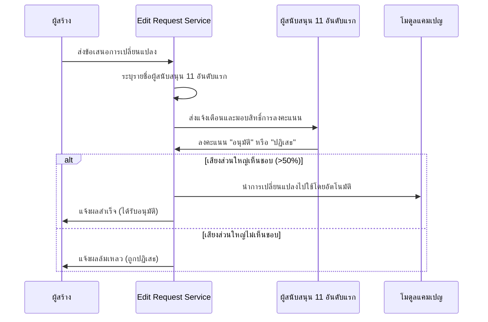

# คู่มือสำหรับนักพัฒนา: โมดูลคำขอแก้ไขข้อมูล (Edit Request Module)

โมดูลคำขอแก้ไขข้อมูลใช้กระบวนการธรรมาภิบาลแบบพิเศษสำหรับการแก้ไขแคมเปญที่เผยแพร่แล้ว เพื่อให้แน่ใจว่าการเปลี่ยนแปลงที่สำคัญ (เช่น ยอดเป้าหมายหรือของรางวัล) ได้รับการอนุมัติจากผู้สนับสนุนรายใหญ่

## 1. โครงสร้างโปรแกรม (Program Structure)

โมดูลนี้ประกอบด้วยวงจรสถานะ (State machine) ที่ซับซ้อนและกระบวนการลงคะแนนจากผู้ใช้หลายคน

### โครงสร้างฝั่ง Backend (`okard-backend/src/modules/edit_request`)
- [controller.py](file:///Users/wisapat/Documents/Code/Git/okard-backend/src/modules/edit_request/controller.py): API สำหรับการสร้างคำขอ, การลงคะแนน และการเรียกดูงานที่รอดำเนินการ
- [service.py](file:///Users/wisapat/Documents/Code/Git/okard-backend/src/modules/edit_request/service.py): ตรรกะหลักสำหรับการเปรียบเทียบความแตกต่างของข้อมูล (Diffing), การคำนวณเกณฑ์เสียงส่วนใหญ่ และการนำการเปลี่ยนแปลงที่ได้รับอนุมัติไปใช้โดยอัตโนมัติ
- [repo.py](file:///Users/wisapat/Documents/Code/Git/okard-backend/src/modules/edit_request/repo.py): จัดการความสัมพันธ์ระหว่างคำขอ (Requests), ผู้อนุมัติ (Approvers) และผลการลงคะแนน (Votes)
- [model.py](file:///Users/wisapat/Documents/Code/Git/okard-backend/src/modules/edit_request/model.py): กำหนดตาราง `EditRequest`, `EditRequestApprover` และ `EditRequestVote`
- [schema.py](file:///Users/wisapat/Documents/Code/Git/okard-backend/src/modules/edit_request/schema.py): โครงสร้างข้อมูลสำหรับรายละเอียดการเปลี่ยนแปลงที่เสนอและผลการลงคะแนน

### โครงสร้างฝั่ง Frontend (`okard-frontend/src/modules/edit_request/components`)
- [EditRequestModal.tsx](file:///Users/wisapat/Documents/Code/Git/okard-frontend/src/modules/edit_request/components/EditRequestModal.tsx): ส่วนติดต่อผู้ใช้สำหรับผู้สร้างในการเสนอการเปลี่ยนแปลง
- [ReviewEditRequestModal.tsx](file:///Users/wisapat/Documents/Code/Git/okard-frontend/src/modules/edit_request/components/ReviewEditRequestModal.tsx): ส่วนติดต่อผู้ใช้สำหรับผู้สนับสนุนรายใหญ่ในการตรวจสอบและลงคะแนน

---

## 2. ภาพรวมการทำงาน (Top-Down Functional Overview)

กระบวนการขอแก้ไขข้อมูลมีวงจรชีวิตแบบ "เสนอ-ลงคะแนน-ดำเนินการ"

---

## 3. คำอธิบายโปรแกรมย่อย (Subprogram Descriptions)

### Backend: ชั้นบริการ (Service Layer - [service.py](file:///Users/wisapat/Documents/Code/Git/okard-backend/src/modules/edit_request/service.py))

| โปรแกรมย่อย | หน้าที่ความรับผิดชอบ | ข้อมูลเข้า (Input) | ข้อมูลออก (Output) |
| :--- | :--- | :--- | :--- |
| `create_request` | ระบุผู้สนับสนุนรายใหญ่, สร้างข้อความเปรียบเทียบความแตกต่าง (Diff) และเริ่มรอบการลงคะแนน | `db`, `requester_id`, `data` | `EditRequest` |
| `cast_vote` | บันทึกการลงคะแนนและตรวจสอบว่าถึงเกณฑ์เสียงส่วนใหญ่แล้วหรือไม่ | `db`, `edit_request_id`, `user_id`, `data` | `Vote` |
| `_generate_display_changes`| ยูทิลิตี้ภายในเพื่อสร้างรายการสรุปการเปลี่ยนแปลงที่มนุษย์อ่านเข้าใจได้ง่าย | `campaign`, `proposed_changes` | สตริง (Markdown) |

---

## 4. การสื่อสารและพารามิเตอร์ (Communication & Parameters)

1.  **ผู้สนับสนุน 11 อันดับแรก**: ระบบจะคัดเลือกผู้ใช้ 11 รายที่มียอดเงินสนับสนุนรวมสูงสุดในแคมเปญนั้นๆ ให้ทำหน้าที่เป็น "ผู้อนุมัติ" (Approvers) โดยอัตโนมัติ
2.  **ข้อมูลการเปลี่ยนแปลงที่เสนอ**: ข้อมูลแบบ JSON ที่ประกอบด้วยค่าใหม่สำหรับ `goal_amount`, `effective_end_date` หรือข้อมูลรางวัลที่ซ้อนอยู่ (`rewards_payload`)
3.  **การทำงานร่วมกันอัตโนมัติ**: เมื่อได้รับอนุมัติ `service.py` จะดำเนินการซิงค์รายการรางวัล (Reward list) ที่ซับซ้อน (ลบรางวัลที่ถูกเอาออก, อัปเดตรางวัลที่แก้ไข และเพิ่มรางวัลใหม่)
4.  **เกณฑ์คะแนน**: ใช้เกณฑ์เสียงส่วนใหญ่ธรรมดา (มากกว่า 50% ของจำนวนผู้อนุมัติทั้งหมดที่ได้รับมอบหมาย)
