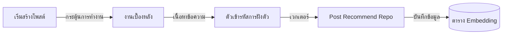

# คู่มือสำหรับนักพัฒนา: โมดูลการฝังตัว (Embedding Module)

โมดูลการฝังตัว (ตั้งอยู่ที่ `src/modules/recommend`) เป็นระบบขับเคลื่อนการสร้างเวกเตอร์ (Vectorization engine) ของระบบ ซึ่งทำหน้าที่แปลงข้อความให้เป็นรูปแบบตัวเลขเพื่อใช้ในการค้นหาและระบบแนะนำ

## 1. โครงสร้างโปรแกรม (Program Structure)

โมดูลนี้เป็นยูทิลิตี้สำหรับการคำนวณล้วนๆ ที่ทำหน้าที่เชื่อมต่อกับโมเดลการเรียนรู้ของเครื่อง (Machine learning models)

### โครงสร้างฝั่ง Backend (`okard-backend/src/modules/recommend`)
- [encoder.py](file:///Users/wisapat/Documents/Code/Git/okard-backend/src/modules/recommend/encoder.py): ส่วนต่อประสานสาธารณะสำหรับการเปลี่ยนรายการข้อความเป็นข้อมูลการฝังตัว (Embeddings)
- [model.py](file:///Users/wisapat/Documents/Code/Git/okard-backend/src/modules/recommend/model.py): ตัวโหลดแบบ Singleton สำหรับโมเดล Transformer

---

## 2. ภาพรวมการทำงาน (Top-Down Functional Overview)

ระบบการฝังตัวเป็น "ยูทิลิตี้ซิงค์ข้อมูล" ที่ใช้งานโดยงานเบื้องหลัง (Background tasks)

---

## 3. คำอธิบายโปรแกรมย่อย (Subprogram Descriptions)

### Backend: ชั้นตัวเข้ารหัส (Encoder Layer - [encoder.py](file:///Users/wisapat/Documents/Code/Git/okard-backend/src/modules/recommend/encoder.py))

| โปรแกรมย่อย | หน้าที่ความรับผิดชอบ | ข้อมูลเข้า (Input) | ข้อมูลออก (Output) |
| :--- | :--- | :--- | :--- |
| `encode_texts` | จัดกลุ่มข้อความและประมวลผลผ่านโมเดลเพื่อสร้างเวกเตอร์ | `List[str]` | `List[List[float]]` |
| `get_embedding_model`| (อยู่ใน model.py) ช่วยให้แน่ใจว่าโมเดล ML ที่มีขนาดใหญ่จะถูกโหลดเข้าสู่หน่วยความจำเพียงครั้งเดียวเท่านั้น | ไม่มี | `ตัวอย่างโมเดล (Model Instance)` |

---

## 4. การสื่อสารและพารามิเตอร์ (Communication & Parameters)

1.  **มิติของเวกเตอร์ (Vector Dimensions)**: ระบบจะสร้างเวกเตอร์ที่มีมิติสูง (โดยปกติคือ 384 หรือ 768 ขึ้นอยู่กับโมเดลที่ใช้)
2.  **การปรับค่ามาตรฐาน (Normalization)**: ข้อมูลการฝังตัวจะถูกส่งกลับเป็นเวกเตอร์ที่ปรับมาตรฐานแบบ L2 (L2-normalized) ซึ่งช่วยให้โมเดลส่วนต่อยอดสามารถใช้การคูณแบบ Dot product อย่างง่ายในการคำนวณความคล้ายคลึงของโคไซน์ (Cosine similarity)
3.  **ต้นทุนการคำนวณ**: การเข้ารหัสข้อความเป็นกระบวนการที่ใช้ทรัพยากร CPU/GPU สูง จึง**ไม่เคย**ถูกเรียกใช้โดยตรงจากการขอ API แต่จะมอบหมายให้ระบบงานเบื้องหลัง (`BackgroundTasks`) เป็นผู้จัดการเสมอ
4.  **การรองรับภาษา**: โมเดลที่ใช้โดยปกติจะเป็นแบบรองรับหลายภาษา (Multi-lingual) หรือได้รับการปรับแต่งให้เข้ากับท้องถิ่นเพื่อรองรับทั้งภาษาอังกฤษและภาษาหลักของแพลตฟอร์ม
