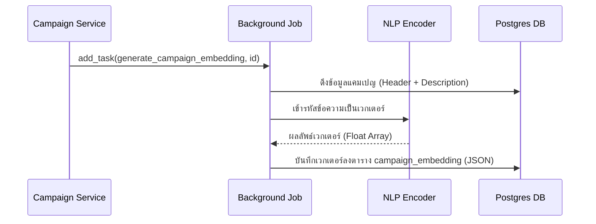

# คู่มือสำหรับนักพัฒนา: โมดูลการฝังตัวเนื้อหา (Campaign Embedding Module)

โมดูลการฝังตัวเนื้อหา (Embedding Module) ทำหน้าที่รับผิดชอบในการแปลงข้อมูลข้อความของแคมเปญ (เช่น ชื่อและคำอธิบาย) ให้เป็นเวกเตอร์ตัวเลขที่มีมิติสูง ข้อมูลนี้เป็นพื้นฐานสำคัญสำหรับการค้นหาความหมาย (Semantic search) และระบบการแนะนำแคมเปญ

## 1. โครงสร้างโปรแกรม (Program Structure)

โมดูลนี้ทำงานเป็นงานเบื้องหลัง (Background job) เพื่อลดภาระการประมวลผลและการตอบสนองของ API

### โครงสร้างฝั่ง Backend (`okard-backend/src/modules/campaign`)
- [background.py](file:///Users/wisapat/Documents/Code/Git/okard-backend/src/modules/campaign/background.py): จัดเตรียมฟังก์ชันสำหรับรันงานเบื้องหลัง (Background worker)
- [model.py](file:///Users/wisapat/Documents/Code/Git/okard-backend/src/modules/campaign/model.py): กำหนดตาราง `campaign_embedding` สำหรับเก็บเวกเตอร์ในรูปแบบ JSON
- [src/modules/recommend/encoder.py](file:///Users/wisapat/Documents/Code/Git/okard-backend/src/modules/recommend/encoder.py): จัดการการเรียกใช้โมเดล NLP เพื่อเข้ารหัสข้อความเป็นเวกเตอร์

---

## 2. ภาพรวมการทำงาน (Top-Down Functional Overview)

กระบวนการสร้างเวกเตอร์จะทำงานเมื่อมีการสร้างหรืออัปเดตแคมเปญ

---

## 3. คำอธิบายโปรแกรมย่อย (Subprogram Descriptions)

### Backend: งานเบื้องหลัง (Background Job - [background.py](file:///Users/wisapat/Documents/Code/Git/okard-backend/src/modules/campaign/background.py))

| โปรแกรมย่อย | หน้าที่ความรับผิดชอบ | ข้อมูลเข้า (Input) | ข้อมูลออก (Output) |
| :--- | :--- | :--- | :--- |
| `generate_campaign_embedding` | จัดทำเวกเตอร์จากหัวข้อและคำอธิบาย แล้วบันทึกลงในตารางที่เกี่ยวข้อง | `campaign_id` | ไม่มี (อัปเดต DB) |

---

## 4. การสื่อสารและพารามิเตอร์ (Communication & Parameters)

1.  **การแยกเก็บข้อมูล**: ข้อมูลเวกเตอร์จะถูกเก็บไว้ในตาราง `campaign_embedding` ซึ่งแยกจากตาราง `campaign` หลัก เพื่อรักษาความเร็วในการสืบค้นข้อมูลพื้นฐาน
2.  **การประมวลผลเป็นชุด**: ระบบส่งข้อความชุดหนึ่งไปยัง `Encoder` เพื่อประมวลผลผ่านโมเดล NLP (เช่น BERT หรือที่คล้ายกัน) และรับเวกเตอร์กลับมา
3.  **การทำงานแบบอะซิงโครนัส**: เนื่องจากกระบวนการเข้ารหัส (Encoding) ใช้ทรัพยากร CPU/GPU ค่อนข้างมาก ระบบจึงเรียกใช้งานผ่าน `BackgroundTasks` ของ FastAPI เพื่อหลีกเลี่ยงการทำให้ผู้ใช้ต้องรอจนเสร็จสิ้น
4.  **รูปแบบข้อมูล**: เวกเตอร์จะถูกจัดเก็บเป็นสตริง JSON ในฐานข้อมูล PostgreSQL เพื่อความยืดหยุ่นในการจัดเก็บแบบอาร์เรย์ตัวเลข
