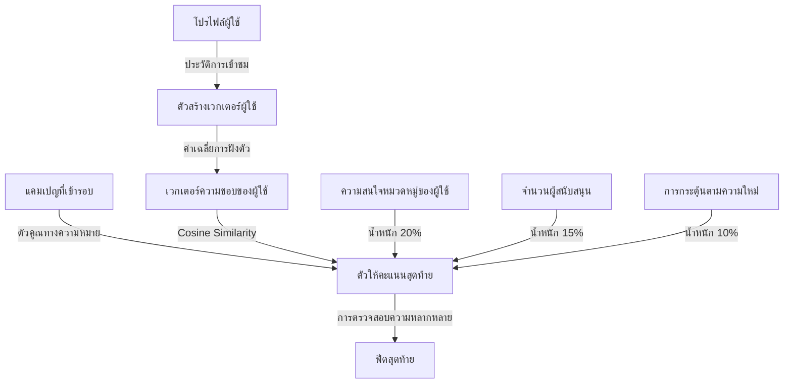

# คู่มือสำหรับนักพัฒนา: โมดูล "สำหรับคุณ" (For You Module)

โมดูล "สำหรับคุณ" ทำหน้าที่จัดเตรียมฟีดข้อมูลแนะนำที่ออกแบบมาเฉพาะบุคคลสำหรับผู้ใช้ โดยใช้เทคนิคการฝังตัวของเวกเตอร์ (Vector embeddings) และการวิเคราะห์พฤติกรรมเพื่อแสดงเนื้อหาที่เกี่ยวข้อง

## 1. โครงสร้างโปรแกรม (Program Structure)

โมดูล "สำหรับคุณ" เป็นบริการวิเคราะห์ขั้นสูงที่รวบรวมปัจจัยการให้คะแนนหลายอย่างเข้าด้วยกันเพื่อจัดอันดับสุดท้าย

### โครงสร้างฝั่ง Backend (`okard-backend/src/modules/for_you`)
- [service.py](file:///Users/wisapat/Documents/Code/Git/okard-backend/src/modules/for_you/service.py): ระบบแนะนำหลัก ประกอบด้วยการสร้างเวกเตอร์ผู้ใช้และการให้คะแนนแบบหลายปัจจัย
- [repo.py](file:///Users/wisapat/Documents/Code/Git/okard-backend/src/modules/for_you/repo.py): ดึงข้อมูลการฝังตัว, ประวัติการเข้าชม และมาตรวัดความสนใจตามหมวดหมู่
- [schema.py](file:///Users/wisapat/Documents/Code/Git/okard-backend/src/modules/for_you/schema.py): โครงสร้างข้อมูลสำหรับผลลัพธ์แคมเปญที่ได้รับการให้คะแนนแล้ว

### โครงสร้างฝั่ง Frontend
- [api/api.ts](file:///Users/wisapat/Documents/Code/Git/okard-frontend/src/modules/campaign/api/api.ts): ฟังก์ชัน `getForYouCampaigns` ทำหน้าที่ดึงรายการข้อมูลที่ปรับให้เข้ากับบุคคล
- โดยปกติจะแสดงในแท็บ "สำหรับคุณ" บนหน้าสำรวจ (Explore) หรือหน้าแรก (Home)

---

## 2. ภาพรวมการทำงาน (Top-Down Functional Overview)

โมดูลนี้ใช้แนวทางแบบผสมผสาน: **ความคล้ายคลึงทางความหมาย (Semantic Similarity) + ความสนใจตามหมวดหมู่ + ความนิยม + ความสดใหม่**

---

## 3. คำอธิบายโปรแกรมย่อย (Subprogram Descriptions)

### Backend: ชั้นบริการ (Service Layer - [service.py](file:///Users/wisapat/Documents/Code/Git/okard-backend/src/modules/for_you/service.py))

| โปรแกรมย่อย | หน้าที่ความรับผิดชอบ | ข้อมูลเข้า (Input) | ข้อมูลออก (Output) |
| :--- | :--- | :--- | :--- |
| `for_you` | จุดเริ่มต้นหลักที่จัดการการดึงข้อมูลและการให้คะแนน | `db`, `user_id` | `List[ScoredCampaign]` |
| `_build_user_vector` | สร้างเวกเตอร์ค่าเฉลี่ยถ่วงน้ำหนักของแคมเปญที่ผู้ใช้เพิ่งเข้าชมเมื่อเร็วๆ นี้ | `db`, `user_id` | `np.ndarray` |
| `diversity_penalty` | ลดคะแนนของแคมเปญที่มีหมวดหมู่ซ้ำกับรายการที่ถูกเลือกไว้ก่อนหน้าแล้ว | `campaign`, `recent_campaigns`| ค่าลอยตัว `penalty` |
| `inject_exploration` | สลับผลลัพธ์อันดับต้นๆ บางส่วนกับรายการอันดับต่ำเพื่อป้องกันการเกิด Echo chambers (การเห็นแต่สิ่งที่ชอบซ้ำๆ) | `scored` (รายการ) | รายการ (`List`) |

---

## 4. การสื่อสารและพารามิเตอร์ (Communication & Parameters)

1.  **น้ำหนักสำหรับการให้คะแนน**:
    - ความคล้ายคลึงทางความหมาย (Vector dot product): 55%
    - ความสนใจตามหมวดหมู่ของผู้ใช้: 20%
    - ความนิยม (บันทึกผู้สนับสนุน): 15%
    - ความสดใหม่ (ค่าเสื่อมตามเวลา): 10%
2.  **การลดความสำคัญของเวกเตอร์ตามเวลา**: ฟังก์ชัน `_build_user_vector` จะใช้วิธีลดน้ำหนักแบบเอกซ์โพเนนเชียล (Exponential decay) กับชุดข้อมูลการเข้าชมที่เก่ากว่า เพื่อให้แน่ใจว่าเวกเตอร์สะท้อนความสนใจในปัจจุบัน
3.  **แผนสำรอง (Fallback)**: หากผู้ใช้เป็นรายใหม่หรือไม่มีประวัติการเข้าชม ระบบจะปรับไปใช้ฟีดที่อิงตามความนิยมทั่วโลกแทน
4.  **เกณฑ์คะแนน**: มีการใช้เกณฑ์คะแนนขั้นต่ำ `MIN_SCORE` ที่ 0.15 เพื่อคัดกรองรายการที่มีความเกี่ยวข้องต่ำออกไป
