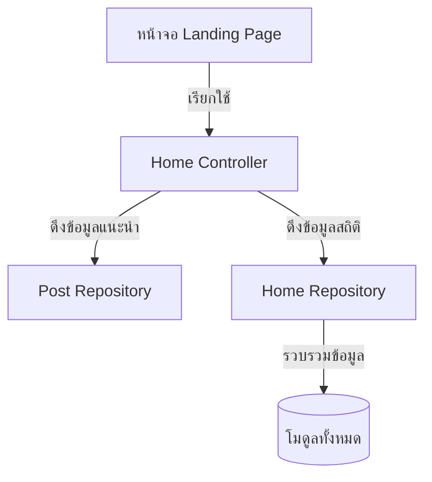

# คู่มือสำหรับนักพัฒนา: โมดูลหน้าแรก (Home Module)

โมดูลหน้าแรกเป็นจุดเข้าใช้งานหลักของแพลตฟอร์ม ทำหน้าที่รวบรวมเนื้อหาเด่นและมาตรวัดกิจกรรมในแต่ละหมวดหมู่

## 1. โครงสร้างโปรแกรม (Program Structure)

โมดูลหน้าแรกเป็นชั้นรวบรวมข้อมูลแบบชั่วคราว (Non-persistent aggregation layer) ที่ทำการดึงข้อมูลจากโมดูลที่มีอยู่แล้ว

### โครงสร้างฝั่ง Backend (`okard-backend/src/modules/home`)
- [controller.py](file:///Users/wisapat/Documents/Code/Git/okard-backend/src/modules/home/controller.py): API สำหรับดึงข้อมูลชุดหลักของหน้า Landing Page
- [service.py](file:///Users/wisapat/Documents/Code/Git/okard-backend/src/modules/home/service.py): ตรรกะทางธุรกิจสำหรับการเลือกโพสต์ที่ "มียอดสนับสนุนสูงสุด" และการคำนวณสถิติหมวดหมู่
- [repo.py](file:///Users/wisapat/Documents/Code/Git/okard-backend/src/modules/home/repo.py): การสืบค้น SQL ที่ได้รับการปรับแต่งเพื่อรวบรวมข้อมูลข้ามหมวดหมู่
- [schema.py](file:///Users/wisapat/Documents/Code/Git/okard-backend/src/modules/home/schema.py): โครงสร้างข้อมูลสำหรับสถิติสรุป

### โครงสร้างฝั่ง Frontend
- หน้า Landing Page หลัก (เส้นทาง `/`) ซึ่งเรียกใช้ Home API เพื่อแสดงภาพสไลด์แนะนำ (Featured carousels) และตัวกรองหมวดหมู่

---

## 2. ภาพรวมการทำงาน (Top-Down Functional Overview)

โมดูลหน้าแรกทำหน้าที่เป็น "ตัวจัดลำดับการแสดงผล" (View Orchestrator)

---

## 3. คำอธิบายโปรแกรมย่อย (Subprogram Descriptions)

### Backend: ชั้นบริการ (Service Layer - [service.py](file:///Users/wisapat/Documents/Code/Git/okard-backend/src/modules/home/service.py))

| โปรแกรมย่อย | หน้าที่ความรับผิดชอบ | ข้อมูลเข้า (Input) | ข้อมูลออก (Output) |
| :--- | :--- | :--- | :--- |
| `get_top_pledged_campaigns` | คัดเลือกโครงการที่ได้รับเงินสมทบมากที่สุด โดยสามารถเลือกกรองตามหมวดหมู่ได้ | `db`, `limit`, `category` | `List[Post]` |
| `get_category_stats_service`| รวบรวมข้อมูลจำนวนโครงการทั้งหมด, จำนวนที่ระดมทุนสำเร็จ และยอดรวมเงินที่ระดมได้ในแต่ละหมวดหมู่ | `db` | `List[CategoryStat]` |

---

## 4. การสื่อสารและพารามิเตอร์ (Communication & Parameters)

1.  **การคำนวณมาตรวัด**: สถิติหมวดหมู่ประกอบด้วย `total_projects` (ทุกสถานะ) เทียบกับ `funded_projects` (โครงการที่บรรลุเป้าหมายแล้ว) เพื่อให้เห็นภาพรวมของอัตราความสำเร็จในระดับสูง
2.  **เนื้อหาเด่น**: ตรรกะ "มียอดสนับสนุนสูงสุด" จะให้ลำดับความสำคัญกับ `current_amount` เพื่อแสดงแคมเปญที่กำลังเป็นที่นิยมและมีผลกระทบสูง
3.  **การพึ่งพาข้ามโมดูล**: แม้ว่าจะไม่มีตารางเป็นของตนเอง แต่โมดูลหน้าแรกพึ่งพาโครงสร้างข้อมูล (Schemas) จากโมดูล `Post` และ `Payment` เป็นอย่างมาก
4.  **ประสิทธิภาพของ UI**: ผลลัพธ์มักจะถูกแคชไว้ หรือให้บริการผ่าน CDN ในฝั่ง Frontend เพื่อให้มั่นใจว่าการโหลดหน้าเว็บครั้งแรกทำได้รวดเร็วมาก
