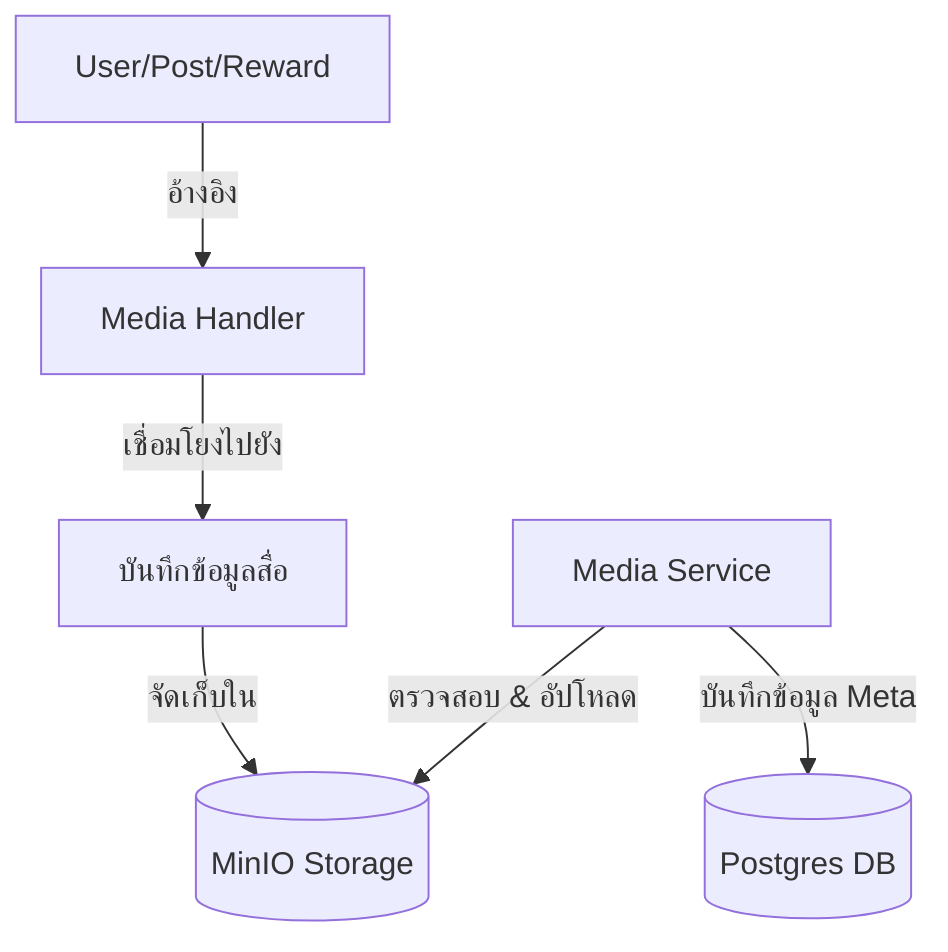

# คู่มือสำหรับนักพัฒนา: โมดูลสื่อ (Media Module)

โมดูลสื่อให้บริการจัดการไฟล์แบบรวมศูนย์ จัดการการอัปโหลด, การจัดเก็บใน MinIO และการเชื่อมโยงแบบ Polymorphic กับเอนทิตีอื่นๆ ในระบบ

## 1. โครงสร้างโปรแกรม (Program Structure)

โมดูลสื่อทำหน้าที่เป็น "ชั้นการจัดเก็บข้อมูล" (Storage Layer) สำหรับสินทรัพย์ที่เป็นไฟล์ไบนารีทั้งหมด (รูปภาพ, วิดีโอ, เอกสาร)

### โครงสร้างฝั่ง Backend (`okard-backend/src/modules/media`)
- [controller.py](file:///Users/wisapat/Documents/Code/Git/okard-backend/src/modules/media/controller.py): API สำหรับการอัปโหลดและลบสื่อโดยตรง
- [service.py](file:///Users/wisapat/Documents/Code/Git/okard-backend/src/modules/media/service.py): ตรรกะหลักสำหรับการตรวจสอบความถูกต้องของไฟล์, การรวมระบบกับ MinIO และการบันทึกข้อมูล Meta
- [repo.py](file:///Users/wisapat/Documents/Code/Git/okard-backend/src/modules/media/repo.py): การดำเนินการ SQL สำหรับตาราง `media` และ `media_handler`
- [model.py](file:///Users/wisapat/Documents/Code/Git/okard-backend/src/modules/media/model.py): กำหนดแอตทริบิวต์ของ `Media` และตารางเชื่อมโยง `MediaHandler`
- [schema.py](file:///Users/wisapat/Documents/Code/Git/okard-backend/src/modules/media/schema.py): โครงสร้างข้อมูลสำหรับการตรวจสอบความถูกต้องของข้อมูล Meta ของสื่อ

### โครงสร้างพื้นฐานส่วนกลาง
- [MinioService](file:///Users/wisapat/Documents/Code/Git/okard-backend/src/modules/common/minio_service.py): ตัวเชื่อมต่อหลักสำหรับพื้นที่จัดเก็บข้อมูลที่รองรับ S3 (S3-compatible storage)

---

## 2. ภาพรวมการทำงาน (Top-Down Functional Overview)

โมดูลนี้ใช้รูปแบบ **MediaHandler** เพื่อรองรับความสัมพันธ์แบบ Polymorphic (หนึ่งตารางเชื่อมโยงได้หลายโมดูล)

---

## 3. คำอธิบายโปรแกรมย่อย (Subprogram Descriptions)

### Backend: ชั้นบริการ (Service Layer - [service.py](file:///Users/wisapat/Documents/Code/Git/okard-backend/src/modules/media/service.py))

| โปรแกรมย่อย | หน้าที่ความรับผิดชอบ | ข้อมูลเข้า (Input) | ข้อมูลออก (Output) |
| :--- | :--- | :--- | :--- |
| `create_media_from_upload` | จัดการการอัปโหลดไฟล์เดียวพร้อมระบุประเภทการอ้างอิง (User/Post) | `db`, `file`, `post_id/clerk_id` | `Media` |
| `_save_files_and_create_media`| ประมวลผลแบบกลุ่มสำหรับแคมเปญ/รางวัล รองรับ `media_manifest` สำหรับการจัดลำดับ | `db`, `parent_type`, `parent_id`, `files`, `manifest` | `List[Media]` |
| `delete_media` | ลบบันทึกข้อมูลในฐานข้อมูลและไฟล์จริงออกจาก MinIO | `db`, `media_id` | `Media` (ที่ถูกลบ) |

---

## 4. การสื่อสารและพารามิเตอร์ (Communication & Parameters)

1.  **กฎการตรวจสอบความถูกต้อง**:
    - **รูปภาพ**: ขนาดสูงสุด 5MB, รูปแบบที่รองรับ: jpg, png, gif, webp
    - **วิดีโอ**: ขนาดสูงสุด 50MB, รูปแบบที่รองรับ: mp4, mov, webm
2.  **ลำดับการแสดงผล**: พารามิเตอร์ `display_order` ช่วยให้ฝั่ง Frontend สามารถควบคุมลำดับของรูปภาพในแกลเลอรีหรือเหตุการณ์สำคัญของแคมเปญได้
3.  **MediaHandler**: ตารางเชื่อมโยงนี้จะเก็บ `reference_id` (UUID) และ `type` (Enum) ซึ่งช่วยให้โมดูลใดๆ (Campaign, Reward ฯลฯ) สามารถ "เป็นเจ้าของ" สื่อได้โดยไม่ต้องแก้ไขโครงสร้างตาราง `Media`
4.  **เส้นทางการจัดเก็บ**: ไฟล์ใน MinIO จะถูกจัดระเบียบตามรูปแบบ: `{parent_type}/{parent_id}/{unique_filename}`
