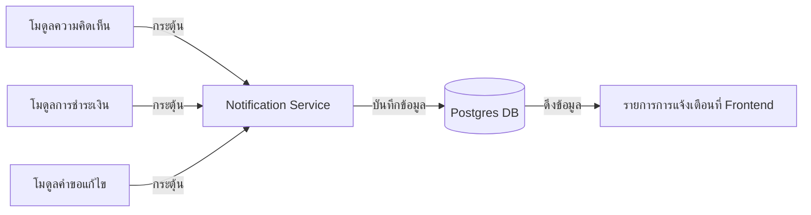

# คู่มือสำหรับนักพัฒนา: โมดูลการแจ้งเตือน (Notification Module)

โมดูลการแจ้งเตือนจัดเตรียมระบบแจ้งเตือนส่วนกลางเพื่อแจ้งให้ผู้ใช้ทราบเกี่ยวกับปฏิสัมพันธ์ทางสังคม, การอัปเดตการให้ทุน และการเปลี่ยนแปลงต่างๆ ในระบบ

## 1. โครงสร้างโปรแกรม (Program Structure)

โมดูลการแจ้งเตือนเป็นส่วนงานที่ใช้งานข้ามสายงาน (Cross-cutting concern) ซึ่งถูกเรียกใช้โดยโมดูลทางสังคมและการเงินเกือบทั้งหมดในระบบ

### โครงสร้างฝั่ง Backend (`okard-backend/src/modules/notification`)
- [controller.py](file:///Users/wisapat/Documents/Code/Git/okard-backend/src/modules/notification/controller.py): API สำหรับการเรียกดูรายการ, การทำเครื่องหมายว่าอ่านแล้ว และการลบการแจ้งเตือน
- [service.py](file:///Users/wisapat/Documents/Code/Git/okard-backend/src/modules/notification/service.py): การดำเนินการทางตรรกะสำหรับการจัดการการแจ้งเตือน
- [repo.py](file:///Users/wisapat/Documents/Code/Git/okard-backend/src/modules/notification/repo.py): การดำเนินการฐานข้อมูลสำหรับตาราง `notification`
- [model.py](file:///Users/wisapat/Documents/Code/Git/okard-backend/src/modules/notification/model.py): โมเดล SQLAlchemy ที่กำหนด `user_id` (ผู้รับ), `actor_id` (ผู้กระตุ้น) และประเภทการแจ้งเตือน (`type`)
- [schema.py](file:///Users/wisapat/Documents/Code/Git/okard-backend/src/modules/notification/schema.py): โครงสร้างข้อมูลสำหรับการตรวจสอบความถูกต้องและประเภทการแจ้งเตือน

### โครงสร้างฝั่ง Frontend (`okard-frontend/src/modules/notification`)
- [NotificationComponent.tsx](file:///Users/wisapat/Documents/Code/Git/okard-frontend/src/modules/notification/NotificationComponent.tsx): UI หลักสำหรับการดูรายการการแจ้งเตือนของผู้ใช้
- `components/`: ส่วนแสดงผลรายการและมุมมองเมื่อไม่มีข้อมูลการแจ้งเตือน

---

## 2. ภาพรวมการทำงาน (Top-Down Functional Overview)

การแจ้งเตือนจะถูกสร้างขึ้นโดยโมดูลอื่นๆ และส่งต่อให้ผู้รับใช้งาน

---

## 3. คำอธิบายโปรแกรมย่อย (Subprogram Descriptions)

### Backend: ชั้นบริการ (Service Layer - [service.py](file:///Users/wisapat/Documents/Code/Git/okard-backend/src/modules/notification/service.py))

| โปรแกรมย่อย | หน้าที่ความรับผิดชอบ | ข้อมูลเข้า (Input) | ข้อมูลออก (Output) |
| :--- | :--- | :--- | :--- |
| `create_notification` | บันทึกการแจ้งเตือนใหม่และจัดการการเชื่อมต่อแบบเรียลไทม์ (ถ้ามี) | `db`, `notif_data` | `Notification` |
| `mark_all_as_read` | อัปเดตการแจ้งเตือนที่ยังไม่ได้อ่านทั้งหมดสำหรับผู้ใช้ที่ระบุ | `db`, `user_id` | `จำนวน` ของรายการที่ถูกอัปเดต |

---

## 4. การสื่อสารและพารามิเตอร์ (Communication & Parameters)

1.  **ประเภทการแจ้งเตือน**: ใช้ Enum `NotificationType` ซึ่งประกอบด้วย `comment`, `payment`, `goal`, `edit_request` และ `system`
2.  **การเชื่อมโยงบริบท**: การแจ้งเตือนแต่ละรายการสามารถเลือกใส่ `campaign_id` หรือ `comment_id` เพื่อให้ฝั่ง Frontend นำทางผู้ใช้ไปยังเนื้อหาที่เกี่ยวข้องได้โดยตรง
3.  **ผู้กระทำ vs. ผู้รับ**: `actor_id` ระบุตัวผู้ใช้ที่กระทำการ (เช่น ผู้เขียนความคิดเห็น) ในขณะที่ `user_id` ระบุตัวผู้รับการแจ้งเตือน
4.  **การล้างข้อมูลอัตโนมัติ**: การแจ้งเตือนเก่าอาจถูกลบออกตามนโยบายการเก็บรักษาข้อมูลที่กำหนดไว้ในชั้น Repository
