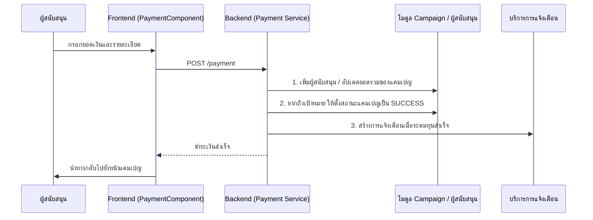

# คู่มือสำหรับนักพัฒนา: โมดูลการชำระเงิน (Payment Module)

โมดูลการชำระเงินจัดการธุรกรรมทางการเงินภายในแพลตฟอร์ม ช่วยให้ผู้ใช้สามารถสนับสนุนแคมเปญและติดตามความคืบหน้าการระดมทุนได้แบบเรียลไทม์

## 1. โครงสร้างโปรแกรม (Program Structure)

โมดูลการชำระเงินมีการทำงานร่วมกับโมดูลแคมเปญ (Campaign) และโมดูลผู้สนับสนุน (Contributor) อย่างใกล้ชิดเพื่อให้แน่ใจถึงความสอดคล้องของข้อมูลระหว่างการทำธุรกรรม

### โครงสร้างฝั่ง Backend (`okard-backend/src/modules/payment`)
- [controller.py](file:///Users/wisapat/Documents/Code/Git/okard-backend/src/modules/payment/controller.py): จุดเชื่อมต่อ API สำหรับกระบวนการชำระเงินและการดูประวัติย้อนหลัง
- [service.py](file:///Users/wisapat/Documents/Code/Git/okard-backend/src/modules/payment/service.py): ตรรกะที่สำคัญในการจัดการธุรกรรม, การอัปเดตยอดรวมของแคมเปญ และการกระตุ้นการแจ้งเตือนเมื่อสำเร็จ
- [repo.py](file:///Users/wisapat/Documents/Code/Git/okard-backend/src/modules/payment/repo.py): การบันทึกข้อมูลพื้นฐานสำหรับรายการการชำระเงิน
- [model.py](file:///Users/wisapat/Documents/Code/Git/okard-backend/src/modules/payment/model.py): กำหนดตาราง `Payment` พร้อมระบุยอดเงิน, วิธีการชำระเงิน และการอ้างอิงถึงผู้ใช้/แคมเปญ
- [schema.py](file:///Users/wisapat/Documents/Code/Git/okard-backend/src/modules/payment/schema.py): โครงสร้างข้อมูลสำหรับการประมวลผลการชำระเงิน

### โครงสร้างฝั่ง Frontend (`okard-frontend/src/modules/payment`)
- [api/api.ts](file:///Users/wisapat/Documents/Code/Git/okard-frontend/src/modules/payment/api/api.ts): ตัวเชื่อมต่ออย่างง่ายสำหรับจุดเชื่อมต่อ `createPayment`
- [PaymentComponent.tsx](file:///Users/wisapat/Documents/Code/Git/okard-frontend/src/modules/payment/PaymentComponent.tsx): ตัวจัดการหลักสำหรับหน้าชำระเงิน (Checkout page)
- `components/`:
    - `PaymentForm.tsx`: แบบฟอร์มสำหรับรายละเอียดผู้ใช้และยอดเงินที่ต้องการสนับสนุน
    - `PaymentMethod.tsx`: การเลือกผู้ให้บริการชำระเงิน (เช่น PromptPay)
    - `PaymentSummary.tsx`: สรุปค่าใช้จ่ายสุดท้ายและตรรกะการยอมรับข้อตกลง

---

## 2. ภาพรวมการทำงาน (Top-Down Functional Overview)

กระบวนการชำระเงินใช้รูปแบบ "ซิงค์ข้อมูลและสรุปแจ้งเตือน" (Sync & Notify)

---

## 3. คำอธิบายโปรแกรมย่อย (Subprogram Descriptions)

### Backend: ชั้นบริการ (Service Layer - [service.py](file:///Users/wisapat/Documents/Code/Git/okard-backend/src/modules/payment/service.py))

| โปรแกรมย่อย | หน้าที่ความรับผิดชอบ | ข้อมูลเข้า (Input) | ข้อมูลออก (Output) |
| :--- | :--- | :--- | :--- |
| `create_payment` | ตรวจสอบสถานะแคมเปญ, บันทึกการชำระเงิน และอัปเดตมาตรวัดการระดมทุนของแคมเปญ | `db`, `clerk_id`, `data` (Schema) | วัตถุ `Payment` |
| `calculate_backup_amounts`| (ถูกเรียกผ่าน reward_service) อัปเดตการคำนวณการให้ทุนแบบแบ่งระดับ (Tiered funding) | `db`, `campaign_id` | ไม่มี |

### Frontend: ตัวจัดการ UI (UI Orchestrator - [PaymentComponent.tsx](file:///Users/wisapat/Documents/Code/Git/okard-frontend/src/modules/payment/PaymentComponent.tsx))

| โปรแกรมย่อย | หน้าที่ความรับผิดชอบ | ข้อมูลเข้า (Input) | ข้อมูลออก (Output) |
| :--- | :--- | :--- | :--- |
| `handleSubmit` | ตรวจสอบข้อตกลงในแบบฟอร์มและส่งข้อมูลไปยัง Backend | สถานะคอมโพเนนต์ (ยอดเงิน, ทิป ฯลฯ) | นำทางไปยังหน้าแสดงแคมเปญ |
| `useEffect (Load Campaign)` | ดึงข้อมูลแคมเปญเป้าหมายเพื่อแสดงความคืบหน้าและส่วนหัว | `campaignId` | อัปเดตสถานะคอมโพเนนต์ |

---

## 4. การสื่อสารและพารามิเตอร์ (Communication & Parameters)

1.  **ความสมบูรณ์ของการทำธุรกรรม (Transaction Integrity)**: บริการ `create_payment` ในส่วนหลังบ้านจะรวมหลายการดำเนินการไว้ด้วยกัน (บันทึกรายรับ, อัปเดตผู้สนับสนุน, อัปเดตยอดเงินรวมของแคมเปญ) ซึ่งควรอยู่ในบล็อกการทำธุรกรรมฐานข้อมูล (Transaction block) เพื่อให้แน่ใจว่าข้อมูลมีความสอดคล้องกัน
2.  **รหัสอ้างอิงภายนอก**: ใช้ `clerk_id` จากฝั่ง Frontend เพื่อค้นหา `user_id` ในระบบท้องถิ่น
3.  **การเปลี่ยนสถานะ**: เมื่อการชำระเงินทำให้ `current_amount` สูงกว่า `goal_amount` บริการจะเปลี่ยนสถานะ (`state`) ของแคมเปญจาก `published` เป็น `success` โดยอัตโนมัติ
4.  **การแจ้งเตือนอัตโนมัติ**: เมื่อบรรลุเป้าหมายจะมีการส่งการแจ้งเตือนสองประเภท: หนึ่งรายการสำหรับผู้สร้าง และการกระจายข่าวแยกต่างหากไปยังผู้สนับสนุนที่มีอยู่ทั้งหมดผ่าน `contributor_service`
