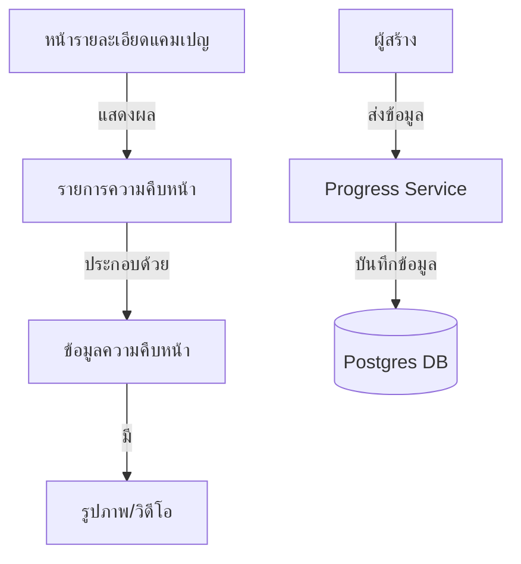

# คู่มือสำหรับนักพัฒนา: โมดูลความคืบหน้า (Progress Module)

โมดูลความคืบหน้าช่วยให้ผู้สร้างสามารถโพสต์อัปเดตข่าวสารไปยังผู้สนับสนุนได้อย่างสม่ำเสมอ เพื่อแสดงถึงพัฒนาการของโครงการและความโปร่งใสในการดำเนินงาน

## 1. โครงสร้างโปรแกรม (Program Structure)

โมดูลความคืบหน้าทำหน้าที่เป็น "ฟีดกิจกรรม" (Activity Feed) เฉพาะสำหรับแต่ละโครงการ

### โครงสร้างฝั่ง Backend (`okard-backend/src/modules/progress`)
- [controller.py](file:///Users/wisapat/Documents/Code/Git/okard-backend/src/modules/progress/controller.py): API สำหรับการโพสต์และการดึงข้อมูลอัปเดตโครงการ
- [service.py](file:///Users/wisapat/Documents/Code/Git/okard-backend/src/modules/progress/service.py): จัดการเนื้อหาข้อความและแกลเลอรีรูปภาพที่เกี่ยวข้อง
- [repo.py](file:///Users/wisapat/Documents/Code/Git/okard-backend/src/modules/progress/repo.py): การดำเนินการฐานข้อมูลสำหรับตาราง `progress`
- [model.py](file:///Users/wisapat/Documents/Code/Git/okard-backend/src/modules/progress/model.py): โมเดล SQLAlchemy สำหรับการอัปเดตที่เชื่อมโยงกับ `campaign_id`
- [schema.py](file:///Users/wisapat/Documents/Code/Git/okard-backend/src/modules/progress/schema.py): โครงสร้างข้อมูลสำหรับการตรวจสอบความถูกต้อง

### โครงสร้างฝั่ง Frontend (`okard-frontend/src/modules/progress`)
- [types.ts](file:///Users/wisapat/Documents/Code/Git/okard-frontend/src/modules/progress/types.ts): อินเทอร์เฟซ TypeScript สำหรับข้อมูลการอัปเดตความคืบหน้า
- [components/ProgressComposer.tsx](file:///Users/wisapat/Documents/Code/Git/okard-frontend/src/modules/progress/components/ProgressComposer.tsx): แบบฟอร์มสำหรับผู้สร้างในการเขียนอัปเดต
- ส่วนนี้จะถูกรวมไว้ในแท็บ "อัปเดต" (Updates) ของหน้ารายละเอียดแคมเปญ

---

## 2. ภาพรวมการทำงาน (Top-Down Functional Overview)

การอัปเดตความคืบหน้าจะแสดงลำดับเหตุการณ์การพัฒนาโครงการแบบเส้นตรง

---

## 3. คำอธิบายโปรแกรมย่อย (Subprogram Descriptions)

### Backend: ชั้นบริการ (Service Layer - [service.py](file:///Users/wisapat/Documents/Code/Git/okard-backend/src/modules/progress/service.py))

| โปรแกรมย่อย | หน้าที่ความรับผิดชอบ | ข้อมูลเข้า (Input) | ข้อมูลออก (Output) |
| :--- | :--- | :--- | :--- |
| `create_progress_with_images` | บันทึกข้อความอัปเดตและประมวลผลไฟล์สื่อที่แนบมา | `db`, `progress_data`, `files` | `Progress` |
| `delete_progress` | ลบข้อมูลอัปเดตและล้างไฟล์สื่อออกจากพื้นที่จัดเก็บข้อมูล | `db`, `progress_id` | `Progress` (ที่ถูกลบ) |

---

## 4. การสื่อสารและพารามิเตอร์ (Communication & Parameters)

1.  **ความหลากหลายของสื่อ**: การอัปเดตแต่ละครั้งสามารถแนบรูปภาพได้หลายรูป โดยจัดการผ่านรูปแบบเดียวกับ `media_service` ที่ใช้ในโมดูลแคมเปญ
2.  **การมองเห็น (Visibility)**: การอัปเดตความคืบหน้าเป็นข้อมูลสาธารณะ แต่กลุ่มเป้าหมายหลักคือผู้สนับสนุนปัจจุบันเพื่อสร้างและรักษาความไว้วางใจ
3.  **ลำดับเวลา**: โดยปกติ API จะส่งข้อมูลอัปเดตกลับมาโดยเรียงลำดับตาม `created_at` จากใหม่ไปเก่า
